# JAVA学习笔记

## 目录

[TOC]

## 一、运行环境与HelloWorld

### Java环境

#### 下载地址

* [OpenJDK](http://jdk.java.net/ "OpenJDK")
* [JDK1.8](https://www.oracle.com/java/technologies/javase/javase-jdk8-downloads.html)
* [Java8 u201](https://www.oracle.com/java/technologies/javase/javase8-archive-downloads.html)
* [JDK15](https://www.oracle.com/java/technologies/javase-jdk15-downloads.html#license-lightbox)
* [JDK最新](https://www.oracle.com/cn/java/technologies/javase-downloads.html)
* [EXE4J](https://www.ej-technologies.com/download/exe4j/files)

#### 使用方法

* 将**bin**目录加入环境变量
* 直接用**DOS**窗口  
* javac.exe负责**编译**
  * 格式：`javac 路径` 
    * 路径：xxx.java源代码路径, 可以是相对路径也可以是绝对路径
* java.exe负责**运行**
  * 格式：`java name` 
    * name：class文件名称,不加后缀

#### Java生态体系

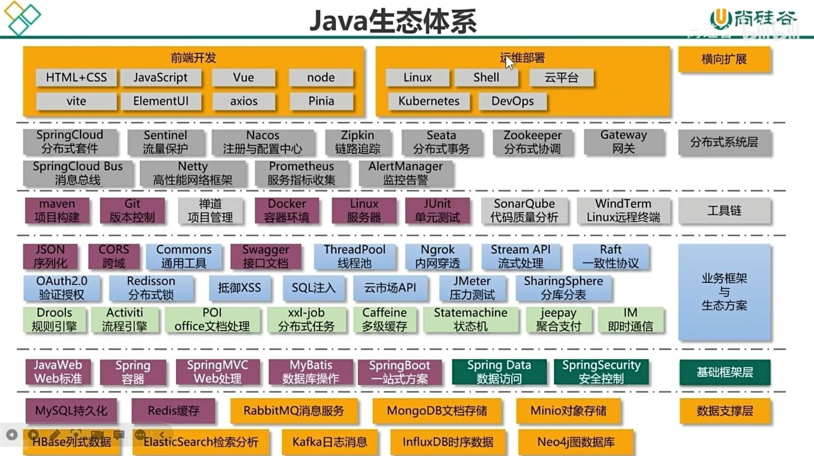

### 注释

* 和C语言一样

```java
/**
 *两星开头，一星结束
 *中间的星号可以省略
 *这样的注释可以让  
 *javadoc.exe
 *生成帮助文档
 */

 // DOS 命令
javadoc -d 目录 *.java
```

### 代码解析

```java
public class helloworld {
//类体
//类体中不能写java语句，声明变量除外
//public        表示公开的
//class         表示生成类
//helloworld    类名
    public static void main(String[] args) {
    //static           表示静态的
    //void             空
    //main             方法名是main
    //(String[] args)  是一个main方法的形式参数列表
        System.out.println("hello world!");
        //向控制台输出 双引号 内的内容
    }
}
```

### public class和class的区别

* 一个java源文件中可以有**多个**class, 但**必须有且只能有**一个`public`  
* 公开类`public class`, 类名必须和java源文件名称一致
* 每个class会生成一个**class后缀**文件
* 每一个class中都可以编写main方法,都可以设定程序入口
* **运行的**class文件中必须有主方法程序入口，没有将会运行错误

***

## 二、Java语法

### 标识符

* 标识符可以用美元符号 "$"  

### 字面值

* 字符串、字符、常量、布尔量

```java
System.out.println("hello world!");//输出字符串
System.out.println(1111100);//输出数字
System.out.println(true);//输出布尔量 真
System.out.println(false);//输出布尔量
System.out.println(3.1415926);//输出浮点数
```

### 变量

* 变量的作用域在**大括号**内
* 方法体内定义的变量叫做**局部变量**
* 方法体外定义的变量叫做**成员变量**
  * **成员变量**没有赋值时，系统会自动赋**0**
* 不同作用域当中变量名可以**重名**

### 数据类型  

不同数据类型占字节数  

| byte | short | int  | long | float | double | bool | char |
| :--: | :---: | :--: | :--: | :---: | :----: | :--: | :--: |
|  1   |   2   |  4   |  8   |   4   |   8    |  1   |  2   |

>Java语言用的是**Unicode**标准，与C语言不同，char占用2个字节，取值范围是[0,65535]  
>Unicode是全国通用标准，一个char可以存一个中文    
>JDK中自带的native2ascii.exe命令可以把文字转换成Unicode编码   
>在命令行输入**native2ascii**，回车，然后输入文字，回车  

#### 类型转换

* 赋值时，编译器会把数当做int类型处理  
* **除了**long类型赋值时，只要没有超过变量类型的**取值范围**，就可以直接赋值，不用强制类型转换
* 浮点型字面值被默认当做**double**类型  

```java
//float强制类型转换
float f = (float)5.1;
float f = 5.1f;
```

* 在Java语言中boolean类型只有两个值：**ture、false**，不像C语言有0和非0表示假和真。
* **short、byte、char**多种类型混合运算时，会先转成**int**数据类型再进行运算。  
* 多种类型混合运算时，先转成**最大的**数据类型再进行运算。  

### 运算符

#### 字符连接运算符

* 当“+”运算两边都是数字的话，一定是进行**加法运算**
* 当“+”运算符两边的数据只要有一边是字符串，一定会进行字符串连接运算，运算后结果是字符串

```java
public class Test {
	public static void main(String[] args) {
		int a = 10;
		int b = 15;
		System.out.printf(a + " + " + b + " = " + (a + b));
		// 10 + 15 = 25
	}
}
```

### 输入和输出

* 输入程序：  

```java
// 首先，创建扫描对象
java.util.Scanner s = new java.util.Scanner(System.in);
String str = s.next();          // 输入字符串
Strinf str = s.nextLine();      // 输入一行
int i      = s.nextInt();       // 输入整数
char c     = s.next.charAt(0);  // 输入一个字符
```

* 输出程序：  

```java
System.out.print();   // 打印括号内容  
System.out.println(); // 打印括号内容并换行  
// Java 5 以后沿用了C语言的输出方式，格式化输出 printf  
System.out.printf("%.2",i);
```

### for循环

* JDK5之后引入了增强for循环
* 语法 `for(数据类型 变量 : 循环对象){}`
* 其中的变量是一个**临时变量**，代指对象中的第一个元素，所以注意在给数组赋值的时候不能用增强for循环
* 缺点：**没有下标**。

```java
public class foreachTest {
	public static void main(String[] args) {
		int[] array = new int[10];
		Random rand = new Random();
		for(int i = 0; i <array.length; i++) {
			array[i] = rand.nextInt(90) + 10;
		}
		for(int i : array) {    // 增强for循环
			System.out.print(i + "  ");
		}
	}
}
```

***********************

### 方法（函数）  

* 方法调用格式：**类名.函数名** 。   
* 方法定义在类体当中，在一个类体中可以定义多个方法，方法**没有**先后顺序。  
* 方法体当中不能再定义方法。  
* return 关键字执行，所在的方法结束。  
* “类名.”省略后，默认从当前类中调用函数。  
* 有返回值的函数，函数内必须有返回值。  
* 在一个**作用域**内，return后面不能编写代码。  

```java
// 方法在C语言中是函数
public class test {
    public static void main(String[] args) {
        int x = 10,y = 20;
        test.sum(x,y);
    }
    public static void sum(int a,int b) {
        int c = a + b;
        System.out.println(a + " + " +  b + " = " +  c);
    }
}
//有返回值函数
public static int sum(int a,int b) {
    int c = a + b;
    return c;
}
```

#### 可变长度形参

* 语法：`print(String... args) {        }`
* 在具有可变长参数的方法中可以把参数当成数组使用，例如可以循环输出所有的参数值。
* 调用的时候可以给出任意多个参数也可不给参数
* 一个方法**只能有一个**可变长参数，并且这个可变长参数必须是该方法的**最后一个参数**

#### 方法重载

* 如果多个函数的**功能相似**，但又不完全一样，可以采用同样的函数名，此时函数区分不再依靠函数名依靠的是函数的实参的**数据类型**。  
* 如果函数功能不同的话，尽可能使用不同的函数名。  
* 构成方法重载的条件：  
  1. 在同一个类当中  
  2. 方法名相同  
  3. 参数列表不同  
     * 数量不同  
     * 顺序不同  
     * 类型不同  

```java
// 以下调用的函数名是一样的
public class test {
    public static void main(String[] args) {
		sum(10,20);
		sum(10.5,20.5);
		sum('A','B');
    }
    
    public static void sum(int a,int b) {
	    System.out.println(a + b);
	    System.out.println("调用了整数求和");	
    }

    public static void sum(double a,double b) {
	    System.out.println(a + b);
	    System.out.println("调用了浮点数求和");	
    }

    public static void sum(char a,char b) {
	    System.out.println(a + b);
	    System.out.println("调用了字符求和");	
    }
}
```

## 三、面向对象

* 面向对象的三大特征
  1. 封装
  2. 继承
  3. 多态
* 从软件周期来看，基于面向对象程序设计分为三个阶段
  1. 面向对象的分析：OOA  
  2. 面向对象的设计：OOD  
  3. 面向对象的编程：OOP  

### 类和对象

* 类 = 特征 +　状态
* 实例变量 - 变量  - 属性 - 特征
* 方法 - 状态
* String、System皆是类对象

#### 对象创建

```java
// 使用形式上有点类似C语言的结构体
public class test {
    public static void main(String[] args) {

		Student s = new Student(); // 新建一个引用对象
		//new Student()是一个地址

		s.num = 47;          
		s.name = "张三";
		s.sex = true;
		s.addr = "中国北京";  // 对象数据更改
		
		System.out.println(s.num);
		System.out.println(s.name);
		System.out.println(s.sex);
		System.out.println(s.addr);
    }
}

public class Student{  // 对象，最好是新建一个java文件
    // 实例变量
	int num;
	String name;
	boolean sex;
	String addr;
}
```

#### 对象内存分析

1. JVM主要包括三块内存空间，分别是：栈内存、堆内存、方法区内存。    
2. 堆内存和方法区内存各有1个，一个线程一个栈内存。  
3. 方法调用的时候，该方法所需要的内存空间在栈内存中分配，称为压栈，方法执行结束之后，该方法所属的内存空间释放，称为弹栈。  
4. 栈中主要存储的是方法体当中的局部变量。  
5. 方法的代码片段以及整个类的代码片段都被存储到方法区内存当中，在类加载的时候这些代码片段会载入。  
6. 在程序执行过程中使用**new**运算符创建的java对象，存储在堆内存当中。对象内部有实例变量，所以实例变量存铺在堆内存当中。 
7. 变量分类：  
   * 局部变量【方法体中声明】   
   * 成员变量【方法体外声明】 
     * 实例变量【前边修饰符没有static】   
     * 静态变量【前边修饰符中有static】
8. 静态变量存储在方法区内存当中。   
9. 三块内存当中变化最频繁的是栈内存，最先有数据的是方法区内存，垃圾回收器主要针对的是堆内存。   
10. 垃圾回收器【自动垃圾回收机制、GC机制】什么时候会考虑将某个java对象的内存回收呢？  
    * 当堆内存当中的java对象成为垃圾数据的时候，会被垃圾回收器回收。  
      * **什么时候堆内存中java对象会变成垃圾呢？**  
        * 没有更多的引用指向它的时候。  
        * 这个对象无法被访问，因为访问对象只能通过引用的方式访问。  

```
以前我是堆，你是栈

你总是能精准的找到我，给我指明出路

后来有一天我明白了

我变成了栈，你却隐身堆海

我却找不到你了，空指针了


我不愿意如此，在下一轮full gc前

我找到了object家的finalize

又找到了你，这次我不会放手


在世界重启前，一边躲着full gc一边老去

```

#### 程序初始化顺序

程序初始化的顺序是怎样的呢？  
java程序的初始化可以看做是代码块的执行，他们的执行顺序如下:  

1. 父类的静态变量
1. 父类的静态代码块
1. 子类的静态变量
1. 子类的静态代码块
1. 父类非静态变量
1. 父类非静态代码块
1. 父类构造函数
1. 子类非静态变量
1. 子类非静态代码块
1. 子类构造函数

是不是很难记，初始化呢，只要记住这几个原则

1. 在实例化一个类时，如果发现父类未被实例化，则先实例化父类。因此父类优先于子类进行初始化
2. 静态对象（变量、方法、代码块）优先于非静态对象
3. 代码块中可能有变量的赋值操作，因此变量优先于代码块执行初始化
4. 构造函数处于最后执行，因为构造函数中可能还有变量的赋值操作，因此变量优先于构造函数

### 封装

* **封装的好处**
  1. 封装之后，看不到封装事物复杂的一面。你只会看到**简单**的一面，对外提供简单的**入口**。  
  2. 封装之后才能成为真正的**对象**，真正的**独立体**。   
  3. 封装后意味着程序可以重复使用，并且**适应性强**。    
  4. 对于事物本身提高了**安全性**。  
* 封装的步骤
  1. 所有属性私有化，使用**private**关键字进行修饰，**private**代表私有的，**修饰的数据只能在本类中访问。**  
  2. 对外提供简单入口
     * 两个**公开**的方法，**set**方法和**get**方法  
     * 写属性，用**set**方法。  
     * 读属性，用**get**方法。  
  3. 命名规范
     * `pubilc void set+属性名(形参){属性 = 形参}`  
     * `pubilc 返回类型 get+属性名(){return 属性}`  
  4. **注意**
     * 有`static`关键字的函数调用：类名.方法名(实参)  
     * 没有`static`关键字的函数调用：引用.方法名(实参)  

```java
public class Test {
    public static void main(String[] args) {
        Student a = new Student();
        
		a.setAge(-1);                    // 无 static 关键字调用方法
        
		System.out.println("年龄是：" + a.getAge());
    }
}

public class Student {  // 对象类
	private int age;

	public void setAge(int a) {
		if(a > 150 || a < 0) {                     // 控制语句
			System.out.println("输入年龄不合法");
			return;                                  // 不合法跳出
		}
		age = a;                       // 写入给私有变量
		
	}
	public int getAge() {
		return age;          // 将私有变量读出
	}
}
```

#### 构造(Constructor)

* 构造方法的语法：`[修饰符列表] 构造方法名(形式参数列表){构造方法体;}`
* 不用写返回值类型，并且也不能写**void**  
* 构造方法方法名必须和**类名**一致  
* **构造方法的作用**
  * 能通过构造方法的调用，创建对象
  * 给对象初始化值
* 构造方法如何调用
  * `new 构造方法名(实参列表)`
* 构造方法结束后自动返回值，不用写return语句。  
* 当一个类中没有定义构造方法，系统默认纵给该类提供一个**无参数**的构造方法，这个构造方法被称为**缺省构造器**  
* 当一个定义出构造方法，那么系统则不再提供缺省构造器，建议自己定义一个无参数的构造方法   
* 构造方法有**重载**机制  

```java
public class Test {
	public static void main(String[] args) {

		Student stu1 = new Student(47,"zhangsan");
		System.out.println(stu1.getName() + " 的学号是 " + stu1.getStuid());
		
	}
}
public class Student {   // 对象类

	private int stuid;      // 私有化变量
	private String name;

	public Student() {    //  缺省构造体
	}
	public Student(int a,String b) { // 属性初始化构造体
		stuid = a;
		name  = b;
	}

	public void setStuid(int a) {      // 创建对象入口 读写属性
		stuid = a;
	}
	public void setName(String a) {
		name = a;
	}
	public int getStuid() {
		return stuid;
	}
	public String getName() {       
		return name;
	}

}
```

### this关键字

* 可以出现在哪？
  1. this.实例对象
  2. this.实例方法
  3. this(形参){构造方法}
     * 只能出现在第一行
* **this是一个引用**，this中保存了内存地址指向自身，this存储在JVM堆内存，java对象内部。
* 创建的对象中，第一个对象都有一个独立的this。 
* 区分局部变量和实例变量的时候，**this**不能省略
* this用在实例方法当中，不能出现在有static的方法当中
  * static的方法调用为： 类名.方法名，调用过程中涉及不到对象概念，所以static方法中不能用this，
  * 因为实例方法调用为：引用.方法名 ，所以在调用实例方法之前必须创建对象，this.也是引用的形式，
* `this(形参)`这种方式可以调用本对象的构造方法

### static关键字

* 当多个对象的有相同属性的元素时，可以将属性定义为static类型
* 调用方法：类名.变量名
* static变量在方法区内存中

#### 静态代码块

* 语法：`static{方法体}`
* 静态代码块在类加载时执行，并且只执行一次
* 静态代码块在一个类中可以编写多个，并且自上而下依次执行  
* 静态代码块作用？
  * 例如项目中要求在类加载的时刻执行代码完成日志的记录，日志记录代码可以写在静态代码块当中 

### 继承

* 继承的作用？
  * **代码复用。有了继承才有了方法覆盖和多态机制**。  
* 继承语法：`[修饰符列表] class 类名 extends 父类名{类体}`
* Java中的继承只支持单继承，一个类不能同时继承很多类，只能继承一个类。C++支持多继承
* 假设一个类没有继承任何类，默认继承JavaSE库中的`java.lang.Object`类
* 术语
  * B继承A类
    * A类称为：父类、基类、超类、superclass
    * B类称为：子类、派生类、subclass
* 在Java语法当中子类继承父类都继承哪些数据呢？
  1. 私有的不支持继承
  2. 构造方法不支持继承
  3. 其它数据都可以被继承
* 间接继承

```java
C extens B{    // C直接继承B类，同时间接继承A T类
}
B extens A{
}
A extens T{
}
```

### 方法覆盖(override)

* 当父类中的方法已经无法满足子类中的业务需求，子类有必要将父类继承过来的方法进行重新编程，这个重新编程写的过程称为方法覆盖
* 什么条件下会方法覆盖？
  * 发生在有继承关系的父子类之间
* 要求两同两小一大原则
  * 方法名相同
  * 参数类型相同
  * 子类返回类型小于等于父类方法返回类型
  * 子类抛出异常小于等于父类方法抛出异常
  * 子类访问权限大于等于父类方法访问权限。［注意：这里的返回类型必须要在有继承关系的前提下比较］

### super关键字

* 语法
  * `super(实参);`调用父类构造体
  * `super.变量`调用父类变量
  * `super.方法(实参)`调用父类方法
* 可以通过子类的构造方法去调用父类的构造方法
* super(...)只能放在第一行，并且**不能与this(...)共存**
* 一个构造方法中没有有用this(...)，也没有用super(...)，会**默认调用super(...)**
* super中储存的不是内存地址，super代表的是当前子类对象中的父类型特征。
* 可以用在实例方法和构造方法中，**不能用在静态方法中**

### Object类

#### toString

* toString 是 Object 类中的一个方法，返回值是对象的地址
* 可以用方法覆盖的方式重写方法

```java
public class Test 
	public static void main(String[] args) {
		Student s = new Student();
		System.out.println(s);
	}
}
class Student {
	public String toString() {
		return "你调用了 1 个String对象"; // 这样返回值就不会是一个看不懂的东西了
	}
}
```

#### equals

* Object中的一个方法
* 判断两个对象是否一样
* 方法中比较的是地址
* 如果`String`对象用`equals`时`"abc".equals(str);`这样写不会发生空指针异常

```java
 // Object中的equals方法
public boolean equals(Object obj) {
	return (this == obj);
}

//Object中的equals方法比较的是内存地址.
//在现实的业务逻辑当中，不应该比较内存地址，应该比较内容。
//所以Object中的equals方法也要重写。
//根据需求规定重写equals方法，
//需求规定：如果身份证号一致，并且名字也一致，则代表是同一个人。
//s1.equals(s2);

public boolean equals(Object obj){	
    if(obj == this) {// 如果是内存地址一样，说明是同一个对象
        return true;
    }
    
    if(obj == null || !(obj instanceof Star)) {
        return false;
    }
    
    Star s = (Star)obj;
    if( this.id == s.id ) {
        return true;
    }
    return false;
}
```

* 关于java语言中如何比较两个字符串是否一致.	
* 在java中比较两个字符串是否一致，不能用“==”
* 只能调用String类的equals方法.

```java
public class Test{
	public static void main(String[] args){
		
		String s1 = new String("ABC");
		String s2 = new String("ABC");
		
		System.out.println(s1==s2); //false
		
		//String已经重写了Object中的equals方法，比较的是内容。
		System.out.println(s1.equals(s2)); //true
		
	}
}
```

#### finalize

* finalize方法每个java对象都有
* finalize方法不需要程序员去调用，由系统自动调用java对象,如果没有更多的引用指向它，则该java对象成为垃圾数据，等待垃圾回收器的回收，垃圾回收器在回收这个java对象之前会自动调用该对象的finalize方法。
* finalize方法是该对象马上就要被回收了，例如：需要释放资源，则可以在该方法中释放。

```java
public class Test01{
	
	public static void main(String[] args){
		
		Person p1 = new Person();
		
		p1 = null; //没有引用再指向它.等待回收.
		
		//程序员只能“建议”垃圾回收器回收垃圾.
		System.gc();
	}
	
}
class Person{
	
	//重写Object中的finalize方法.
	public void finalize() throws Throwable { 
		
		System.out.println(this + "马上就要被回收了！");
		
		//让引用再次重新指向该对象，该对象不是垃圾数据，不会被垃圾回收器回收！
		//Person p = this;
	}
}
```

#### hashCode

* hashCode方法返回的是该对象的哈希码值
* java对象的内存地址经过哈希算法得出的int类型的数值.

### 多态

* 作用
  1. 降低程序耦合度，提高程序扩展力
  2. 能使用多态尽量使用多态
  3. 父类型引用指向子类型对象
* 关于java语言中向上转型和向下转型
  1. 向上转型(upcasting) :  子--->父
     * 自动类型转换
  2. 向下转型(downcasting) :  父--->子
     * 强制类型转换 
       * 在做强制类型转换的时候程序是存在风险的！
       * 为了避免ClassCastException的发生，java引入了 **instanceof**  
         1. instanceof运算符的运算结果是**boolean**类型 
         2. 语法：`引用 instanceof 类型` --> true/false
       * 类在强制类型转换成接口类型的时候，类和接口之间不需要继承关系，也可以转换（实现关系）

### final关键字

* final表示最终的，不可变的
* final修饰的类**无法被继承**
* final修饰的方法**无法被覆盖**
* final修饰的变量一旦被赋值后，**不可二次赋值**
* final修饰的实例变量必须**手动赋值**，不能采用系统默认值，并且一般和static联合使用

### 抽象类(abstract)

* 定义：class关键字前加**abstract**
* 抽象类**有构造方法**，但**无法被实例化**  
* 抽象类中可以定义抽象方法，方法没有方法体，以“ ; ”号结束
* 抽象类**不一定**要抽象方法，但抽象方法**一定**是出现在抽象类中
* 一个**非抽象类**继承抽象类必须将抽象方法**重写、覆盖、实现**
* 抽象类和抽象方法都不能被**final**修饰，因为final修饰的类**不能被继承**，而抽象方法就是被子类实现的

### 接口(interface)

* 接口也是一种引用类型，可以**等同看做类**.
* 语法：`[修饰符] interface 接口名{}`
* 接口中只能出现：常量、抽象方法
  * 所有元素都用**public**修饰  
  * 接口中的方法默认都是 **public abstract** 的，不能更改
  * 接口中的变量默认都是 **public static final** 类型的，不能更改，所以必须显示初始化
  * 以上关键字都可以**省略**
* 接口其实是一个特殊的抽象类,特殊在接口是完全抽象的
* 接口中没有构造方法,无法被实例化
* 接口和接口之间可以**多继承**
* 一个类可以实现多个接口。(这里的“实现”可以等同看做“继承”)
* 一个非抽象的类实现接口，需要将接口中所有的方法“实现/重写/覆盖”.

```java
interface B{
	void m1();
}
interface C{
	void m2();
}
interface D{
	void m3();
}
interface E extends B,C,D{
	void m4();
}

//implements是实现的意思，是一个关键字.
//implements和extends意义相同。
class MyClass implements B,C{
	public void m1(){} // 实现
	public void m2(){}
}


class F implements E{
	public void m1(){} // 实现
	public void m2(){}
	public void m3(){}
	public void m4(){}
}
```

#### 接口和抽象类的区别

1. 接口描述了方法的特征，不给出实现，一方面解决java的单继承问题，实现了强大的可接插性
2. 抽象类提供了部分实现，抽象类是不能实例化的，抽象类的存在主要是可以把公共的代码移植到抽象类中
3. 面向接口编程，而不要面向具体编程（面向抽象编程，而不要面向具体编程）
4. 优先选择接口（因为继承抽象类后，此类将无法再继承，所以会丧失此类的灵活性）

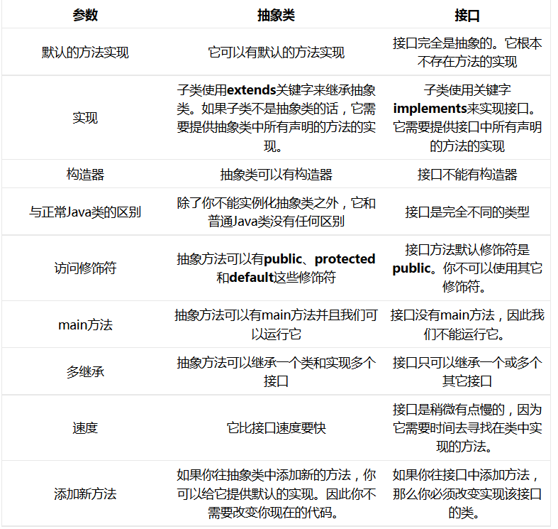

#### 抽象类和接口的方法类型

* 关于抽象类
  * JDK 1.8以前，抽象类的方法默认访问权限为protected
  * JDK 1.8时，抽象类的方法默认访问权限变为default
* 关于接口
  * JDK 1.8以前，接口中的方法必须是public的
  * JDK 1.8时，接口中的方法可以是public的，也可以是default的
  * JDK 1.9时，接口中的方法可以是private的

### package包

* 引入包更加方便管理，可以反不同功能的类加入到不同的包内，查找方便，易维护
* 定义：
  * 在Java源程序**第一行**上编写，只能编写**一个**
  * 语法结构：`package 包名`
* 命名规范（参考）
  * <https://www.cnblogs.com/wangcp-2014/p/10215620.html>
  * 公司域名倒写 + 项目名 + 模块名 + 功能名
  * `package com.baidu.www`
  * 一个包对应一个目录
* DOS命令`javac -d . xxx.java`可以快速生成包目录
* 当用了`package`后类名变成**包名.类名**，DOS命令也要变成`java xxx.xxx.xxx.类名`
* 在同一个包下，创建对象时可以省略包名

#### import关键字

* import关键字可以导入其它包目录或类，导入后即使不在同一个包目录下也可以运行
* import语句编写到**package下面**
* `java.lang.*`不需要导入（默认导入）

### 访问控制权限

| 修饰符        | 类的内部 | 同一个包里 | 子类 | 任何地方 |
| :------------ | :------: | :--------: | :--: | :------: |
| **private**   |    Y     |     N      |  N   |    N     |
| **缺省**      |    Y     |     Y      |  N   |    N     |
| **protected** |    Y     |     Y      |  Y   |    N     |
| **public**    |    Y     |     Y      |  Y   |    Y     |

### 匿名内部类*

1. 什么是内部类?
   * 在类的内部又定义了一个新的类,被称为**内部类**.   
2. 内部类的分类
   * 静态内部类
   * 实例内部类
   * 局部内部类
3. 使用内部类编程,程序可读性很差,能不使用尽量不使用.  
4. 匿名内部类是**局部内部类**的一种.因为这个类没有名字而得名,叫做匿名内部类.  
5. 缺点
   1. 太复杂,太乱,可读性差
   2. 类没有名字,不能重复使用  

```java
MyMath mm = new MyMath(new Sum() {
		
	// 匿名内部类 写法
	public int sum(int a,int b) {
		return a + b;
	}
});
//这里直接new了一个接口,在接口后面加了一个花括号,在花括号内进行了方法实现
```

## 四、数组

* 语法 `int[] array = new int[5]; `或`int[] array = {1, 2, 3};`
* 数组是**引用数据类型**
* 在进行方法传递时数组传递的是地址

### main方法中的字符串数组*

&emsp;&emsp;这个数组是留给用户的,用户可以在控制台上输入参数,这个参数会被转换成`String[] args`  
&emsp;&emsp;在运行时输入命令,例如`java test hello world`,这个时候**JVM**会将`hello world`以空格分离,放到字符串数组`String[] args`中

**程序**  

```java
public class test {
	public static void main(String[] args) {
		
		for(int i = 0; i < args.length; i++) {
			System.out.println(args[i]);
		}
		
	}
}
/*输出
hello
world
*/
```

### 二维数组

* 语法 `int[][] array = new int[2][3]; `或`int[][] array = {{1, 2, 3},{4,5,6},{7,8,9}};`
* 二维数组是一种特殊的一维数组(套娃数组)
* 类型定义无所谓方括号位置`int[][] array`、`int[] array[]`、`int array[][]`
* new出的对象一定要有行，可以没有列`int[][] array = new array[2][]`

## 五、常用类

### java.lang关系图

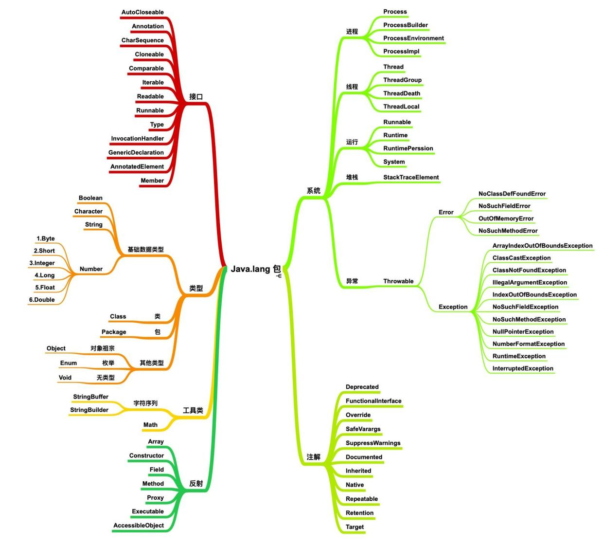

### String

* String字符串一经声明是不能改变的
* String在底层是一个byte数组,并且是用`private final`修饰的
* 如果要大量的连接字符串可以使用`StringBuffer`和`StringBuilder`
  * `StringBuffer`中的方法都有`synchronized`关键字修饰, 表示`StringBuffer`在多线程下运行是安全的
  * `StringBuilder`反之

```java
public class StringTest02 {
	public static void main(String[] args) {

		StringBuffer sb = new StringBuffer(100);

		//sb = "123";

		sb.append("456");
		sb.append(false);

		System.out.println(sb);
		
	}
}
```

只要采用**双引号赋值**字符串，那么在编译期将会放到**方法区中的字符串的常量池**里,如果是运行时对字符串相加或相减会放到堆中（放之前会先验证方法区中是否含有相同的字符串常量，如果存在，把地址返回，如果不存在，先将字符串常量放到池中，然后再返回该对象的地址）  

```java
public class StringTest02 {
    public static void main(String[] args) {
        String s1 = "abc";
        String s2 = "abc";
        String s3 = new String("abc");
        System.out.println("s1==s2, " + (s1==s2));
        System.out.println("s2==s3, " + (s2==s3));
        System.out.println("s2 equlas s3," + (s2.equals(s3)));
    }
}
```

* 如果是采用双引号引起来的字符串常量，首先会到常量池中去查找，如果存在就不再分配，如果不存在就分配，常量池中的数据是在编译期赋值的，也就是生成 class 文件时就把它放到常量池里了，所以 s1 和 s2 都指向常量池中的同一个字符串“abc”
* 关于 s3，s3 采用的是`new`的方式，在`new`的时候存在双引号，所以他会到常量区中查找`"abc"`，而常量区中存在“abc”，所以常量区中将不再放置字符串，而 new 关键子会在堆中分配内存，所以在堆中会创建一个对象 abc，s3 会指向 abc
* 如果比较 s2 和 s3 的值必须采用 equals，String 已经对 eqauls 方法进行了覆盖

### StringBuffer和StringBuilder

StringBuffer 称为字符串缓冲区，它的工作原理是：预先申请一块内存，存放字符序列，如果字符序列满了，会重新改变缓存区的大小，以容纳更多的字符序列。StringBuffer是可变对象，这个是 String 最大的不同  

**StringBuilder**用法同StringBuffer，StringBuilder和StringBuffer的区别是StringBuffer中所有的方法都是同步的，是线程安全的，但速度慢，StringBuilder的速度快，但不是线程安全的  

### 包装类

| 基本数据类型 | byte | short | int     | long | float | double | boolean | char      |
| ------------ | ---- | ----- | ------- | ---- | ----- | ------ | ------- | --------- |
| **包装类**   | Byte | Short | Integer | Long | Float | Double | Boolean | Character |

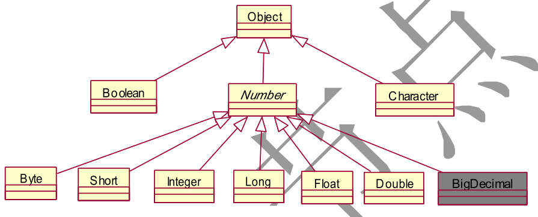

除了boolean和Character外，其它的包装类都有`valueOf()`和`parseXXX`方法，并且还具有`byteVaue(),shortVaue(),intValue(),longValue(),floatValue()`和`doubleValue()`方法，这些方法是最常用的方法  

* `valueOf()` 装箱：基本数据类型 --> 包装类
* `parsexxx()` 字符串 --> 基本数据类型
* `xxxValue()` 拆箱：包装类 --> 基本数据类型

```java
public class StringTest02 {
    public static void main(String[] args) {
	    int a = 100;
        System.out.println(a);
        
	    Integer a1 = new Integer(999);
	    System.out.println(a1);

	    System.out.println(Integer.MAX_VALUE); // int类型最大值
	    
	    Double a2 = new Double(a1.doubleValue());
	    System.out.println(a2);
    }
}
```

> 100  
> 999  
> 2147483647  
> 999.0  

#### 装箱和拆箱

* 装箱是指将基本数据类型转换为包装类  
* 拆箱是指将包装类转换为基本数据类型
* 从JDK5开始, 引入了**自动装箱和自动拆箱**

```java
int i = 100;
Integer j = new Integer(100); // 装箱
Integer k = new Integer(i);   // 装箱
Integer l = 100;
Integer m = i;    // 自动装箱


int a = j.intValue(); // 拆箱
int b = j;    //自动拆箱
```

### 日期类

取得今天的日期

```java
Date nowTime = new Date(); // 获取当前时间，这里得到的是一个总毫秒，但是Date重写了toString()方法
System.out.println(nowTime); //Thu Mar 05 10:51:06 CST 2020 // 这种格式

SimpleDateFormat sdf = new SimpleDateFormat("yyyy-MM-dd HH:mm:ss SSS");
String nowTimeStr = sdf.format(nowTime); // 格式化时间
System.out.println(nowTimeStr);

String time = "2008-08-08 08:08:08 888"; // 字符串转换成Date类
Date dateTime = sdf.parse(time);
System.out.println(dateTime); //Fri Aug 08 08:08:08 CST 2008

// 获取自1970年1月1日 00:00:00 000到当前系统时间的总毫秒数。
long nowTimeMillis = System.currentTimeMillis();
System.out.println(nowTimeMillis); //1583377912981
```

从JAVA8开始有了更新的时间日期类。  

```java
import java.time.LocalDate;
import java.time.LocalDateTime;
import java.time.format.DateTimeFormatter;
import java.time.temporal.ChronoUnit;
 
/**
 * jdk8 时间操作示例
 * @author wanghogngang
 *
 */
public class Jdk8TimeTest {
	public static void main(String[] args) {
		// 日期操作  start  ==================================================================
		
		//格式化
		DateTimeFormatter fmDate = DateTimeFormatter.ofPattern("yyyy-MM-dd");
    	
		//当天
		LocalDate today = LocalDate.now();
		System.out.println("当   天:"+today.format(fmDate));
		
		//2天前
		LocalDate pro2day = LocalDate.now().minus(2, ChronoUnit.DAYS);
		System.out.println("2天前:"+pro2day.format(fmDate));
        
		// 日期操作   end  ====================================================================
        
        
		// 时间操作  start  ==================================================================
        
 		//格式化
 		DateTimeFormatter fmTime = DateTimeFormatter.ofPattern("yyyy-MM-dd HH:mm:ss");
     	
 		//当前时间
 		LocalDateTime now = LocalDateTime.now();
 		System.out.println("当前时间:"+now.format(fmTime));
 		
 		//2小时前
 		LocalDateTime pro2hour = LocalDateTime.now().minus(2, ChronoUnit.HOURS);
 		System.out.println("2小时前:"+pro2hour.format(fmTime));
 		
 		// 日期操作   end  ====================================================================
	}
}
```

### 数字类

#### DecimalFormat

`DecimalFormat`可以用来格式化数据以便于阅读  

```java
import java.text.DecimalFormat;

public class test {
    public static void main(String[] args) {
	    DecimalFormat df = new DecimalFormat(",###.##");
	    System.out.println(df.format(12734234.247));
    }
}
```

#### BigDecimal

* `BigDecimal`可以精确计算,主要是账务数据
* BigDecimal与mysql的decimal：<https://blog.csdn.net/qq_19934363/article/details/88617373>
* `BigDecimal`的等值比较应使用`compareTo()`方法，而不是`equals()`方法。
    * `equals()`方法会比较值和精度（1.0 与 1.00 返回结果为 `false`），而 `compareTo()` 则会忽略精度。

```java
import java.math.BigDecimal;

public class test {
    public static void main(String[] args) {
	    BigDecimal bd1 = new BigDecimal(1092.23481);
	    BigDecimal bd2 = new BigDecimal(1);
	    //相加运算
	    System.out.println(bd1.add(bd2));
    }
}
```

#### 随机数

```java
import java.util.Random;
public class RandomTest01 {
    public static void main(String[] args) throws Exception{
        Random r = new Random();
        for (int i=0; i<5; i++) {
            // 产生5个0 - 100随机数
            System.out.println(r.nextInt(100));
        }
    }
}
```

## 六、异常

### 异常的基本概念

在程序运行过程中出现的错误称为**异常**

```java
public class test {
	public static void main(String[] args) {
		int a = 100;
		int b = 0;
		System.out.println(a / b);
	}
}

// output
Exception in thread "main" java.lang.ArithmeticException: / by zero
	at test.main(test.java:57)
```

### 异常的分类

#### 异常的层次结构

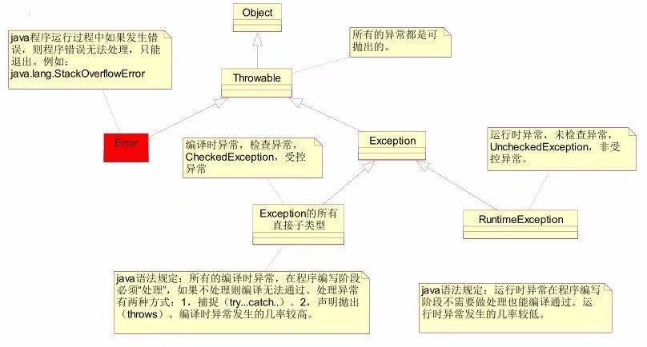


#### 异常的分类

* 编译时异常(受检异常 受控异常 **CheckedException**)
  * 这种异常必须处理, 否则编译不通过
* 运行时异常(非受检异常 非受控异常 **RuntimeException**)
  * 这种异常可以不用做显示处理, 例如被除数为 0

### 异常的处理

Java参异常处理一般有两种方式

- throws上抛(抛给上一级, 推卸责任)
  - 抛给上一级后, 调用都对这个异常同样有两种处理方式
  - 异常发生后如果一直上抛, 最终抛给main方法, 如果继续上抛给JVM, 将会终止程序的执行
- try catch捕捉(就地解决)

#### throw和throws

在Java中，异常也就是一个对象，它能够被程序员自定义抛出或者应用程序抛出，必须借助于throws和throw 语句来定义抛出异常。
throws和throw通常是成对出现的，例如

```java
static void cacheException() throws Exception{
    throw new Exception();
}
```

throw 语句用在方法体内，表示抛出异常，由方法体内的语句处理。throws语句用在方法声明后面，表示再抛出异常，由该方法的调用者来处理。  

throws 主要是声明这个方法会抛出这种类型的异常，使它的调用者知道要捕获这个异常。throw是具体向外抛异常的动作，所以它是抛出一个异常实例。  

#### try catch finally

```java
try {

}catch(SQLException e) {
    e.printStackTrace();
}catch(Exception e) {
    e.printStackTrace();
}finally {

}
```

- try中包含可能产生异常的代码
- catch 可以有多个,后面紧跟异常类型
- 当`try`中的代码出现异常时, 代码会立即中止, 随即跳转到catch语句块中, 如果没有异常则会执行try中的代码, 不会中断到catch中
- catch异常捕获按照**由小到大**的顺序，先捕获子异常，现再捕获父异常
- finally表示, 不管有没有出现异常finally中的代码都会执行(除非中止程序的运行), finally和try可以单独使用

```
try {
    
}finally {
    
}
```

#### getMessage() 和 printStackTrace()

- getMessage() 取得异常描述信息
- printStackTrace() 打印异常堆栈信息

```java
public class test {
    public static void main(String[] args) {
	    int a = 10;
	    int b = 0;
	    try{
		    System.out.println(a / b);
	    } catch(ArithmeticException e) {
		    e.printStackTrace(); // 打印异常堆栈信息
		    
		    System.out.println("测试1"); //  以下代码也会执行
		    
		    System.out.println("异常描述: " + e.getMessage());  

		    return; // 即使有return , finally也会执行
	    } finally {
		    System.out.println("测试2");  // finally中的代码一定会执行
	    }
    }
}
```

### 常见的异常

**运行时异常**  

| 序号 | 异常名称                       | 异常描述         |
| ---- | ------------------------------ | ---------------- |
| 1    | ArrayindexOutOfBoundsException | 数组越界异常     |
| 2    | NullPointerException           | 空指针异常       |
| 3    | llegal/ArgumentException       | 非法参数异常     |
| 4    | NegativeArraySizeException     | 数组长度为负异常 |
| 5    | llegalStateException           | 非法状态异常     |
| 6    | ClassCastException             | 类型转换异常     |

**编译时异常**  

| 序号 | 异常名称               | 异常描述                         |
| ---- | ---------------------- | -------------------------------- |
| 1    | NoSuchFieldException   | 表示该类没有指定名称抛出来的异常 |
| 2    | NoSuchMethodException  | 表示该类没有指定方法抛出来的异常 |
| 3    | llegalAccessException  | 不允许访问某个类的异常           |
| 4    | ClassNotFoundException | 类没有找到抛出异常               |

### 自定义异常

1. 自定义异常继承`Exception`和`RuntimeException`，到底继承哪一个视情况而定
2. 两个构造函数，一个有参一个无参

```java
//自定义受控异常
public class MyException extends Exception {
    public MyException() {
        //调用父类的默认构造函数
        super();
    }
    public MyException(String s) {
        //手动调用父类的构造方法
        super(s);
    }
}
```

### 方法覆盖与异常

- 方法重写时，子类方法不能抛出比父类方法更大的异常，但可以抛出父类方法异常的子异常或者不抛出异常。
- 当父类方法没有抛出异常，子类方法也不可抛出异常（`RuntimeException`除外）。

## 七、集合

### 集合概述

1. 集合实际上就是一个容器，可以容纳其它类型的数据
2. 集合不能直接储存基本数据类型，也不能直接储存Java对象，集合中储存的都是对象的内存地址（引用）。
3. 集合本身也是一个引用数据类型，是一个对象。
4. 每一个不同的集合中，底层都会对应不同的数据结构。往不同的集合中储存元素，等于将数据放到了不同的数据结构中。（数组、二叉树、哈希表、链表）。
5. 所有的集合类和接口都在`java.util`包下。
6. 在Java中集合分为两大类
   1. 单个方式储存元素，超级父接口`java.util.Collection`
   2. 键值对儿的方式储存元素，超级父接口`java.util.Map`

### 集合继承结构图

#### Collection部分

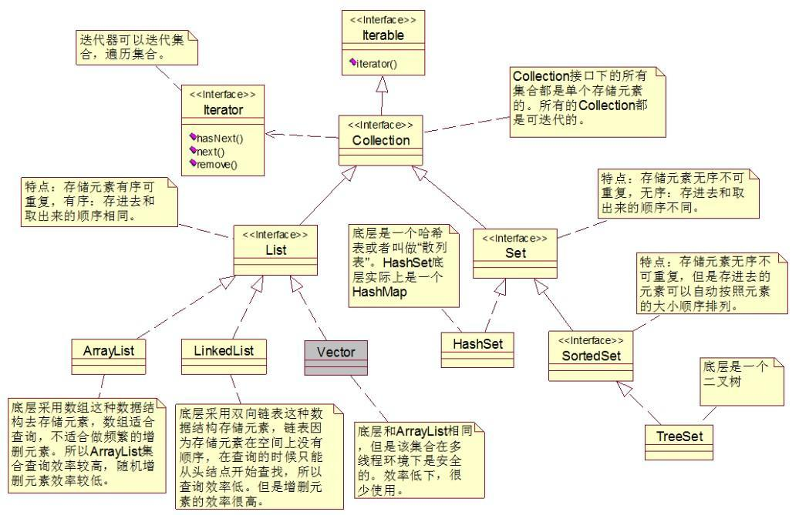

#### Map部分

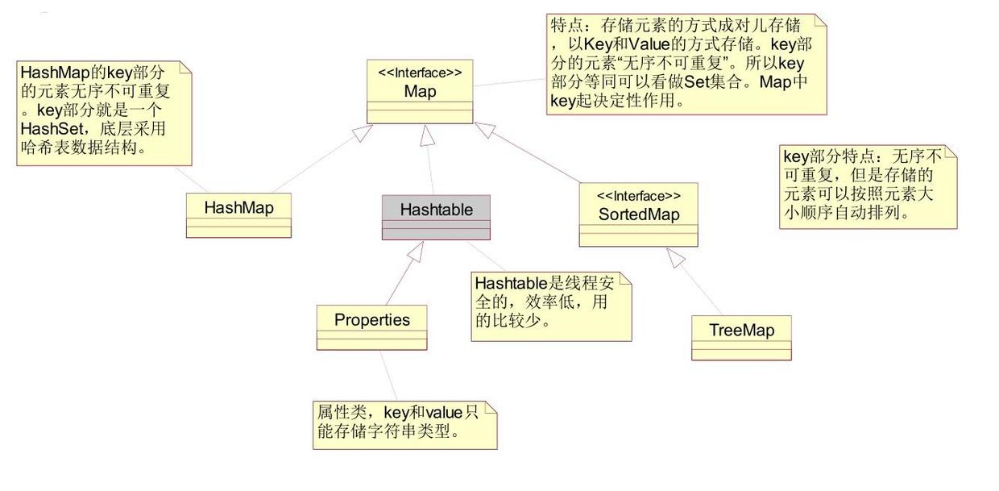


#### 总结构图

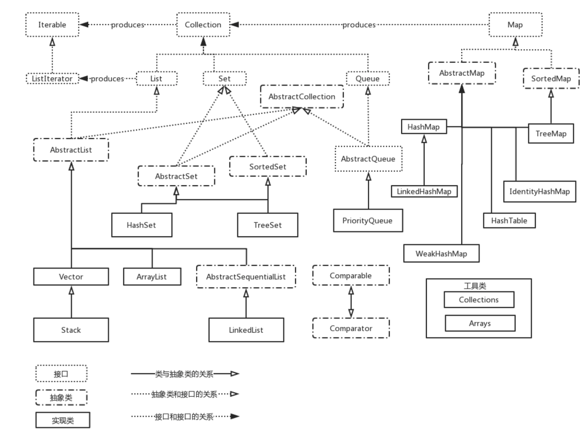

### Collection

1. 没用【泛型】之前，`Collection`可以储存`Object`所有的子类型；用【泛型】之后，`Collection`只能储存某个具体类型。
2. `Collection`的常用方法
   1. `boolean add(Object e)`  向集合中添加元素
   2. `int size()` 获取集合元素**个数**（不是容量）
   3. `void clear()` 清空集合
   4. `boolean contains(Object o)` 判断当前集合中是否包含元素o，包含返回true，不包含返回false
      * 底层调用了`equals`方法，所以查找的内容
   5. `boolean remove(Object o)` 删除集合中某个元素
      * 底层调用了`equals`方法，所以删除的是内容相同的元素
   6. `boolean isEmpty(Object o)` 判断集合中的元素个数是否为0
   7. `Object[] toArray()` 调用这个方法可以把集合转换成数组。【作为了解，使用不多。】

### iterator迭代器

1. 获取集合对象的迭代器对象`Iterator it = c.iterator();`
2. 通过以上获取的迭代器对象开始迭代
3. 当集合成员发生改变，**迭代器要重新获取**
4. 迭代器在迭代之前，会获取所迭代集合的**快照**，所以每当原本集合的元素更改后，都要重新获取迭代器
5. 在迭代集合的过程中，不能调用集合的`remove()`方法,可以使用迭代器的`remove()`方法。
6. 当运行`iterator`的`remove()`方法后，迭代器会把快照中的对应元素删除，同时，也会把快照删除元素对应的原本集合中的元素一并删除。

```java
Iterator<T> it = c.iterator();
while(it.hasNext()){
    System.out.println(it.next()); // 不用泛型返回一个`Object`类型
} 
```

#### Collection集合的遍历

通常集合有三种遍历的方式

1. 迭代器
2. 对于`List`数据结构用下标、`size`和`get`方法
3. 增强`for`循环

```java
import java.util.*;
public class foreachTest {
	public static void main(String[] args) {
		List<String> ls = new LinkedList<>();
		ls.add("hello");
		ls.add("12345");
		ls.add("66666");

		// 迭代器，这种方法最保险
		Iterator<String> it = ls.iterator();
		while(it.hasNext()) {
			String str = it.next();
			System.out.println(str);
		}

		//get方法和下标，只适用于List数据结构
		for(int i = 0; i < ls.size(); i++) {
			System.out.println(ls.get(i));
		}

		// 增强for循环，简单易写
		for(String s : ls) {
			System.out.println(s);
		}
	}
}
```


### Collection

* List的方法
  1. `void add(int index, Object element)` 在指定下标`int index`处，插入元素`Object element`
  2. `Object set(int index, Object element)` 更改指定下标的元素
  3. `Object get(int index)` 获取`int index`下标元素
  4. `int indexOf(Object o)` 查找`Object o`对应的第一个元素
  5. `int lastIndexOf(Object o)` 查找`Object o`对应的最后一个元素
  6. `Object remove(int index)` 删除指定下标的元素

#### ArrayList

* 初始化容量是10，超过容量会扩容为以前的1.5倍（数组扩容效率较低，建议给定一个初始化预估容量）
* `ArrayList`底层是一个`Object`数组
* 优点
  * 检索效率较高（占用空间相同，内在地址连续可以计算出下标）
* 缺点
  1. 随机增删元素效率低
  2. 无法存储大数据量

#### LinkedList

* 底层是双向链表
* 随机增删效率高，检索效率低
* 在储存上内在地址不连续

#### Vector

* 底层也是一个数组
* 初始化容量是10，扩容之后是原容量的2倍
* Vector中所有的方法都是线程同步的，都带有`synchronized`关键字，是线程安全的。但是效率比较低，已经淘汰。
* 现在，在线程安全的情况下，不需要选用Vector集合，取而代之的是`ArrayList`集合；在并发环境下，出现了 `CopyOnWriteArrayList`，`Vector`完全被弃用了。
* 如何将一个线程不安全的`ArrayList`集合转换成线程安全的呢？
  * `java.util.Collctions`


```java
List myList = new ArrayList();
colections.synchronizedList(myList);
```

#### TreeSet

1. `TreeSet`可以对集合进行排序，默认为升序，也可以做客户化排序
2. 排序有两种方式
   1. 实现`Comperable`接口，重写`compareTo`方法
   2. 在new对象的时候，构造方法中传入一个构造器，构造器实现`Comparator`接口，重写`compare`方法（可以用匿名内部类的方式）

### Map

1. Map和Collection没有继承关系
2. Map集合以`key`和`value`的方式储存数据（键值对）
   * key和value都是引用数据类型
   * key和value都是储存的内存地址
   * key起到主导地位，value只是key的一个附属品
3. Map接口中常用方法
   1. `V put(K key, V value)` 向Map集合中添加键值对
   2. `V get(Object key)` 通过key获取value
   3. `void clear()` 清空Map集合
   4. `boolean containsKey(Object key)` 判断Map中是否包含某个key
   5. `boolean containsValue(Object value)` 判断Map中是否包含某个value
   6. `boolean isEmpty()`   判断Map集合中元素个数是否为0
   7. `V remove(Object key)` 通过key删除键值对
   8. `int size()` 获取Map集合中键值对的个数。
   9. `Collection<V> values()` 获取Map集合中所有的value，返回一个Collection
   10. `Set<K> keySet()` 获取Map集合所有的key（所有的键是一个set集合）
   11. `Set<Map.Entry<K,V>> entrySet()`

#### Map集合的遍历

两种方法

1. `keySet()`方法获取`Set`集合key值，再根据key值获取对应value
2. 第二种方式
   * 通过`Set<Map.Entry<K,V>> entrySet()`方法将`Map`集合转换成`Set`集合
   * 被转换的`Set`集合元素是`Map.Entry<K,V>`类型的对象
   * 再调用对象中`getKey()`和`getValue()`方法获取key和value
   * 这种方式效率比较高，因为获取key和value都是直接从node对象中获取的属性值。这种方式比较适合于大数据量

```java
import java.util.*;
public class MapTest02 {
	public static void main(String[] args) {
		Map<Integer, String> map1 = new HashMap<>();
		map1.put(1, "1234");
		map1.put(2, "abcd");
		map1.put(3, "6666");
		map1.put(4, "----");
		
		Set<Integer> keys = map1.keySet();
		// 迭代器
		Iterator<Integer> it = keys.iterator();
		while(it.hasNext()) {
			Integer key = it.next();
			String value = map1.get(key);
			System.out.println(key + " = " + value);
		}
		// foreach
		for(Integer key : keys) {
			System.out.println(key + " = " + map1.get(key));
		}

		// 第二种方法

		Set<Map.Entry<Integer, String>> set1 = map1.entrySet();
		// 迭代器
		Iterator<Map.Entry<Integer, String>> it2 = set1.iterator();
		while(it2.hasNext()) {
			Map.Entry<Integer, String> node = it2.next();
			Integer key = node.getKey();
			String value = node.getValue();
			System.out.println(key + " = " + value);			
		}
		// foreach
		for(Map.Entry<Integer, String> node : set1) {
			System.out.println(node.getKey() + " = " + node.getValue());
		}		
	}
}
```

#### HashMap

1. `HashMap`是一种哈希表/散列表的数据结构
2. 哈希将数组和单向链表整合在一起，充分的发挥它们的优点。
3. `HashMap`底层是一个`Node<K,V>[]`类型的一维数组，数组中的每个元素是一个单向链表.
4. `HashMap`怎样写入和读取
   * `map.put(K, V);`
     1. 将K,V封装到Node对象中
     2. 底层调用K的`hashCode`方法得出哈希值，通过哈希算法将hash值转化成下标，下标位置上如果为空，就把`Node`放到这个位置上，如果下标上有链表，就挨个和链表中的每一个结点`Node`上的K进行`equals`，如果一直返回`false`就把新的结点放到链表的末尾，返回`true`，覆盖
   * `v = map.get(K);`
     * 与上面大致相同，`equals`为true的结点Node的`value`就是要找的`value`，为false则没有
5. 放在`HashMap`和`HashSet`集合中元素必须要同时重写`equals`和`hashCode`方法
6. `HashMap`的初始容量为16，默认加载因子是0.75

#### Map中的值

集合类|key|value|super|说明
-|-|-|-|-|-|-
Hashtable|不能为null|不能为null|Dictionary|线程安全
ConcurrentHashMap|不能为null|不能为null|AbstractMap|线程局部安全
TreeMap|不能为null|可以为null|AbstractMap|线程不安全
HashMap|可以为null|可以为null|AbstractMap|线程不安全


### 泛型

1. JDK5.0之后推出新特性：泛型 
2. 语法：`List<String> ls = new LinkedList<String>()`
   * 在JDK8.0之后引入了钻石表达式（自动类型推断），后面的`<>`中的内容可以省略
   * `List<String> ls = new LinkedList<>()`
3. 泛型的语法机制只在程序的**编译阶段**起作用，只是给编辑器参考的。
4. 使用泛型的好处
   1. 集合储存元素类型统一
   2. 从集合中取出的元素是泛型指定类型，不需要作大量的强制类型转换（向下转型）。
5. 泛型的缺点
   * 集合中元素缺乏多样性

```java
Iterator<String> it = ls.iterator();
while(it.hasNext()) {
	String str = it.next(); // 正常来说这里取出来的是Object类型的
	System.out.println(str);
}
```

#### 自定义泛型

在类名的后面加`<标识符>`，标识符可以是任何符合Java语法的符号，常见的如T、E、K、V等形式的参数常用来表示泛型。

```java
import java.util.*;
public class GenericTest02<T> {

	private T value;

	public GenericTest02(T value) {
		this.value = value;
	}
	
	public void setValue(T value) {
		this.value = value;
	}
	public T getValue() {
		return this.value;
	}	
	public static void main(String[] args) {
		GenericTest02<String> gt = new GenericTest02<>("Hello World!");
		System.out.println(gt.getValue());
		gt.setValue("你好，世界！！！");
		System.out.println(gt.getValue());
	}
}
```

## 八、IO流

### IO流是什么

* 通过IO流可以完成对硬盘的读和写
* 分类方式
  * 方向不同
    1. 往内存中去，叫输入`Input`或者读`Read`
    1. 从内存中出来，叫输出`Output`或者写`write`
  * 数据不同
    1. 字节流，一个字节一个字节的
    2. 字符流，只能操作文本文件
* 所有的流都是在`java.io.*`包下
* 所有的流都实现了`java.io.Closeable`接口，都是可关闭的，都能调用`close()`方法，要有用完流就关闭的好习惯
* 输出流都实现了`java.io.Flushable`接口
* **注意**：在java中只要“类名”以Stream结尾的都是字节流。以“Reader/Writer”结尾的都是字符流。

### IO流的四大首领

```java
java.io.InputStream  //字节输入流
java.io.OutputStream //字节输出流

java.io.Reader		//字符输入流
java.io.Writer		//字符输出流
```

### IO关系图

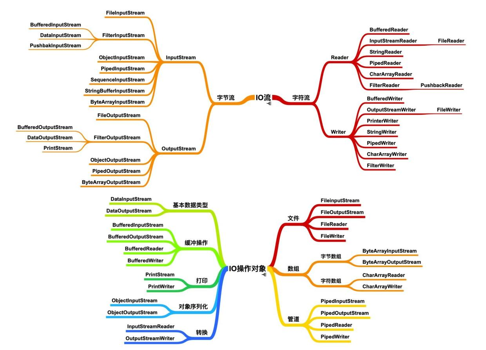

java.io包下需要掌握的流有16个：

```java	
	//文件专属：
		java.io.FileInputStream //（掌握）
		java.io.FileOutputStream //（掌握）
		java.io.FileReader
		java.io.FileWriter

	//转换流：（将字节流转换成字符流）
		java.io.InputStreamReader
		java.io.OutputStreamWriter

	//缓冲流专属：
		java.io.BufferedReader
		java.io.BufferedWriter
		java.io.BufferedInputStream
		java.io.BufferedOutputStream

	//数据流专属：
		java.io.DataInputStream
		java.io.DataOutputStream

	//标准输出流：
		java.io.PrintWriter
		java.io.PrintStream//（掌握）

	//对象专属流：
		java.io.ObjectInputStream//（掌握）
		java.io.ObjectOutputStream//（掌握）
```

### 路径

在Java程序中，文件最好是和Class文件放在一个文件中的，但是在大多集成开发环境中，class文件和源代码文件并不是一个路径。  
如果使用相对路径，那么文件只能放在源代码文件中，如果使用绝对路径，平台不通用  
可以使用类路径，然后获取类路径的绝对路径。

```java
String path = Thread.currentThread().getContextClassLoader().getResource("com/javase/test/db.properties").getPath(); // 从包开始的类路径

FileInputStream fis = new FileInputStream(path);

// 这种方式能直接以流的形式返回
InputStream is = Thread.currentThread().getContextClassLoader().getResourceAsStream("com/javase/test/db.properties"); 
```

### 文件流

#### FileInputStream

* `int available()`：返回流当中剩余的没有读到的字节数量  
* `long skip(long n)`：跳过几个字节不读。  
* `read()` 读字节

```java
int readData = 0;
while((readData = fis.read()) != -1) {
    System.out.println(readData);
}
```

* 此外`read()`方法可以传入一个byte数组和指定起始与偏移,传入几个容量大小的数读几个数，读取到的是字节本身，将读到的内容写到byte数组里，字节个个数作为方法返回值，如果到最后剩下的字节数小于数大小，则只读最后几个，返回最后几个个数。  

```java
int readData = 0;
byte[] bytes = new byte[10];
while( (readData = fis1.read(bytes)) != -1 ) {
    Systemp.out.println(new String(bytes, 0, readData));
}
```

#### FileOutputStream

1. 在new对象的时候，如果没有文件会创建文件，如果有文件默认会把文件的内容清空，再写入。
2. `write()`方法，可以跟一个字符、字符数组、指定起始偏移、
3. `FileOutputStream(String name, boolean append)`构造方法可以选择是否以追加的方式写入，当为true时为追加模式

```java
fis.write(str.getBytes()); // 写一个字符串

int readData = 0;
byte[] bytes = new byte[1024 * 1024];
while( (readData = fis1.read(bytes)) != -1 ) { // 一边读一边写
    fos.write(bytes, 0, readData); // 写
}
```

#### 字符流

与字节流的使用方法类似  

### 缓冲流

* ` br = new BufferedReader(new FileReader("path"));`
* 缓冲流主要是为了提高效率而存在的，减少物理读取次数。
* `BufferedReader` 提供了实用方法`readLine()`，可以直接读取一行`，BufferWriter` 提供了 `newLine()`可以写换行符。


### 转换流

* `FileReader fr = new InputStreamReader(new FileInputStream("Path"));`
* `InputStreamReader`  主要是将**字节**流输入流转换成**字符**输入流
* `OutputStreamWriter` 主要是将**字节**流输出流转换成**字符**输出流

### 数据流

* `DataInputStream`和`DataOutputStream`
* `dos = new DataOutputStream(new FileOutputStream("path"));`
* 数据流要求读取的数据顺序要和写入时一样，否则不能读出正常的数据
* writeChars()写字符串  writeChar() writeInt() writeShort() ...

### 打印流

`PrintStream`可以改变`println()`方法改变输出方向，使其指向一个文本文件。常用于打印日志文件      

```java
public static void main(String[] args) {
    PrintStream ps = System.out;
    ps.println("Hello World!!!!");
    PrintStream ps = new PrintStream(new FileOutputStream("log.txt", true)); //改变输出方向
    ps.println(hello); 输出到log.txt
    ps = new PrintStream(new FileOutputStream(FileDescriptor.out)); // 重新输出到控制台
    ps.println("hello");
}
```

### 对象流

* `ObjectInputStream` `ObjectOutputStream`
* `ois = new ObjectInputStream(new FileInputStream("path"));`
* `<T> readObject()` `writeObject()`
* 对象流可以将 Java 对象转换成二进制写入磁盘，这个过程通常叫做**序列化**
* 还可以从磁盘读出完整的 Java 对象，而这个过程叫做**反序列化**
* 如果实现序列化该类必须实现序列化接口`java.io.Serializable`，该接口**没有**任何方法，该接口只是一种标记接口，标记这个类是可以序列化的
* 用`transient`关键字修饰的属性序列化时会忽略
* 在序列化存储时，他会为该类生成一个`private static final long serialVersionUID`，而我们在该类中新加入了一个属性后，那么在使用的时候他就会为该类生成一个新的`serialVersionUID`，这个两个UID不同，所以Java认为是不兼容的两个类。所以说通常我们在实现序列化的类中加入一个自定义的`serialVersionUID`这个UID是固定不变的，那么，以后改动代码的时候就不会发生类似的情况了。比如说`String`类中的UID一直都是`private static final long serialVersionUID = -6849794470754667710L;`没有变过。

### File

1. `File`类和四大家庭没有关系
2. `File`对象是文件和路径的一种抽象的表现形式，比如`C:\Users\admin\Desktop\`和`C:\Users\admin\Desktop\新建文本文档.txt`，所以说一个`File`对象可以是路径也有可能是一个文件
3. 常用方法
   1. `exists()` 判断对象是否存在
   2. `renameTo(File dest)` 文件重命名
   3. `delete()` 删除文件
   4. `mkdir()` 新建单级文件夹
   5. `mkdirs()` 新建多级文件夹
   6. `parentPath()` 返回对象父路径字符串
   7. `parentFile()` 返回对象父路径对象
   8. `getAbsolutePath()` 返回对象的绝对路径字符串
   9. `getAbsoluteFile()` 返回对象的绝对路径对象
   10. `getName()` 返回文件名
   11. `isDirectory()` 判断是否是一个目录
   12. `isFile()` 判断是否是一个文件
   13. `lastModified()` 返回从1970年1月1日到最后一次修改文件总ms数(long)
   14. `length()` 返回文件大小（字节）
   15. `listFiles()`返回单个目录下的所有子文件

### IO和Properties的联用

`Properties`对象可以用`load()`方法加载进去一个`InputStream`或者`Reader`对象，文件内容由多个key=value组成，然后通过`getProperty()`方法传入**key**，返回**value**，此用法常用于配置文件中。  

#### 资源绑定器

`java.util.ResourBundle`  

**要求**  

1. 文件必须在类路径下
2. 文件必须以properties后缀结尾
3. 代码上路径不能有‘properties’后缀

```java
ResourceBundle bundle = ResourceBundle.getBundle("com/javase/test/db"); // 不能有后缀，源下的文件路径
String str = bundle.getString("className");
System.out.println(str);
```

### 各种IO

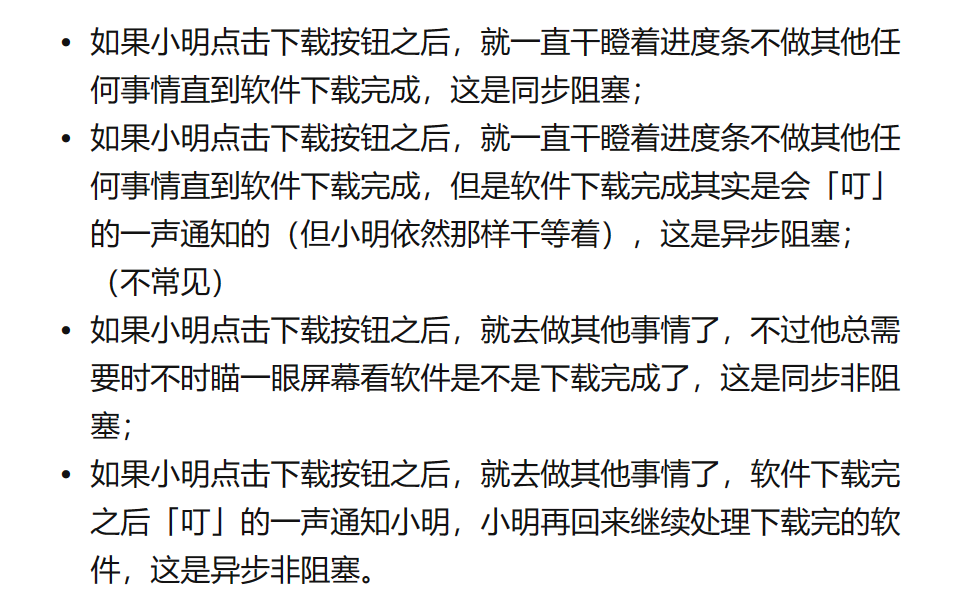

## 九、多线程

### 线程的基本概念

* 线程是一个进程中的执行场景，一个进程可以有多个线程。
* 同一个进程中的线程共享其中的内存和资源
* 进程引入多线程可以提高进程的使用率
* 线程和线程之间的栈内存独立，堆内存和方法区内存共享。一个线程一个栈。
* **描述 java 程序的执行原理：** java命令执行会启动JVM，JVM的启动表示启动一个应用程序，表示启动了一个进程。该进程会自动启动一个“主线程”，然后主线程负责调用某个类的 main 方法。所以 main 方法的执行是在主线程中执行的。然后通过 main 方法代码的执行可以启动其他的“分支线程”。所以，**main方法结束程序不一定结束，因为其他的分支线程有可能还在执行。**

### 线程的创建与启动

线程的创建方式主要有两种

* 继承`Thread`类，并重写`run()`方法
* 实现`Runnable`接口，并实现`run()`方法（推荐使用这种方法）

#### 继承`Thread`类

```java
package com.javase.thread;

public class ThreadTest01 {
    public static void main(String[] args) {
        test th = new test();
//        t.run(); // 串行
        th.start(); // 并发

        for (int i = 0; i < 100; i++) {
            System.out.println("主线程 -->" + i);
        }
    }
}

class test extends Thread {

    @Override
    public void run() {
        for (int i = 0; i < 100; i++) {
            System.out.println("支线程 -->" + i);
        }
    }
}
```

#### 实现`Runnable`接口

```java
package com.javase.thread;

public class ThreadTest {
    public static void main(String[] args) {
        Runnable t = new test();
        Thread th = new Thread(t);
//        t.run(); // 串行
        th.start(); // 并发

        for (int i = 0; i < 100; i++) {
            System.out.println("主线程 -->" + i);
        }
    }
}

class test implements Runnable { // 实现Runnable接口

    @Override
    public void run() {
        for (int i = 0; i < 100; i++) {
            System.out.println("支线程 -->" + i);
        }
    }
}
```

可以用匿名内部类的方式

```java
package com.javase.thread;

public class ThreadTest02 {
    public static void main(String[] args) {
        Thread t = new Thread(new Runnable(){
            @Override
            public void run() {
                for (int i = 0; i < 100; i++) {
                    System.out.println("分支线程 -->" + i);
                }
            }
        });
        t.start();
        for (int i = 0; i < 100; i++) {
            System.out.println("主线程 -->" + i);
        }
    }
}
```

### 线程的生命周期

线程有五个生命周期：新建、就绪、运行、阻塞、死亡

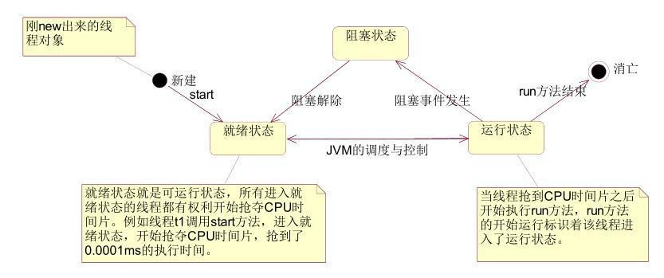


1. 新建：采用 new 语句创建完成
2. 就绪：执行 start 后
3. 运行：占用 CPU 时间
4. 阻塞：执行了 wait 语句、执行了 sleep 语句和等待某个对象锁，等待输入的场合
5. 终止：退出 run()方法

### 线程的调度与控制

通常我们的计算机只有一个 CPU，CPU 在某一个时刻只能执行一条指令，线程只有得到 CPU
时间片，也就是使用权，才可以执行指令。在单 CPU 的机器上线程不是并行运行的，只有在
多个 CPU 上线程才可以并行运行。  
Java 虚拟机要负责线程的调度，取得 CPU 的使用权，目前
有两种调度模型：**分时调度模型和抢占式调度模型**，**Java 使用抢占式调度模型**。  

**分时调度模型**：所有线程轮流使用 CPU 的使用权，平均分配每个线程占用 CPU 的时间片  
**抢占式调度模型**：优先级高的线程获取 CPU 的时间片相对多一些，如果线程的优先级相同，
那么会随机选择一个  

#### 线程优先级

* 线程优先级主要分三种`MAX_PRIORITY`、`MIN_PRIORITY`、`NORM_PRIORITY`（static int）
* 设置优先级的方法是`setPriority();`

#### 线程休眠

* `static void sleep(long millis)`
* 当一个线程遇到sleep()方法时就会睡眠，进入到阻塞状态，放弃CPU，腾出CPU时间片给其它线程用。当睡眠时间到达了，线程会进入可运行状态，得到 CPU 时间片继续
  执行，如果线程在睡眠状态被中断了，将会抛出`IterruptedException`异常。

#### 线程让先

* `static void yield()`
* 与`sleep()`类似，只是不能由用户指定暂停多长时间，并且**只能让同优先级的线程有执行的机会**

#### 线程合并

* `void join()` 等待该线程终止。 
* `void join(long millis)` 等待该线程终止的时间最长为 millis 毫秒。 
* `void join(long millis, int nanos)` 等待该线程终止的时间最长为 millis 毫秒 + nanos 纳秒 
* 调用后当前线程会被阻塞不再执行，直到被调用的线程执行完毕，当前线程才会执行

#### 休眠停止

##### `interuppt()`

* `void interrupt()` 
* 不建议使用，因为盲目停止可能会丢失数据。  

##### 标记停止

```java
package com.javase.thread;

public class ThreadTest05 {
    public static void main(String[] args) {
        test5 t = new test5();
        Thread th = new Thread(t);
        th.setName("t");
        th.start();
        try {
            Thread.sleep(5 * 1000);
        } catch (InterruptedException e) {
            e.printStackTrace();
        }
        // th.stop(); // 这个方式已经落后了
        t.run = false;
    }
}
class test5 implements Runnable {
    boolean run = true;

    @Override
    public void run() {

        for (int i = 0; i < 10; i++) {
            if(run == true) {
                System.out.println(Thread.currentThread().getName() + "--->" + i);
                try {
                    Thread.sleep(1 * 1000);
                } catch (InterruptedException e) {
                    e.printStackTrace();
                }
            } else {
                //可以在这里写遗言
                return;
            }
        }
    }
}

```

### 线程同步

#### 为什么要使用线程同步

当两个线程同时操作修改了同一个对象的成员变量时，可能会出现线程安全问题，如果想要得到正确的结果必须采用线程同步，加锁。

#### 线程同步的使用

什么时候要使用线程同步呢？  

1. 多线程并发
2. 有共享数据
3. 共享数据有修改的行为

##### 线程同步的语法机制

1. 同步代码块
   * `synchronized(线程共享对象) {同步代码块}`
   * 灵活
2. 在实例方法上使用`synchronized`
   * `public synchronized void fun() {}`
   * 表示共享对象一定是this
   * 并且同步代码块是整个方法体。
3. 在静态方法上使用`synchronized`
   * `public synchronized static void fun() {}`
   * 表示找类锁。
   * 类锁永远只有1把，无论创建了多少个对象，那类锁也只有一把。

##### 死锁

在使用线程同步的时候应该避免多重线程同步嵌套

```java
package com.javase.thread;

public class DeadLockTest {
    public static void main(String[] args) {
        Object o1 = new Object();
        Object o2 = new Object();
        Thread t1 = new Thread(new Mythread01(o1,o2));
        Thread t2 = new Thread(new Mythread02(o1,o2));
        t1.start();
        t2.start();
    }
}
class Mythread01 implements Runnable{
    private Object o1;
    private Object o2;
    public Mythread01(Object o1, Object o2) {
        this.o1 = o1;
        this.o2 = o2;
    }

    @Override
    public void run() {
        synchronized (o2) {
            try {
                Thread.sleep(1000);
            } catch (InterruptedException e) {
                e.printStackTrace();
            }
            synchronized (o1) {

            }
        }
    }
}
class Mythread02 implements Runnable{
    private Object o1;
    private Object o2;
    public Mythread02(Object o1, Object o2) {
        this.o1 = o1;
        this.o2 = o2;
    }

    @Override
    public void run() {
        synchronized (o1) {
            try {
                Thread.sleep(1000);
            } catch (InterruptedException e) {
                e.printStackTrace();
            }
            synchronized (o2) {

            }
        }
    }
}
```

#### 怎样避免线程安全的问题呢

1. 尽量使用局部变量代替实例变量和静态变量
2. 如果是实例变量可以考虑创建多个对象
3. 如果以上方法都不可取，那就只能`synchonized`

### 守护线程

* 从线程本身分类可以分为
  1. 用户线程（以上都是用户线程）
  2. 守护线程
* 当所有的用户线程结束，守护线程都会结束生命周期。
* 只要有一个用户线程存在，那么，守护线程就不会消失。
* java中的垃圾回收器就是一个守护线程，只有应用程序中所有的线程消失，那么，它才会结束。
* **使用方法**：线程启动前调用`setDaemon(true);`实例方法。

### 定时器

#### 定时器的作用

* 间隔特定的时间，执行特定的程序。
* `java.util.Timer`

```java
import java.text.ParseException;
import java.text.SimpleDateFormat;
import java.util.Date;
import java.util.Timer;
import java.util.TimerTask;

public class TimerTest {
    public static void main(String[] args) {
        Timer timer = new Timer();
        SimpleDateFormat sdf = new SimpleDateFormat("yyyy-MM-dd  HH:mm:ss");
        try {
            Date fristTime = sdf.parse("2021-07-11  14:43:20");
            timer.schedule(new TimerTaskTest(), fristTime, 1000 * 5);
        } catch (ParseException e) {
            e.printStackTrace();
        }

    }
}
class TimerTaskTest extends TimerTask {
    public void run() {
        SimpleDateFormat sdf = new SimpleDateFormat("yyyy-MM-dd  HH:mm:ss");
        Date d = new Date();
        String strdate = sdf.format(d);
        System.out.println(strdate + "备份了数据");
    }
}
```

```java
    public static void main(String[] args) {
        ScheduledExecutorService scheduledExecutorService = Executors.newScheduledThreadPool(10);
        scheduledExecutorService.scheduleAtFixedRate(() -> {
            System.out.println("定时任务");
        }, 1,3, TimeUnit.SECONDS);
    }

```

### `Callable`接口

* 优点：可以获取到线的执行结果
* 缺点：效率降低，在获取线程结果的时候，当前线程会阻塞。

```java
FutureTask ft = new FutureTask(new FutureTest()); // 创建一个FutureTask对象，并传入一个Callable接口，实现call方法地，可以使用匿名内部类
Thread th = new Thread(ft); // 传入
ft.get(); // 获取返回值
```

### `wait()`方法和`notify()`方法

* `wait()`方法和`notify()`方法不是线程对象的方法，是`Object`的方法，所以不能通过线程对象调用。
* 作用：
  * `o.wait()`：让`o`对象上的活动线程进入无限期等待，直到被唤醒为止。
  * `o.notify()`：唤醒正在`o`对象上等待的线程。
  * `o.notifyAll()`：唤醒正在`o`对象上所有处于等待的线程。

#### 互锁

```java
class EvenNum implements Runnable {
    private Num num;

    public EvenNum() {
    }
    public EvenNum(Num num) {
        this.num = num;
    }

    public void run() {
        while(true) {
            synchronized (num) { // 要加同一把锁
                if (num.getI() % 2 == 0) {
                    try {
                        num.wait();
                    } catch (InterruptedException e) {
                        e.printStackTrace();
                    }
                }
                
                //执行代码
                
                num.notify();
            }
        }
    }
}
```

************************************************************

## 十、反射

### 反射的基本概念


什么是反射机制？

>Java反射机制是在程序的运行过程中，对于任何一个类，都能够知道它的所有属性和方法；对于任意一个对象，都能够知道调用它的任意属性和方法，这种动态获取信息以及动态调用对象方法的功能称为java语言的反射机制。（来源于百度百科）  

简单的说，反射机制可以操作字节码，可以让程序更加的灵活。  

* 包：`java.lang.reflect.*`
* 相关的主要的类
  * `java.lang.Class`
  * `java.lang.reflect.Method`
  * `java.lang.reflect.Constructor`
  * `java.lang.reflect.Field`
* Java的反射机制提供了以下几个功能
  * 在运行时判断任意一个对象所属的类
  * 在运行时构造任意一个类的对象
  * 在运行时判断任意一个类所有的成员变量和方法
  * 在运行时调用任意一个对象的方法

### Class类

`java.lang.Class`
**构造`Class`类的三种方式：**

1. `Class c = Class.forName("java.lang.String");`
   * 如果你只希望一个类的静态代码块执行`static{}`，其它一律不执行，`Class.forName("完整类名");`.
   * **这个方法会导致类加载，静态代码块执行。**
2. `Class c = 对象.getClass();`
3. `Class c = 类型.class`

获取了Class对象后可以调用无参数的构造方法来实例化对象。

```java
Class c = Class.forName("java.util.Date");
Object o = c.newInstance(); // JDK9之后过时
```

如果你只希望一个类的静态代码块执行`static{}`，其它一律不执行(JDBC)。  
`Class.forName("完整类名");`  
这个方法会导致类加载，静态代码块执行。  

#### 常用方法

* `public String getName()` 返回这个类对象的全名
* `public String getSimpleName()` 返回这个类的第简名
* `public static Class<?> forName(String className)` 根据类名得一个类对象的引用
* `public T newInstance()` 实例化对象表示的对象引用
* `public Field getField(String name)` 获得某个public的属性对象
* `public Field[] getFields()` 获得所有public的属性对象
* `public Field getDeclaredField(String name)`获得某个属性对象
* `public Field[] getDeclaredFields()` 获得所有的属性对象
* `public Method getDeclaredMethod(String name,Class<?>... parameterTypes)` 返回一个方法对象，指定方法名，形参列表

### Field属性

#### 常用方法

* `public Object get(Object obj)` 返回属性的值
* `public void set(Object obj,Object value)` 写入实例化类的属性值
* `public String getName()`
* `public Class<?> getType()` 返回属性的类型
* `public int getModifiers()` 返回属性的修饰符配合`Modifier.toString()`

### Method方法

#### 常用方法

* `Object invoke(Object obj, Object... args)` 调用Class对象的方法，指定对象和形参列表

*********************************

## 十一、注解

### 什么是注解

* 注解是一种引用数据类型，编译之后也是生成class文件
* 语法格式：`@注解类型名`
* 定义`[修饰符列表] @interface 注解类型名{  }`
* 注解可以出现在类上、属性上、方法上、变量上等....还可以出现在注解类型上。
* 注解中可以添加属性值，i当加入了属性值后，注解的后面必需赋值，除非在定义属性值时定义了默认值default。
* 属性值可以是基本数据类型，和引用数据类型，数组，枚举
* 当只有一个属性值，并且名字是“value”时，赋值名字可以省略

```java
public @interface MyAnnotation {
    String str();
    int value() default 10;
}
```

### JDK内置注解

* `java.lang`Deprecated 表示已过时，不推荐使用，或已经有了更好的方式
* `java.lang`Override 表示方法是重写方法，只能注解方法

#### 元注解

* 用来标注注解类型的注解
* `Target` 
  * `java.lang.annotation.Target`
  * `@Target(ElementType.METHOD)`：表示“被标注的注解”只能出现在方法上。
  * `@Target(value={CONSTRUCTOR, FIELD, LOCAL_VARIABLE, METHOD, PACKAGE, MODULE, PARAMETER, TYPE})`表示该注解可以出现在：构造方法上、字段上、局部变量上、方法上、类上
* `Retention`
  *  `java.lang.annotation.Retention`
  *  `@Retention(value=RetentionPolicy.RUNTIME)`表示注解可以出现在Class文件中并且可以被反射
  *  `@Retention(RetentionPolicy.SOURCE)` 出现在源代码中
  *  `@Retention(RetentionPolicy.CLASS)` 出现在class文件中

```java
public @interface Retention {
	//属性
	RetentionPolicy value();
}

RetentionPolicy的源代码：
public enum RetentionPolicy {
	 SOURCE,
	 CLASS,
	 RUNTIME
}

//@Retention(value=RetentionPolicy.RUNTIME)
@Retention(RetentionPolicy.RUNTIME)
public @interface MyAnnotation{}
```