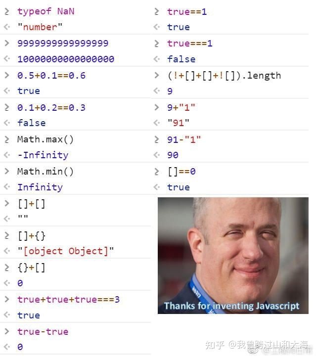

# JavaScript

## 目录

[TOC]

## JavaScript概述

* JavaScript是一种脚本语言（以下称为JS）
* JavaScript主要用来打哈哈和HTML中的结点，产生动态效果。
* JavaScript包括三块：ECMAScript、DOM、BOM
    * ECMAScript是ECMA制定的262标准，JavaScript和JScript都遵守这个标准，ECMAScript是JavaScript核心语法
    * DOM编程是通过JavaScript对HTML中的dom节点进行操作，DOM是有规范的，DOM规范是W3C制定的。（Document Object Model：文档对象模型）
    * BOM编程是对浏览器本身操作，例如：前进、后退、地址栏、关闭窗口、弹窗等。由于浏览器有不同的厂家制造，所以BOM缺少规范，一般只是有一个默认的行业规范。（Browser Object Model：浏览器对象模型）

### 真是个奇妙的语言



## 嵌入JS的三种方式

### 行间事件

* `<input type="button" value="hello" onclick="window.alert('hello js')" />`
    * `window`是JS中的内置BOM顶级对象，代表当前浏览器窗口。
    * `window`对象有一个`alert()`函数，该函数可以在浏览器上弹出消息框。
* JS中的任何一个事件都对应一个事件句柄，例如鼠标单击事件click，对应的事件句柄就是onclick，事件句柄都是以标签的属性方式存在。在事件句柄后面可以编写JS代码，当触发这个事件之后，这段JS代码则执行了。

### 页面Script标签嵌入

* `<script type="text/javascript">JS代码</script>`
* 一个页面中可以写多个脚本块
* 脚本块的位置没有限制
* 暴露在脚本块中的JS代码在页面打开的时候遵循自上而下的顺序依次逐行执行


### 外部引入

* `<script type="text/javascript" src="js文件路径"></script>`
* `<script type="text/javascript" src="js文件路径">`这里不能写JS代码`</script>`
* 这种写法错误：`<script type="text/javascript" src="js文件路径"/>`

## 标识符、变量、函数

标识符与Java类似

### 变量的声明与赋值

* 变量未赋值，系统默认值为`undefined`。
* JS是一种弱类型的编程语言，一个变量可以接收任何类型的值。
* 在函数体内用`var`声明的变量是全局变量,函数执行结束后，变量释放。
* 在函数体外声明的变量是全局变量。
* **如果不使用`var`关键字声明变量，不论在哪个位置，它都是全局变量**。
* 全局变量在浏览器关闭时销毁。
* 没有`var`关键字，声明变量要手动赋值。
* null NaN undefined三者类型不同，null和undefined的值可以等同

### 函数

#### 定义函数的两种语法

第一种  

```
function 函数名(形式参数列表){
	函数体;
}
```

第二种，定义一个变量，值是一个匿名函数  

```
函数名 = function(形式参数列表){
	函数体;
}
```

* JS函数不能同名，没有重载机制
* 点击按钮，调用函数

```
<input type="button" value="hello" onclick="sayHello();"/>

<script type="text/javascript">
	function sayHello(){
		alert("hello js");
	}
</script>
```

### 回调函数

* 因为函数是可以`var func = function() {}`这样定义的
* 所以，函数名也可以看作一个**参数**
* 把一个函数以**参数的形式**传递出去，这个函数将在某一时刻**被调用**（调用者是函数的接收方）, 【回调函数】

```javascript
// 定义一个回调函数
function callback(data) {
    console.log(data);
}

// 函数的接收方
function call(fn) {
    fn(123) // 回调函数执行
}

// 把 callback 这个函数以 形参 的形式发给 call 函数
call(callback) 
```

### 箭头表达式

* 语法：`(x, y) => x - y;`
* 包围参数列表的小括号`()`
    * 无参(一定要写括号):`() => {...}`
    * 1个参数(括号可省略):`x => {...}`
    * 多个参数(一定要写括号)：`(x, y) => {}`
* 包围函数体的大括号`{}`
    * 如果只有返回语句，可以省略{}和return关键字，直接写返回值。
    * 但如果返回值是object类型，应该用()包围对象。
        * 如`num => ({age:num})`。否则返回值为undefined。
        * 原因见JS中的`{}`,`()`及自调用
    * 如果有多条语句，函数体用`{}`括起来，不可省略。
* **普通函数中 this 指向的是函数的调用者**
* **箭头函数的 this 指向上下文对象**

```
<script>
    var person = {
        name: "zhangsan",
        log: function() {
            // 能正常使用 this 因为 log 函数的调用者正是 person
            console.log(this.name);
            setInterval(function() {
                // 不能正常输出，因为这个函数的调用者是 setInterval 
                console.log(this.name);
            },500)
        },
    };
    person.log()
</script>
```

### typeof运算符

```
typeof "John"                // 返回 string
typeof 3.14                  // 返回 number
typeof false                 // 返回 boolean
typeof [1,2,3,4]             // 返回 object
typeof {name:'John', age:34} // 返回 object
typeof null                  // object
```

### 数据类型

* **number**类型除了普通的数字外，还有NaN、Infinity
    * 在JS中可以0为除数，`number / 0 == Infinity`
    * `isNaN()`判断 是不是 非数字
        * 会选尝试把传入数据转成一个数字(true, false, '123')
    * `Number()`把不是一个数字的类型转换成 数字
        * 转换失败为NaN
    * `parseInt()`把 数字字符串 转换成数字，只取整数位，不会四舍五入
    * `Math.ceil()`向上取整
* **boolean**
    * `Boolean()`把非布尔转换为布尔类型
        * 有数据就是true，无数据就是false
        * 这个函数会在隐式调用
* **String**
    * 不同字符串的创建有不同的类型
        * `var str = ""`string类型
        * `var str = new String("");`object类型
    * 常用函数
        * `charAt()`获取指定下标位置的字符
        * `concat()`连接字符串
        * `indexOf()`获取某个字符串在当前字符串中第一次出现处的索引
        * `lastIndexOf()` 获取某个字符串在当前字符串中最后一次出现处的索引
        * `replace()`替换
        * `split()` 拆分字符串
        * `substr(startIndex, length)` 截取字符串
        * `substring(startIndex, endIndex)` 截取字符串, 不包括endIndex
        * `toLowerCase()`转小写
        * `toUpperCase()`转大写
* **Object**
    * 在JS当中内置了一个类型Object，可以将Object类型看做是所有对象的超类/基类。
    * 在JS当中默认定义的类型，没有特殊说明的话，默认继承Object。
    * 属性：
	    * `prototype` 属性，可以给对象动态扩展方法
	    * `constructor` 属性
	* 方法：
	    * `toLocaleString` 方法
	    * `toString` 方法
	    * `valueOf` 方法

```
var obj = new Object();
// 扩展方法
Object.prototype.doSome = function(){
	console.log("测试prototype属性！~~~")
}
// 扩展属性
Object.prototype.username = "zhangsan"

// 调用doSome方法
obj.doSome()
// 访问对象的username属性
console.log(obj.username)
```

### 类的定义

```
//第一种方式：
function 类名(形式参数列表){

    this.属性名 = 参数;
    this.属性名 = 参数;
    
    this.方法名 = function(){

}
}
//第二种方式：
类名 = function(形式参数列表){

    this.属性名 = 参数;
    this.属性名 = 参数;
    
    this.方法名 = function(){
    
    }
}
```

## 事件

### 常用事件

* `blur`失去焦点
* `focus`获得焦点
* `click`鼠标单击
* `dblclick`鼠标双击
* `keydown`键盘按下
* `keyup`键盘弹起
* `mousedown`鼠标按下
* `mouseover`鼠标经过
* `mousemove`鼠标移动
* `mouseout`鼠标离开
* `mouseup`鼠标弹起
* `reset`表单重置
* `select`文本被选定
* `load`**页面加载完毕后执行**
* `submit`表单提交
* `change`下拉列表选中项改变，或文本框内容改变

### 注册事件

#### 第一种方式

* 页面加载时会先注册事件
* 只有当事件发生时，函数才会执行
* 在事件句柄中调用的函数被称为**回调函数**

```
<input type="button" value="hello jack" onclick="sayHello()"/>
```

#### 第二种方式

根据标签元素id获取标签节点  

```
var el = document.getElementById("id");
el.属性 =  ;
```

那么就可以这么这么写  

```
<body>
    <input type="button" value="按钮" id="btn">
    
    <script type="text/javascript">
    			
        function sum(){
        	console.log("sum function invoke!")
        }
        
        var hellobtnElt = document.getElementById("btn");
        // 函数名不能有括号
        hellobtnElt.onclick = sum;
    </script>
</body>
```

这里html代码写在了script代码的上边，是可以正常执行的，如果html在script代码的下边，由于是顺序执行，script中在注册事件时是会找不到id。  

```
<body>
    <script type="text/javascript">
        // 匿名函数
        // load事件会在页面加载完后触发
        window.onload = function() { 
            var el = document.getElementById("btn");
            
            el.onclick = function() {
                console.log("按钮按下");
            }
        }
    </script>
    
    <input type="button" value="按钮" id="btn">
</body>
```

### 捕捉键值

* 在触发事件中的回调函数时，会传一个形式参数对象，这个形式参数对象有一个`keyCode`属性，属性是一个键值
* 回车的键值是13
* ESC的键值是27

```
<body>
    <script type="text/javascript">
        window.onload = function() {
            var el = document.getElementById("text");
            el.onkeydown = function(y) {
                if(y.keyCode == 13) {
                    console.log("回车按下");
                }
            }
        }
    </script>
    <input type="text" value="" id="text">
</body>
```


## void运算符

* `javascript:`可以在html代码中指定JS语句
* `void(表达式)`运算符的表达式没有返回值
* `<a href="javascript:void(0)" id="id1" onclick="">超链接</a>`废除掉href标签
* 如果想要在a标签的click函数中取得href的值，并不跳转链接，可以在click的回调函数最后`return false`
    * <https://blog.csdn.net/xuwoool/article/details/83916197>


## 控制语句

* `for....in...`
    * `for(var index in 遍历对象)`
    * 如果遍历对象是数组，index为下标;如果是对象,index是对象的属性
* `with(对象){}`
    * 在with中的代码不用以`对象.属性`的方式调用，直接用属性名即可


## 常用内置对象

### 数组

* 数组创建的方法
    * `var array = [元素, 元素, ...];`
    * `var array = new Array();`
* JS中的数组可以有不同类型的元素
* JS中的数组不会有数组下标越界异常，当放入元素数组位置超过数组容量，数组会自动扩容。
* 数组没有元素的位置值为`undefined`

#### 常用函数

* `push()`压栈
* `pop()`弹栈，返回弹出元素
* `reverse()`数组元素反转
* `join()`数组以传入串连接，返回字符串
* `array.splice(index, howmany, item1, ....., itemX)`
    * 方法向/从数组添加/删除项目，并返回删除的项目。
    * `index`	必需。整数，指定在什么位置添加/删除项目，使用负值指定从数组末尾开始的位置。
    * `howmany`	可选。要删除的项目数。如果设置为 0，则不会删除任何项目。
    * `item1, ..., itemX`	可选。要添加到数组中的新项目。
* `array.sort(function(a, b){return a - b});`

### Date

* `new Date()`返回一个时间(Sat Dec 11 2021 16:10:32 GMT+0800 (中国标准时间))
* `getFullYear`获取年
* `getMonth`获取月-1（0-11）
* `getDate`获取日
* `getDay`获取星期
* `toLocaleString()`获取当前地区格式时间和日期
* `toLocaleDateString()`获取当前地区格式日期
* `toLocaleTimeString()`获取当前地区格式时间
* `getTime()`获取当前Unix时间戳


## DOM

BOM: Browser Object Model（浏览器对象模型），通过BOM的对象和方法可以完成浏览器窗口的操作，例如：关闭浏览器，前进，后退，修改地址栏上的地址等，这些操作都属于BOM。**BOM的顶级内置对象是window**。  
DOM: Document Object Model（文档对象模型），通过DOM的对象和方法可以完成网页中元素的增删改，让网页产生动态效果，**DOM的顶级内置对象是document**。  

### document对象常用方法

添加事件处理程序  
`document.getElementById(id).onclick = function(){code}`	向 onclick 事件添加事件处理程序

查找 HTML 元素
  方法                        |            描述
--------------------------------------|----------------------------------
document.getElementById(id)           | 通过元素 id 来查找元素
document.getElementsByTagName(name)   | 通过标签名来查找元素
document.getElementsByClassName(name) | 通过类名来查找元素

改变 HTML 元素
方法|	描述
-|-
element.innerHTML = new html content |	改变元素的 inner HTML
element.attribute = new value |	改变 HTML 元素的属性值
element.setAttribute(attribute, value) |	改变 HTML 元素的属性值
element.style.property = new style	| 改变 HTML 元素的样式

添加和删除元素
方法 |	描述
-|-
document.createElement(element)	| 创建 HTML 元素
document.removeChild(element)	| 删除 HTML 元素
document.appendChild(element)	| 添加 HTML 元素
document.replaceChild(element)	| 替换 HTML 元素
document.write(text)	| 写入 HTML 输出流

### innerHTML和innerText

* `innerHTML`用来修改HTML的内容，HTML语法是生效的
* `innerText`修改文本内容，HTML语法不会生效

### 定时执行函数

* `setInterval("function()", 100ms)`周期性100ms执行function函数
* `clearInterval()`停止周期性调用


### DOM CSS

```
document.getElementById(id).style.property=新样式
```


## BOM

### 弹出框

* `window.alert("sometext");`警告框
* `window.confirm("sometext");`确认框，返回true或false
* `window.prompt("sometext","defaultvalue");`输入值，返回输入文本
* **会阻塞页面的加载**

### 窗口层级

* `setTop()`将当前窗口设为顶级窗口
* `window.top`就是当前窗口对应的顶级窗口.
* `window.self`表示当前自己这个窗口

```
if(window.top != window.self){
	window.top.location = window.self.location;
}
```
### 窗口的前进与后退

* `window.history.back();`窗口后退一步
* `window.history.go(-1);`窗口后退一步
* `Window history.forward();`窗口前进一步
* `window.history.go(1);`窗口前进一步
* `window.history.go(0);`窗口刷新

### 页面跳转

* `window.open(url,target)`窗口开户并打开一个链接
    * `_self`当前窗口
    * `_blank`新窗口
    * `_parent`父级窗口
    * `_top`顶级窗口
* `window.close()`窗口关闭
* `window.location.href = "url"`
* `window.location = "url"`
* `document.location.href = "url"`
* `document.location = "url"`

#### location属性

```
http://localhost:8080/servlet/admin/hello5?name=%E5%BC%A0%E4%B8%89

location
Location {ancestorOrigins: DOMStringList, href: 'http://localhost:8080/servlet/admin/hello5?name=%E5%BC%A0%E4%B8%89', origin: 'http://localhost:8080', protocol: 'http:', host: 'localhost:8080', …}
    ancestorOrigins: DOMStringList {length: 0}
    assign: ƒ assign()
    hash: ""
    host: "localhost:8080"
    hostname: "localhost"
    href: "http://localhost:8080/servlet/admin/hello5?name=%E5%BC%A0%E4%B8%89"
    origin: "http://localhost:8080"
    pathname: "/servlet/admin/hello5"
    port: "8080"
    protocol: "http:"
    reload: ƒ reload()
    replace: ƒ replace()
    search: "?name=%E5%BC%A0%E4%B8%89"
    toString: ƒ toString()
    valueOf: ƒ valueOf()
    Symbol(Symbol.toPrimitive): undefined
```

### 页面属性

* `window.location.href` 返回当前页面的 href (URL)
* `window.location.hostname` 返回 web 主机的域名
* `window.location.pathname` 返回当前页面的路径或文件名
* `window.location.protocol` 返回使用的 web 协议（http: 或https:）
* `window.location.assign` 加载新文档
* `window.location.host` 获取地址和端口号

## JSON

* `eval()`可以把一个字符串当成一段JS代码执行
* 什么是JSON？、
    * JavaScript Object Notation（JavaScript标记对象）简称JSON。
* JSON是一种轻量级的数据交换格式。
* 什么是轻量级：
	* 体现在JSON的体积小。虽然一个小的体积可能表示的数据很多。
* JSON和XML都是非常标准的数据交换格式。
	* XML体积大，解析难度大。
	* JSON体积小，解析更容易。
	* XML和JSON相对比来说，XML的语法严格，json的语法相对松散。
* `JSON.stringify()`把JSON对象转换成JSON字符串
* `JSON.parse()`把JSON字符串成JSON对象

**如何创建JSON对象**  

```
var jsonObj = {
	"属性名" : 属性值,
	"属性名" : 属性值,
	"属性名" : 属性值,
	"属性名" : 属性值,
	"属性名" : 属性值,
	"属性名" : 属性值,
	....
}
```

* 属性值，可以是任意类型。
* JSON是一种无类型的对象，直接一个大括号包起来就是一个JSON对象了。
* []是数组对象，{}是JSON对象

**如何访问对象属性**  

* `对象名.属性名`
* `对象名["属性名"]`

**JSON对象的属性值可以是JSON对象**  

```
var user = {
    "username" : "zhangsan",
    "password" : "123",
    "email" : "zhangsan@123.com",
    "address" : {"city" : "深圳","street" : "宝安"}
}
```

**一个接收的字符串如何变成JOSN对象**  

```
var fromJavaJSON = "{\"name\":\"zhangsan\", \"age\":20}";  

window.eval("var stu = " + fromJavaJSON) 

console.log(stu.name + "," + stu.age)
```

## 正则表达式

* 常用元字符
    * `.` 匹配除换行符以外的任意字符 
    * `\w` 匹配字母或数字或下划线或汉字 
    * `\s` 匹配任意的空白符 
    * `\d` 匹配数字 
    * `\b` 匹配单词的开始或结束 
    * `^` 匹配字符串的开始 
    * `$` 匹配字符串的结束
* 常用限定字符
    * `*` 重复零次或更多次 0-N次
    * `+` 重复一次或更多次  1-N次
    * `?` 重复零次或一次  0或1次
    * `{n}` 重复n次  n次
    * `{n,}` 重复n次或更多次  n+次
    * `{n,m}` 重复n到m次  n到m次
    * **注意：数量永远匹配的都是前面的那个字符出现的次数。**
* 常用反义字符
    * `\W` 匹配任意不是字母，数字，下划线，汉字的字符 
    * `\S` 匹配任意不是空白符的字符 
    * `\D` 匹配任意非数字的字符 
    * `\B` 匹配不是单词开头或结束的位置 
    * `[^x]` 匹配除了x以外的任意字符 
    * `[^aeiou]` 匹配除了aeiou这几个字母以外的任意字符 
* 其它
    * `|` 表示或者
    * `[]`单个符号集，无论`[]`中有多少个符号，只匹配一个
    * `()`字符分组，一般用于多个字符重复
    * `[\u4E00-\u9FA5]`汉字
    * `[\u0000-\u00FF]`半角符号
    * `[\uFF00-\uFFFF]`全角符号
    * `[a-z]{1}` a到z所有的字符中的任意1个。
    * `[a-zA-Z0-9]{3,}`前面这堆中的任意字符至少出现3个。
    * `[1-9][0-9]{4,}`qq号的正则表达式，最小的qq号是10000
    * `[1-9]` 没有指定数量的时候，默认是1个。

### 正则匹配

```
var regExp = /^\w+([-+.]\w+)*@\w+([-.]\w+)*\.\w+([-.]\w+)*$/;
if(regExp.test(email)) {
    emailError.innerText = "";
} else {
    emailError.innerText = "邮箱格式不正确！";
    emailError.style.fontSize = "8px";
    emailError.style.color = "red";
}
```

## AJAX

* AJAX 即“Asynchronous Javascript And XML”（异步JavaScript和XML），是指一种创建交互式网页应用的网页开发技术。
* ajax 是一种浏览器**异步**发起请求。局部更新页面的技术。

```
// 获取AJAX请求对象
var xhr = new XMLHttpRequest();
//设置请求参数   (请求方式（POST/GET）,请求地址,是否异步（true/false）
xhr.open("POST","registerServlet",true);
// 回调函数
xhr.onreadystatechange = function() {
    if (xhr.readyState == 4 && xhr.status == 200) {
        //请求返回数据
        alert(xhr.responseText);
    }
}
var username = document.getElementById("username").value;
var password = document.getElementById("password1").value;
var email = document.getElementById("email").value
var concent = "username=" + username + "&password=" + password + "&email=" + email;
/*设置请求头 服务器知道参数用符号&间隔，
如果参数值中需要&，则必须对其进行编码。
编码格式就是application/x-www-form-urlencoded*/
xhr.setRequestHeader('Content-type','application/x-www-form-urlencoded');
/*发送请求 
如果是GET请求只需要在上面open的地址中加上参数即可
url?name=value&name=value&name=value*/
xhr.send(concent);

```


