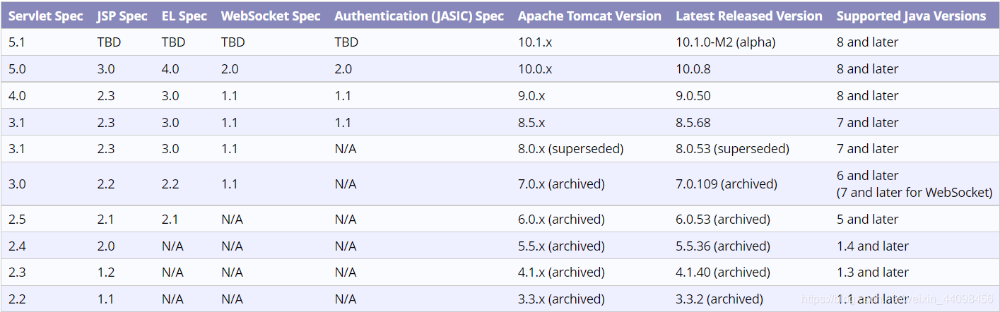
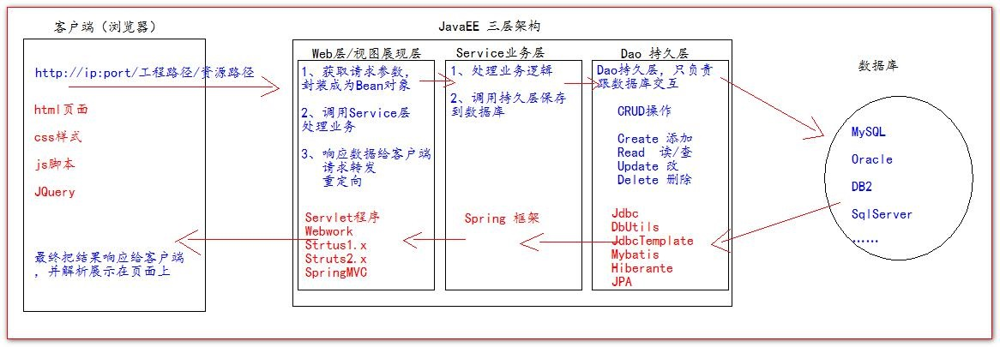
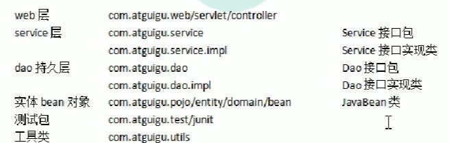
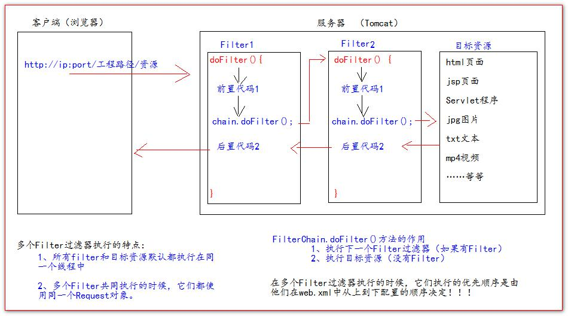

# JavaWeb学习笔记

## 目录

[TOC]

## 下载链接

* Tomcat：<https://tomcat.apache.org/>
* JSTL标签库：<https://tomcat.apache.org/taglibs/standard/>
* commons工具jar包：<https://commons.apache.org/>
* GSON：<https://search.maven.org/artifact/com.google.code.gson/gson/2.8.9/jar>
* GoogleKaptcha：<https://code.google.com/p/kaptcha/>

## Tomcat启动

1. 首先要配置好JDK的JAVA_HOME的环境变量，JAVA_HOME为JDK的安装目录
2. 进入Tomcat的bin目录，双击startup.bat脚本文件
3. 浏览器输入<http://localhost:8080>或<http://127.0.0.1:8080>
4. 双击shutdown.bat，关闭服务

### 可能会遇到的问题

#### 1. 启动闪退

没有配置好JAVA_HOME环境变量

#### 2. 启动CMD乱码

修改 tomcat 下的 conf/logging.properties这个文件 为 GBK

```
# java.util.logging.ConsoleHandler.encoding = UTF-8
java.util.logging.ConsoleHandler.encoding = GBK
```

### Tomcat版本选择

* Tomcat10更改了包名，用tomcat9及以下的版本依赖的项目，在tomcat10环境下可以无法运行。
* `javax`改为了`jakarta`
* Tomcat10版本避坑：<https://blog.csdn.net/qq_50596778/article/details/119579555?utm_source=app&app_version=4.21.0&code=app_1562916241&uLinkId=usr1mkqgl919blen>

```xml
<dependencies>
    <!--Servlet依赖-->
    <dependency>
      <groupId>javax.servlet</groupId>
      <artifactId>javax.servlet-api</artifactId>
      <version>3.1.0</version>
      <scope>provided</scope>
    </dependency>
    <!--Jsp依赖-->
    <dependency>
      <groupId>javax.servlet.jsp</groupId>
      <artifactId>javax.servlet.jsp-api</artifactId>
      <version>2.2.1</version>
      <scope>provided</scope>
    </dependency>
    <!--JSTL表达式依赖-->
    <dependency>
      <groupId>javax.servlet.jsp.jstl</groupId>
      <artifactId>javax.servlet.jsp.jstl-api</artifactId>
      <version>1.2.1</version>
    </dependency>
    <!--standard标签库-->
    <dependency>
      <groupId>taglibs</groupId>
      <artifactId>standard</artifactId>
      <version>1.1.2</version>
    </dependency>
</dependencies>
```




## IDEA创建Web项目（2020）

参考: <https://blog.csdn.net/weixin_43716048/article/details/108639475>

### IDEA工程JSP页面乱码

1. 服务器配置中
    * 将Vm option改为:`-Dfile.encoding=UTF-8`
    * 重启服务器，清除浏览器缓存，刷新页面
2. help ——>Edit Costom VM options-->idea64.exe.vmoptions
    * 末行加上`-Dfile.encoding=UTF-8`
3. File-->settings-->Editor-->Console-->DefaultEncoding-->UTF-8
4. tomcat下的 conf/logging.properties这个文件改回UTF-8

### JavaEE的三层架构



### 一个web项目的目录结构

* web 层 
    * `com.example.web/servlet/controller`
* service 层 
    * Service 接口包
        * `com.example.service`
    * Service 接口实现类
        * `com.example.service.impl`
* dao 持久层 
    * Dao 接口实现类
        * `com.example.dao`
    * Dao 接口包 
        * `com.example.dao.impl`
* 实体 bean 对象 
    * JavaBean 类
        * `com.example.pojo/entity/domain/bean`
* 测试包 `com.example.test/junit`
* 工具类 `com.example.utils`




## Servlet

* Servlet 是 JavaEE 规范之一。规范就是接口
* Servlet 就 JavaWeb 三大组件之一。三大组件分别是：Servlet 程序、Filter 过滤器、Listener 监听器。
* Servlet 是运行在服务器上的一个 java 小程序，它可以接收客户端发送过来的请求，并响应数据给客户端。

### Servlet实现方式

1. 编写一个类去实现 Servlet 接口
1. 实现 service 方法，处理请求，并响应数据
1. 到 web.xml 中去配置 servlet 程序的访问地址


```java
public class HelloServlet implements Servlet {
    /**
    * service 方法是专门用来处理请求和响应的
    * @param servletRequest
    * @param servletResponse
    * @throws ServletException
    * @throws IOException
    */
    @Override
    public void service(ServletRequest servletRequest, ServletResponse servletResponse) throws
    ServletException, IOException {
        System.out.println("Hello Servlet 被访问了");
        HttpServletRequest httpServletRequest = (HttpServletRequest) servletRequest;

        String method = httpServletRequest.getMethod();

        if("GET".equals(method)) {
            doGet(); // 执行GET请求处理
        }else if("POST".equals(method)) {
            doPost();
        }
    }
}
```

* `init()`先执行构造方法，然后就是此方法执行
* `ServletConfig()`方法
* `service()`第三次执行此方法，为servlet请求响应方法
* `getServletInfo()`方法
* `destroy()`servlet销毁执行方法

**web.xml**

```xml
<?xml version="1.0" encoding="UTF-8"?>
<web-app xmlns="http://xmlns.jcp.org/xml/ns/javaee"
    xmlns:xsi="http://www.w3.org/2001/XMLSchema-instance"
    xsi:schemaLocation="http://xmlns.jcp.org/xml/ns/javaee
    http://xmlns.jcp.org/xml/ns/javaee/web-app_4_0.xsd"
    version="4.0">
    <!-- servlet 标签给 Tomcat 配置 Servlet 程序 -->
    <servlet>
        <!--servlet-name 标签 Servlet 程序起一个别名（一般是类名） -->
        <servlet-name>HelloServlet</servlet-name>
        <!--servlet-class 是 Servlet 程序的全类名-->
        <servlet-class>com.atguigu.servlet.HelloServlet</servlet-class>
    </servlet>
    <!--servlet-mapping 标签给 servlet 程序配置访问地址-->
    <servlet-mapping>
        <!--servlet-name 标签的作用是告诉服务器，我当前配置的地址给哪个 Servlet 程序使用-->
        <servlet-name>HelloServlet</servlet-name>
        <!--url-pattern 标签配置访问地址 <br/>
        / 斜杠在服务器解析的时候，表示地址为：http://ip:port/工程路径
        <br/>
        /hello 表示地址为：http://ip:port/工程路径/hello
        <br/>
        -->
        <url-pattern>/hello</url-pattern>
    </servlet-mapping>
</web-app>
```

* `<servlet></servlet>`servlet 标签给 Tomcat 配置 Servlet 程序
    * `<servlet-name></servlet-name>`servlet程序的别名
    * `<servlet-class></servlet-class>`对应别名的全类名
* `<servlet-mapping></servlet-mapping>`给 servlet 程序配置访问地址
    * `<servlet-name><servlet-name>`告诉服务器，我当前配置的地址给哪个 Servlet 程序使用，对应上面的那个别名
    * `<url-pattern>/hello</url-pattern>`配置访问地址，解析为<http://ip:port/工程路径/hello>

#### HttpServlet类

一般在实际项目开发中，都是使用继承 HttpServlet 类的方式去实现 Servlet 程序。  

1. 编写一个类去继承 HttpServlet 类
2. 根据业务需要重写 doGet 或 doPost 方法
3. 到 web.xml 中的配置 Servlet 程序的访问地址


```java
public class HelloServlet2 extends HttpServlet {
    /**
    * doGet（）在 get 请求的时候调用
    * @param req
    * @param resp
    * @throws ServletException
    * @throws IOException
    */
    @Override
    protected void doGet(HttpServletRequest req, HttpServletResponse resp) throws ServletException,
    IOException {
        System.out.println("HelloServlet2 的 doGet 方法");
    }
    /**
    * doPost（）在 post 请求的时候调用
    * @param req
    * @param resp
    * @throws ServletException
    * @throws IOException
    */
    @Override
    protected void doPost(HttpServletRequest req, HttpServletResponse resp) throws ServletException,
    IOException {
        System.out.println("HelloServlet2 的 doPost 方法");
    }
}
```

如果重写了`init()`方法记得要写`super.init(config)`

### ServletConfig类

1. 可以获取 Servlet 程序的别名 servlet-name 的值
2. 获取初始化参数 init-param
3. 获取 ServletContext 对象

```xml
<servlet>
    <servlet-name>HelloServlet</servlet-name>
    <servlet-class>com.atguigu.servlet.HelloServlet</servlet-class>
    <!--init-param 初始化参数-->
    <init-param>
        <!--参数名-->
        <param-name>username</param-name>
        <!--参数值-->
        <param-value>root</param-value>
    </init-param>
    
    <init-param>
        <param-name>url</param-name>
        <param-value>jdbc:mysql://localhost:3306/test</param-value>
    </init-param>
</servlet>

<servlet-mapping>
    <servlet-name>HelloServlet</servlet-name>
    <url-pattern>/hello</url-pattern>
</servlet-mapping>
```


```java
@Override
public void init(ServletConfig servletConfig) throws ServletException {
    System.out.println("2 init 初始化方法");
    // 获取 Servlet 程序的别名 servlet-name 的值
    System.out.println("HelloServlet 程序的别名是:" + servletConfig.getServletName());
    // 获取初始化参数 init-param
    System.out.println("初始化参数 username 的值是;" + servletConfig.getInitParameter("username"));
    System.out.println("初始化参数 url 的值是;" + servletConfig.getInitParameter("url"));
    // 获取 ServletContext 对象
    System.out.println(servletConfig.getServletContext());
}
```

* 只有对应的`<servlet-class>`才能获取到对应`<init-param>`的值（一个标签内）


### ServletContext类

1. ServletContext 是一个接口，它表示 Servlet 上下文对象
2. 一个 web 工程，只有一个 ServletContext 对象实例，通常对应一个web.xml文件。
3. ServletContext 对象是一个域对象。
    * 什么是域对象?
        * 域对象，是可以像 Map 一样存取数据的对象，叫域对象。
        * 这里的域指的是存取数据的操作范围，整个 web 工程。
4. ServletContext 是在 web 工程部署启动的时候创建。在 web 工程停止的时候销毁


* `getRealPath()`获取绝对路径
* `getInitParameter()`获取context-param
* `setAttribute()`存数据
* `getAttribute()`取数据
* `removeAttribute()`删除数据

### GET和POST

- GET请求和POST请求如何选择，什么时候使用GET请求，什么时候使用POST请求？
    - 怎么选择GET请求和POST请求呢？衡量标准是什么呢？你这个请求是想获取服务器端的数据，还是想向服务器发送数据。如果你是想从服务器上获取资源，建议使用GET请求，如果你这个请求是为了向服务器提交数据，建议使用POST请求。
    - 大部分的form表单提交，都是post方式，因为form表单中要填写大量的数据，这些数据是收集用户的信息，一般是需要传给服务器，服务器将这些数据保存/修改等。
    - 如果表单中有敏感信息，还是建议适用post请求，因为get请求会回显敏感信息到浏览器地址栏上。（例如：密码信息）
    - 做文件上传，一定是post请求。要传的数据不是普通文本。
    - 其他情况都可以使用get请求。

* `getParameter("name")`通过传过来的name返回value
* `setCharacterEncoding("UTF-8")`设置编码
* `req.getParameterValues()`获取同名name的value数组

#### HttpServletRequest

每次只要有请求进入 Tomcat 服务器，Tomcat 服务器就会把请求过来的 HTTP 协议信息解析好封装到 Request 对象中。然后传递到 service 方法（doGet 和 doPost）中给我们使用。我们可以通过 HttpServletRequest 对象，获取到所有**请求**的信息。

##### 常用方法

* 请求地址相关
    1. `getRequestURI();`用户请求的URI（客户端相对路径）
    1. `getRequestURL()`获取请求的统一资源定位符（绝对路径）
    2. `getPathInfo()` 获取url-patten的相对路径，占位符处路径
    3. `getPathTranslated()` 返回 URL 中在 servlet 名称之后，在检索字符串之前的路径信息。
    1. `getServletPath();` 获取Servlet路径，不包含上下文、通配符
    2. `getQueryString();` get请求的请求参数`key1=value1&key2=value2`
* 请求参数相关
    1. `getParameter()`获取请求的参数
    1. `getParameterValues()`获取请求的参数（多个值的时候使用）
* 数据相关
    1. `setAttribute(key, value);`设置域数据
    1. `getAttribute(key);`获取域数据
    2. `getHeader()`获取请求头
* 请求客户端相关
    1. `getMethod();` GET还是POST
    1. `getRemoteHost()`获取客户端的 ip 地址
    1. `getRemoteAddr();` 远程IP，即客户端IP
    1. `getRemotePort();` 远程端口，即客户端端口
    1. `getRemoteUser();` 远程用户
    1. `getScheme();` 协议头，例如http
* 本机相关
    1. `getContextPath();` context路径
    2. `getLocale();` 用户的语言环境
    1. `getProtocol();` 获取协议类型
    1. `getLocalAddr();` 获取本地IP，即服务器IP
    1. `getLocalName();` 获取本地名称，即服务器名称
    1. `getLocalPort();` 获取本地端口号，即Tomcat端口号
    2. `getScheme()`获取协议名称
    2. `getServerName();` 服务器名称
    1. `getServerPort();` 服务器端口
* 其它
    1. `setCharacterEncoding("utf-8");` 设置request编码方式
    1. `getRequestDispatcher()`获取请求转发对象
    1. `getRequestedSessionId();` 客户端的Session的ID

##### 请求参数中文乱码

```
req.setCharacterEncoding("UTF-8");
```

##### 请求转发

```java
// 问路：Servlet2（柜台 2）怎么走
/**
* 请求转发必须要以斜杠打头，/ 斜杠表示地址为：http://ip:port/工程名/ , 映射到 IDEA 代码的 web 目录
*
*/
RequestDispatcher requestDispatcher = req.getRequestDispatcher("/servlet2");
requestDispatcher.forward(req,resp);
```

##### 请求转发到HTML页面中文乱码

一个HTML文件在集成开发创建时是UTF-8的格式，这个格式在IDE上应该可以设置，但在打开时是更具默认编码格式打开的（即ANSI），因此会产生乱码，当然，这只是找到了原因。而解决的办法就是将这个HTML以我们想要的格式打开，即UTF-8，但又不能设置pageEncoding，因此我们可以将HTML当作JSP处理，静态HTML是可以转成JSP的。  
在web.xml中加入以下片段，意思是，任何以html结尾的URL请求的资源，都已UTF-8格式打开  

```
<jsp-config>
    <jsp-property-group>
        <url-pattern>*.html</url-pattern>
        <page-encoding>UTF-8</page-encoding>
    </jsp-property-group>
</jsp-config>
```

参考：<https://www.cnblogs.com/Cl0ud/p/15322455.html>

#### HttpServletResponse

HttpServletResponse 类和 HttpServletRequest 类一样。每次请求进来，Tomcat 服务器都会创建一个 Response 对象传递给 Servlet 程序去使用。HttpServletRequest 表示请求过来的信息，HttpServletResponse 表示所有**响应**的信息.  
我们如果需要设置返回给客户端的信息，都可以通过 HttpServletResponse 对象来进行设置  

##### 打印数据

* 字节流
    * `getOutputStream();`
    * 常用于下载（传递二进制数据）
* 字符流
    * `getWriter();`
    * 常用于回传字符串（常用）
* 两个流同时只能使用一个。
* 使用了字节流，就不能再使用字符流，反之亦然，否则就会报错。
* `write("response's content!!!");`往客户端传数据

##### 响应乱码

```java
// 解决响应中文乱码方案一（不推荐使用）：
// 设置服务器字符集为 UTF-8
resp.setCharacterEncoding("UTF-8");
// 通过响应头，设置浏览器也使用 UTF-8 字符集
resp.setHeader("Content-Type", "text/html; charset=UTF-8");

// 解决响应中文乱码方案二（推荐）：
// 它会同时设置服务器和客户端都使用 UTF-8 字符集，还设置了响应头
// 此方法一定要在获取流对象之前调用才有效
resp.setContentType("text/html; charset=UTF-8");
```

1. 解决响应中文乱码方案一（不推荐使用）：
    * `resp.setCharacterEncoding("UTF-8");`设置服务器字符集为 UTF-8
    * `resp.setHeader("Content-Type", "text/html; charset=UTF-8");`通过响应头，设置浏览器也使用 UTF-8 字符集
2. 解决响应中文乱码方案二（推荐）：
    * `resp.setContentType("text/html; charset=UTF-8");`
    * 它会同时设置服务器和客户端都使用 UTF-8 字符集，还设置了响应头
    * **此方法一定要在获取流对象之前调用才有效**

##### 请求重定向

请求重定向，是指客户端给服务器发请求，然后服务器告诉客户端说。我给你一些地址。你去新地址访问。叫请求重定向（因为之前的地址可能已经被废弃）。

* 请求重定向的第一种方案：
    * `resp.setStatus(302);`设置响应状态码 302 ，表示重定向，（已搬迁）
    * `resp.setHeader("Location", "http://localhost:8080");`设置响应头，说明 新的地址在哪里
* 请求重定向的第二种方案（推荐使用）：
    * `resp.sendRedirect("http://localhost:8080");`

### BaseServlet

* 在代码编写中，每一个操作都要写一个Servlet程序，即同一个类的每种操作（例如：增、删、改、查）均需要一个Servlet去实现（一个doGet/doPost只能实现一种方法）。
* 可以写一个BaseServlet来降低代码的冗余。
* 将多个方法写到同一个servlet，通过子类继承BaseServlet
* 在html代码中访问servlet需要在地上加方法名称`url?action=方法名`
* **注意**：`getDeclaredMethod(String name, Class<?>... parameterTypes)`中要使用`.class`，不可使用`对象.getclass()`，因为`HttpServletRequest`和`HttpServletRespons`是两个接口
    * `.getClass()`是类的字节码对象, 而`.class` 是接口的字节码对象, 两者不相等

```java
public abstract class BaseServlet extends HttpServlet {

    @Override
    protected void doGet(HttpServletRequest req, HttpServletResponse resp) throws ServletException, IOException {
        doPost(req, resp);
    }

    protected void doPost(HttpServletRequest req, HttpServletResponse resp) throws ServletException, IOException {
        // 解决post请求中文乱码问题
        req.setCharacterEncoding("UTF-8");
        // 解决响应中文乱码问题
        resp.setContentType("text/html; charset=UTF-8");

        String action = req.getParameter("action");
        try {
            // 获取action业务鉴别字符串，获取相应的业务 方法反射对象
            Method method = this.getClass().getDeclaredMethod(action, HttpServletRequest.class, HttpServletResponse.class);
//            System.out.println(method);
            // 调用目标业务 方法
            method.invoke(this, req, resp);
        } catch (Exception e) {
            e.printStackTrace();
        }
    }
}
```

### Servlet3.0新特性

* 从tomcat7以上支持servlet3.0
* 参考：<https://blog.csdn.net/pan_junbiao/article/details/88414912>

#### 新增注解

* 使用注解就可以完成对servlet的映射，无需配置web.xml文件
* Servlet 3.0新增的注释有`@WebServlets`、`@WebFilter`、`@WebListener`、`@WebInitParam`等

##### @WebServlet注解

* 指定链接对servlet类程序的映射

| 属性名            | 类型             | 描述                                                                        |
|----------------|----------------|---------------------------------------------------------------------------|
| name           | String         | 指定Servlet的name属性，等价于&lt;servlet-name&gt;标签。如果没有显示指定，则该Servlet的取值即为类的全限定名。 |
| value          | String[]       | 该属性等价于urlPatterns属性。两个属性不能同时使用。                                           |
| urlPatterns    | String[]       | 指定一组Servlet的URL匹配模式，等价于&lt;url-pattern&gt;标签。                             |
| loadOnStartup  | int            | 指定Servlet的加载顺序，等价于&lt;load-on-startup&gt;标签。                              |
| initParams     | WebInitParam[] | 指定一组Servlet初始化参数，等价于&lt;init-param&gt;标签。                                 |
| asyncSupported | boolean        | 声明Servlet是否支持异步操作，等价于&lt;async-supported&gt;标签。                           |
| smallIcon      | String         | 此Servlet的小图标。                                                             |
| largeIcon      | String         | 此Servlet的大图标。                                                             |
| description    | String         | 该Servlet的描述信息，等价于&lt;description&gt;标签。                                   |
| displayName    | String         | 该Servlet的显示名，通常配合工具使用，等价于&lt;display-name&gt;标签。                          |


```java
@WebServlet(value = "/loginServlet")
public class LoginServlet extends HttpServlet {
    //省略代码
}
```

##### @WebInitParam注解

* @WebInitParam注释等价于web.xml文件中的<servlet>和<filter>的<init-param>子标签，该注释通常不单独使用，而是配合@WebServlet或者@WebFilter使用。

| 属性名         | 类型     | 描述                                     |
|-------------|--------|----------------------------------------|
| name        | String | 指定参数的名字，等价于&lt;param-name&gt;标签，必填项。   |
| value       | String | 指定参数的值，等价于&lt;param-value&gt;标签，必填项。   |
| description | String | 关于参数的描述，等价于&lt;description&gt;标签，非必填项。 |

```java
 
@WebServlet(urlPatterns = { "/simple" }, name = "SimpleServlet", 
initParams = { @WebInitParam(name = "username", value = "pan_junbiao") })
public class SimpleServlet extends HttpServlet
{
	// 省略了Servlet中间的代码
}
```

## JSP

* 什么是JSP
    * JSP(全称 Java Server Pages)是由 Sun 公司专门为了解决动态生成 HTML 文档的技术。
* 为什么要用JSP
    * 通过 Servlet 输出简单的html页面信息都非常不方便。那我们要输出一个复杂页面的时候，就更加的困难，而且不利于页面的维护和调试。所以 sun 公司推出一种叫做 jsp 的动态页面技术帮助我们实现对页面的输出繁锁工作。

### JSP的本质

* jsp 页面本质上是一个 Servlet 程序。
* 当我们第一次访问 jsp 页面的时候。Tomcat 服务器会帮我们把 jsp 页面翻译成为一个 java 源文件。并且对它进行编译成为.class 字节码程序。
* HttpJspBase 类。它直接地继承了 HttpServlet 类。也就是说。jsp 翻译出来的 java 类，它间接了继承了 HttpServlet 类。也就是说，翻译出来的是一个 Servlet 程序
* JSP翻译成servlet代码后，底层实现，也是通过输出流。把 html 页面数据回传给客户端。

### JSP的三种语法

#### JSP头部的`page`指令

```
<%@ page contentType="text/html;charset=UTF-8" language="java" %>
```

* jsp 的 page 指令可以修改 jsp 页面中一些重要的属性，或者行为。
* `language` 属性：表示jsp翻译后是什么语言文件。暂时只支持 java。
* `contentType` 属性：表示jsp返回的数据类型是什么。也是源码中`response.setContentType()`参数值
* `pageEncoding`属性：表示当前jsp页面文件本身的字符集。
* `import`属性：跟java源代码中一样。用于导包，导类。
* `autoFlush`属性：设置当out输出流缓冲区满了之后，是否自动刷新冲级区。默认值是true。
* `buffer`属性：设置out缓冲区的大小。默认是 8kb
* `errorPage`属性：设置当 jsp 页面运行时出错，自动跳转去的错误页面路径。
* `isErrorPage` 属性：设置当前 jsp 页面是否是错误信息页面。默认是 false。如果是 true 可以获取异常信息。
* `session` 属性：设置访问当前 jsp 页面，是否会创建 HttpSession 对象。默认是 true。
* `extends` 属性：设置 jsp 翻译出来的 java 类默认继承谁。

#### JSP中的常用脚本

##### 声明脚本（极少使用）

* 格式`<%!   声明 java 代码   %>`
* 可以给jsp翻译出来的java类定义**属性**和**方法**甚至是**静态代码块**。**内部类**等。

```java
<%--1、声明类属性--%>
<%!
    private Integer id;
    private String name;
    private static Map<String,Object> map;
%>

<%--2、声明 static 静态代码块--%>
<%!
    static {
        map = new HashMap<String,Object>();
        map.put("key1", "value1");
        map.put("key2", "value2");
        map.put("key3", "value3");
    }
%>

<%--3、声明类方法--%>
<%!
    public int abc(){
        return 12;
    }
%>

<%--4、声明内部类--%>
<%!
    public static class A {
        private Integer id = 12;
        private String abc = "abc";
    }
%>
```

##### 表达式脚本（常用）

* 格式：`<%=  表达式   %>`
* 作用：给JSP页面输出数据
* 特点：
    1. 所有的表达式脚本都会被翻译到`_jspService()`方法中
    2. 表达式脚本都会被翻译成为`out.print()`输出到页面上
    3. 由于表达式脚本翻译的内容都在`_jspService()`方法中,所以`_jspService()`方法中的对象都可以直接使用。
    4. **表达式脚本中的表达式不能以分号结束。**

```java
<%=12 %> <br>
<%=12.12 %> <br>
<%="我是字符串" %> <br>
<%=map%> <br>
<%=request.getParameter("username")%>
```

##### 代码脚本

* 格式：
```
<%
    Java代码块
%>
```
* 作用：可以在 jsp 页面中，编写我们自己需要的功能（写的是 java 语句）。
* 特点：
    1. 代码脚本翻译之后都在`_jspService()`方法中
    2. 代码脚本由于翻译到`_jspService()`方法中，所以在`_jspService()`方法中的现有对象都可以直接使用。
    3. 还可以由多个代码脚本块组合完成一个完整的java语句。
    4. 代码脚本还可以和表达式脚本一起组合使用，在jsp页面上输出数据


### JSP的三种注释

* HTML注释`<!--  单行注释 多行注释  -->`
* Java注释`//单行注释   /*多行注释*/`
* JSP注释`<%--  单行注释 多行注释  --%>`

### JSP的九大内置对象

1. `request`请求对象
1. `response`响应对象
1. `pageContext`JSP的上下文对象
1. `session`会话对象
1. `application`ServletContext对象
1. `config`ServletConfig对象
1. `out`JSP输出流对象
1. `page`当前JSP对象
1. `exception`异常对象

### JSP的四大域对象


1. `pageContext`(PageContextImpl 类)当前 jsp 页面范围内有效
1. `request`(HttpServletRequest 类)一次请求内有效
1. `session`(HttpSession类)一个会话范围内有效（打开浏览器访问服务器，直到关闭浏览器）
1. `application`(ServletContext 类)整个 web 工程范围内都有效（只要 web 工程不停止，数据都在）

* 域对象是可以像 Map 一样存取数据的对象。四个域对象功能一样。不同的是它们对数据的存取范围。
* 虽然四个域对象都可以存取数据。在使用上它们是有优先顺序的
* 四个域在使用的时候，优先顺序分别是，他们从小到大的范围的顺序。    
    

### out 输出和 response.getWriter 输出的区别

* response 中表示响应，我们经常用于设置返回给客户端的内容（输出）out 也是给用户做输出使用的。
* 当JSP页面所有代码执行完毕后会做以下两个操作
    1. 执行`out.flush()`操作，会把out缓冲区中的数据追加写入到`response`缓中区末尾
    2. 会执行`rasponse`的刷新操作。把全部数据写给客户端
* 由于 jsp 翻译之后，底层源代码都是使用out来进行输出，所以一般情况下。我们在 jsp 页面中统一使用out来进行输出。避免打乱页面输出内容的顺序。
* `out.write()` 输出字符串没有问题
* `out.print()` 输出任意数据都没有问题（都转换成为ASCII字符串后调用的 write 输出）
* **结论：在 jsp 页面中，可以统一使用 out.print()来进行输出**

### JSP常用标签

#### 静态包含

* `<%@ include file=""%>` 就是静态包含
    * file 属性指定你要包含的 jsp 页面的路径
    * 地址中第一个斜杠 / 表示为 `http://ip:port/工程路径/`映射到代码的 web 目录
* 静态包含的特点：
    1. 静态包含不会翻译被包含的 jsp 页面。
    2. 静态包含其实是把被包含的 jsp 页面的代码拷贝到包含的位置执行输出。

```
<%@ include file="/include/footer.jsp"%>
```

* html jqery页面静态包含：<https://www.cnblogs.com/futao123/p/5489966.html>
* 各种静态包含的方式：<https://blog.csdn.net/waillyer/article/details/106587002>

#### 动态包含

* `<jsp:include page=""></jsp:include>`
    * page 属性是指定你要包含的 jsp 页面的路径
    * 动态包含也可以像静态包含一样。把被包含的内容执行输出到包含位置
* 动态包含的特点：
    1. 动态包含会把包含的 jsp 页面也翻译成为 java 代码
    2. 动态包含底层代码使用如下代码去调用被包含的jsp页面执行输出。
        * `JspRuntimeLibrary.include(request, response, "/include/footer.jsp",out, false);`
    3. 动态包含，还可以传递参数

```
<jsp:include page="/include/footer.jsp">
    <jsp:param name="username" value="bbj"/>
    <jsp:param name="password" value="root"/>
</jsp:include>
```

#### 标签转发

* `<jsp:forward page=""></jsp:forward>`是请求转发标签，它的功能就是请求转发page属性设置请求转发的路径

```
<jsp:forward page="/scope2.jsp"></jsp:forward>
```

### Listener监听器

* 什么是Listener监听器？
    1. Listener 监听器它是JavaWeb的三大组件之一。JavaWeb的三大组件分别是：Servlet 程序、Filter过滤器、Listener监听器。
    2. Listener 它是 JavaEE 的规范，就是接口
    3. 监听器的作用是，监听某种事物的变化。然后通过回调函数，反馈给客户（程序）去做一些相应的处理。


#### ServletContextListener监听器

* `ServletContextListener`它可以监听`ServletContext`对象的创建和销毁。
* `ServletContext`对象在 web 工程启动的时候创建，在 web 工程停止的时候销毁。
* 监听到创建和销毁之后都会分别调用`ServletContextListener`监听器的方法反馈。
* 两个方法分别是：
    1. `public void contextInitialized(ServletContextEvent sce);`在`ServletContext`创建的时候马上调用，做初始化
    2. `public void contextDestroyed(ServletContextEvent sce);`在`ServletContext`销毁之后调用
* 如何使用`ServletContextListener`监听器监听`ServletContext`对象。
* 使用步骤如下：
    1. 编写一个类去实现`ServletContextListener`
    2. 实现其两个回调方法
    3. 到 web.xml 中去配置监听器
* `web.xml`配置

```
<!--配置监听器-->
<listener>
    <listener-class>com.atguigu.listener.MyServletContextListenerImpl</listener-class>
</listener>
```

## EL表达式     

### EL表达式简介

* EL 表达式的全称是：Expression Language。是表达式语言。
* EL 表达式的什么作用：EL 表达式主要是代替 jsp 页面中的表达式脚本在 jsp 页面中进行数据的输出。
* 因为 EL 表达式在输出数据的时候，要比 jsp 的表达式脚本要简洁很多。
* **EL 表达式的格式是：`${表达式}`**
* **EL 表达式在输出 null 值的时候，输出的是空串。jsp 表达式脚本输出 null 值的时候，输出的是 null 字符串。**

### EL表达式搜索数据的顺序

* EL 表达式主要是在 jsp 页面中输出数据。
* **只能输出域对象中的数据。**
* 当四个域中都有相同的key的数据的时候，EL表达式会按照四个域的**从小到大**的顺序去进行搜索，找到就输出。
    *  pageContext ====>>> request ====>>> session ====>>> application

### EL表达式输出值

1. `${域名称.键名称}`：从指定域中获取指定键的值
    * 域名称：
        1. pageScope            -->pageContext
        2. requestScope         -->request
        3. sessionScope         -->session
        4. applicationScope     -->application(ServletContext)
        * 举例：在request域中存储了name-->张三
        * 获取：`${requestScope.name}`
2. `${name}`:表示依次从最小的域中查找是否有该键对应的值，直到找到为止。
3. 获取对象  List集合 Map集合的值
      1. 对象:`${域名称.键名.属性名}` 如果属性名没有重复的可以去掉域名称
      *本质上会去调用对象的getter方法。
      2. List集合：`${域名称.键名[索引]}`
      3. Map集合：`${域名称.键名.key名称}` `${域名称.键名["key名称"]}`

### 运算符

#### 基本运算符

* 关系运算符
    * `==`为`eq`
    * `!=`为`ne`
    * `<`为`lt`
    * `>`为`gt`
    * `<=`为`le`
    * `>=`为`ge`
* 逻辑运算
    * `&&`为`and`
    * `||`为`or`
    * `!`为`not`
* 算术运算
    * `/`为`div`
    * `%`为`mod`
    * 其余不变
* 两种运算符都可使用

#### empty运算

* empty运算可以判断一个数据是否为空，如果为空，则输出true,不为空输出false。
    1. 值为 null 值的时候，为空
    2. 值为空串的时候，为空
    3. 值是 Object 类型数组，长度为零的时候
    4. list 集合，元素个数为零
    5. map 集合，元素个数为零

#### “.”点运算 和 [] 中括号运算符

* `.`点运算，可以输出 Bean 对象中某个属性的值。
* `[]`中括号运算，可以输出有序集合中某个元素的值。
* 并且`[]`中括号运算，还可以输出 map 集合中 key 里含有特殊字符的 key 的值。

### EL表达式的11个隐含对象

* EL 个达式中 11 个隐含对象，是 EL 表达式中自己定义的，可以直接使用。

变量       |类型               |作用
-----------|-------------------|-----------------
pageContext|PageContextImpl|它可以获取 jsp 中的九大内置对象
pageScope|Map<String,Object>|它可以获取 pageContext 域中的数据
requestScope|Map<String,Object>|它可以获取 Request 域中的数据
sessionScope|Map<String,Object>|它可以获取 Session 域中的数据
applicationScope|Map<String,Object>|它可以获取 ServletContext 域中的数据
param|Map<String,String>|它可以获取请求参数的值
paramValues|Map<String,String[]>|它也可以获取请求参数的值，获取多个值的时候使用。
header|Map<String,String>|它可以获取请求头的信息
headerValues|Map<String,String[]>|它可以获取请求头的信息，它可以获取多个值的情况
cookie|Map<String,Cookie>|它可以获取当前请求的 Cookie 信息
initParam|Map<String,String>|它可以获取在web.xml中配置的<context-param>上下文参数

#### 四大域对象

* EL 获取四个特定域中的属性
* pageScope======pageContext 域
* requestScope======Request 域
* sessionScope======Session 域
* applicationScope======ServletContext 域

#### pageContext 对象的使用

```
<%
    pageContext.setAttribute("req", request);
%>

```

1. 协议： ${ req.scheme }<br>
2. 服务器 ip：${ pageContext.request.serverName }<br>
3. 服务器端口：${ pageContext.request.serverPort }<br>
4. 获取工程路径：${ pageContext.request.contextPath }<br>
5. 获取请求方法：${ pageContext.request.method }<br>
6. 获取客户端 ip 地址：${ pageContext.request.remoteHost }<br>
7. 获取会话的 id 编号：${ pageContext.session.id }<br>


#### 其他隐含对象的使用


* `${ param.参数名 }`
* `${ paramValues.参数名[index] }`
* 输出请求头【User-Agent】的值：`${ header['User-Agent'] }`
* 输出请求头【Connection】的值：`${ header.Connection }`
* 输出请求头【User-Agent】的值：`${ headerValues['User-Agent'][0] }`
* 获取 Cookie 的名称：`${ cookie.JSESSIONID.name }`
* 获取 Cookie 的值：`${ cookie.JSESSIONID.value }` 
* 获取<context-param>的参数值
    * `${ initParam.参数名 }`


## JSTL标签库

* JSTL 标签库 全称是指 JSP Standard Tag Library
JSP标准标签库。是一个不断完善的开放源代码的 JSP 标签库。
* EL 表达式主要是为了替换jsp中的表达式脚本，而标签库则是为了替换代码脚本。这样使得整个 jsp 页面变得更佳简洁。

JSTL 由五个不同功能的标签库组成。

功能范围|URI|前缀
-|-|-
核心标签库--重点|http://java.sun.com/jsp/jstl/core|c
格式化|http://java.sun.com/jsp/jstl/fmt|fmt
函数|http://java.sun.com/jsp/jstl/functions|fn
数据库(不使用)|http://java.sun.com/jsp/jstl/sql|sql
XML(不使用)|http://java.sun.com/jsp/jstl/xml|x

在 jsp 标签库中使用 taglib 指令引入标签库

```
CORE 标签库
<%@ taglib prefix="c" uri="http://java.sun.com/jsp/jstl/core" %>
XML 标签库
<%@ taglib prefix="x" uri="http://java.sun.com/jsp/jstl/xml" %>
FMT 标签库
<%@ taglib prefix="fmt" uri="http://java.sun.com/jsp/jstl/fmt" %>
SQL 标签库
<%@ taglib prefix="sql" uri="http://java.sun.com/jsp/jstl/sql" %>
FUNCTIONS 标签库
<%@ taglib prefix="fn" uri="http://java.sun.com/jsp/jstl/functions" %>
```

### 使用方法

1. 先导入 jstl 标签库的 jar 包。
    * taglibs-standard-impl-1.2.1.jar
    * taglibs-standard-spec-1.2.1.jar
    * 下载地址：<https://tomcat.apache.org/taglibs/standard/>
2. 第二步，使用 taglib 指令引入标签库。
    * `<%@ taglib prefix="c" uri="http://java.sun.com/jsp/jstl/core" %>`

### <c:set />（使用很少）

* 作用：set 标签可以往域中保存数据
* `<c:set scope="session" var="abc" value="abcValue"/>`
    * scope 属性设置保存到哪个域
        * page 表示 PageContext 域（默认值）
        * request 表示 Request 域
        * session 表示 Session 域
        * application 表示 ServletContext 域
    * var 属性设置 key 是多少
    * value 属性设置值

### <c:if />

* if 标签用来做 if 判断。
* test 属性表示判断的条件（使用 EL 表达式输出）

```
<%
    pageContext.setAttribute("bool",false);
%>
<c:if test="${ bool == true }">
    <h3>真</h3>
</c:if>
<c:if test="${ bool == false}">
    <h3>假</h3>
</c:if>
```

### <c:choose> <c:when> <c:otherwise>

* 作用：多路判断。跟 switch ... case .... default 非常接近
    * choose 标签开始选择判断
    * when 标签表示每一种判断情况
    * test 属性表示当前这种判断情况的值
    * otherwise 标签表示剩下的情况
* <c:choose> <c:when> <c:otherwise>标签使用时需要注意的点：
    * 1、标签里不能使用 html 注释，要使用 jsp 注释
    * 2、when 标签的父标签一定要是 choose 标签

```
<%
    pageContext.setAttribute("score",80);
%>
<c:if test="${ score<= 100 && score >=0 }">
    <c:choose>
        <c:when test="${ score <= 100 && score > 90 }">
            <h3>A</h3>
        </c:when>
        <c:when test="${ score <= 90 && score > 80 }">
            <h3>B</h3>
        </c:when>
        <c:when test="${ score <= 80 && score > 70 }">
            <h3>C</h3>
        </c:when>
        <c:when test="${ score <= 70 && score > 60 }">
            <h3>D</h3>
        </c:when>
        <c:otherwise>
            <h3>E</h3>
        </c:otherwise>
    </c:choose>
</c:if>
<c:if test="${ score > 100 || score < 0 }">
    <h3>成绩不合法</h3>
</c:if>
```

### <c:forEach />

* 循环
* begin 属性设置开始的索引
* end 属性设置结束的索引
* var 属性表示循环的临时变量(当前遍历的数据)
* step 步长
* items 对象
* varStatue 循环状态对象
    * count 循环次数

#### 输出1-10

```
<c:forEach begin="1" end="10" var="i">
    ${ i }&nbsp;
</c:forEach>
```

#### 遍历数组

```
<%
    String[] strings = new String[]{"1","2","3","4"};
    pageContext.setAttribute("arr",strings);
%>
<c:forEach items="${ pageScope.arr }" var="str">
    ${ str }&nbsp;
</c:forEach>

```

#### 遍历List集合

```
<%
    ArrayList<Object> list1 = new ArrayList<>();
    list1.add("123");
    list1.add("456");
    list1.add("789");
    pageContext.setAttribute("list",list1);
%>

<c:forEach items="${ pageScope.list }" var="l" >
    ${ l }
</c:forEach>
```

#### 遍历Map集合

```
<%
    HashMap<Object, Object> map1 = new HashMap<>();
    map1.put("10","111");
    map1.put("20","222");
    map1.put("30","333");
    pageContext.setAttribute("m",map1);
%>
<c:forEach items="${ pageScope.m }" var="m">
    ${m.key} = ${ m.value }&nbsp;
</c:forEach>
```

#### 九九乘法表

```
<table border="1" cellpadding="0" cellspacing="0">
    <c:forEach begin="1" end="9" var="i">
        <tr>
            <c:forEach begin="1" end="${ i }" var="j">
                <td>&nbsp;${ i } * ${ j } = ${i*j}&nbsp;</td>
            </c:forEach>
        </tr>
    </c:forEach>
</table>
```

## 文件上传和下载

* 导入以下两个包
    * `commons-io-2.11.0.jar`
    * `commons-fileupload-1.4.jar`
* 表单的`encType`为`multipart/form-data`，并且表单method为POST
* 有一个file类型的input
    * `<input type="file" name="file">`
* **文件在上传时会以多段格式上传**
* 详解：<https://blog.csdn.net/sun8112133/article/details/79968573?utm_source=app&app_version=4.21.0&code=app_1562916241&uLinkId=usr1mkqgl919blen>

### 上传

```
<form action="fileUpServlet" method="post" enctype="multipart/form-data">
    <input type="file" name="file">
    <br><br>
    <button type="submit">上传</button>
</form>
```

* `ServletFileUpload` 类，用于解析上传的数据。
* `FileItem` 类，表示每一个表单项。
* `boolean ServletFileUpload.isMultipartContent(HttpServletRequest request);`判断当前上传的数据格式是否是多段的格式。
* `public List<FileItem> parseRequest(HttpServletRequest request)`解析上传的数据
* `boolean FileItem.isFormField()`判断当前这个表单项，是否是普通的表单项。还是上传的文件类型。
    * `true` 表示普通类型的表单项
    * `false` 表示上传的文件类型
* `String FileItem.getFieldName()`获取表单项的 name 属性值
* `String FileItem.getString()`获取当前表单项的value值。
* `String FileItem.getName();`获取上传的文件名
* `void FileItem.write( File );`将上传的文件写到参数File对象所指向抽硬盘位置 。


```java
public class FileUpServlet extends HttpServlet {
    @Override
    protected void doPost(HttpServletRequest req, HttpServletResponse resp) throws ServletException, IOException {
        req.setCharacterEncoding("utf-8");
        System.out.println("post");
        boolean multipartContent = ServletFileUpload.isMultipartContent(req);

        if(multipartContent) {
            ServletFileUpload servletFileUpload = new ServletFileUpload(new DiskFileItemFactory());//工厂
            try {
                List<FileItem> fileItems = servletFileUpload.parseRequest(req);//获取多段数据集合
                System.out.println(fileItems);
                for (FileItem fileItem:fileItems) {
                    if(fileItem.isFormField()) { //不是文件

                    }else { //是文件
                        System.out.println("文件名：" + fileItem.getName());
                        fileItem.write(new File("C:\\Users\\admin\\Desktop\\新建文件夹\\" + fileItem.getName()));
                    }
                }
            } catch (FileUploadException e) {
                e.printStackTrace();
            } catch (Exception e) {
                e.printStackTrace();
            }
        } else{

        }
    }
}

```

### 下载

* `response.getOutputStream();`文件响应输出流     
* `servletContext.getResourceAsStream();`获取文件的地址路径
* `servletContext.getMimeType();`获取文件类型
* `response.setContentType();`告诉浏览器文件类型
* `response.setHeader("Content-Disposition", "attachment; fileName=文件名");`
    * 这个响应头告诉浏览器。这是需要下载的。
    * attachment 表示附件，也就是下载的一个文件。fileName=后面，表示下载的文件名。
    * 如果的IE和Chromium内核
        * `Content-Disposition: attachment; filename=文件名`
    * 如果是Gecko(Firefox内核)和Chromium
        * `Content-Disposition: attachment; filename==?charset?B?文件名?=`

#### 附件下载中文乱码

##### IE和Chromium内核

* 如果客户端浏览器是IE浏览器 或者 是谷歌浏览器。我们需要使用 URLEncoder 类先对中文名进行UTF-8的编码操作。

```java
String newName = URLEncoder.encode("文件名", "UTF-8");
```

##### Gecko(Firefox内核)和Chromium内核

* 如果客户端浏览器是火狐浏览器或者谷歌浏览器。 那么我们需要对中文名进行 BASE64 的编码操作。

```java
nBASE64Encoder base64Encoder = new BASE64Encoder();
byte[] bytes = "文件名".getBytes("utf-8");
base64Encoder.encode(bytes);
```


```java
protected void doGet(HttpServletRequest req, HttpServletResponse resp) throws ServletException, IOException {
    String fileName = "apache-tomcat-9.0.56-windows-x64.zip"; // 伪装文件
    String mimeType = getServletContext().getMimeType("/file/" + fileName);
    resp.setContentType(mimeType);
    if(req.getHeaders("User-Agent").equals("FireFox")) { // 如果是火狐浏览器
        resp.setHeader("Content-Disposition", "attachment; filename==?UTF-8?B?" + new BASE64Encoder().encode("中国.jpg".getBytes("UTF-8")) + "?=");
    }else {
        resp.setHeader("Content-Disposition", "attachment; filename=" + URLEncoder.encode(fileName, "UTF-8"));
    }
    InputStream resourceAsStream = getServletContext().getResourceAsStream("/file/" + fileName);
    ServletOutputStream outputStream = resp.getOutputStream();

    IOUtils.copy(resourceAsStream,outputStream);
}
```

## 会话

### Cookie

1. Cookie 是服务器通知客户端保存键值对的一种技术。
2. 客户端有了 Cookie 后，每次请求都发送给服务器。
3. 每个 Cookie 的大小不能超过 4kb

#### 创建Cookie

```java
Cookie cookie = new Cookie("key", "value");//创建Cookie对象
resp.addCookie(cookie);//保存Cookie
```

#### 修改Cookie

```
// 方法1
Cookie cookie = new Cookie("key","newValue");//创建新的Cookie覆盖对象
resp.addCookie(cookie);//覆盖

// 方法2
Cookie cookie = CookieUtils.findCookie("key", req.getCookies());//打到对应Cookie
if (cookie != null) {//如果找到了，不为空调用修改方法
    cookie.setValue("newValue2");
    resp.addCookie(cookie);
}
```

#### Cookie生命

* Cookie 的生命控制指的是如何管理 Cookie 什么时候被销毁（删除）
* `setMaxAge()`
    * 正数，表示在指定的秒数后过期
    * 负数，表示浏览器一关，Cookie 就会被删除（**默认值是-1**）
    * 零，表示马上删除 Cookie

```java
Cookie cookie = new Cookie("key1", "value1");//创建cookie对象
cookie.setMaxAge(60 * 60); // 设置 Cookie 一小时之后被删除。无效
resp.addCookie(cookie);//保存
```

#### Cookie路径

* Cookie 的 path 属性可以有效的过滤哪些 Cookie 可以发送给服务器。哪些不发。
* path 属性是通过请求的地址来进行有效的过滤。
* CookieA  `path=/工程路径`
* CookieB  `path=/工程路径/abc`
* 请求地址如下：
    * <http://ip:port/工程路径/a.html>
        * CookieA 发送
        * CookieB 不发送
    * <http://ip:port/工程路径/abc/a.html>
        * CookieA 发送
        * CookieB 发送


```java
Cookie cookie = new Cookie("path1", "path1");
cookie.setPath( req.getContextPath() + "/abc" ); 
resp.addCookie(cookie);
```


### Session

1. Session 就一个接口（HttpSession）。
2. Session 就是会话。它是用来维护一个客户端和服务器之间关联的一种技术。
3. 每个客户端都有自己的一个 Session 会话。
4. Session 会话中，我们经常用来保存用户登录之后的信息。

#### Session创建

* `request.getSession()`
    * 第一次调用是：创建 Session 会话
    * 之后调用都是：获取前面创建好的 Session 会话对象。
* isNew(); 判断到底是不是刚创建出来的（新的）
    * true 表示刚创建
    * false 表示获取之前创建
* 每个会话都有一个身份证号。也就是 ID 值。而且这个 ID 是唯一的。
    * getId() 得到 Session 的会话id值。

#### Session域

```
req.getSession().setAttribute("key1", "value1");

Object attribute = req.getSession().getAttribute("key1");

```


#### Session生命

* `public void setMaxInactiveInterval(int interval)`
    * 设置某个Session的超时时间（以秒为单位），超过指定的时长，Session就会被销毁。
    * 值为正数的时候，设定 Session 的超时时长。
    * 负数表示永不超时（极少使用）
* `public int getMaxInactiveInterval()`获取 Session 的超时时间
* `public void invalidate()`让当前 Session 会话马上超时无效。
* **Session 默认的超时时间长为 30 分钟。**

**web.xml**

```
<session-config>
    <session-timeout>30</session-timeout>
</session-config>
```

```java
// 先获取 Session 对象
HttpSession session = req.getSession();
// 设置当前 Session30 秒后超时
session.setMaxInactiveInterval(30);
session.invalidate();//立即失效
```

## Filter过滤器

1. Filter过滤器它是JavaWeb的三大组件之一。三大组件分别是：Servlet程序、Listener监听器、Filter过滤器
2. Filter过滤器它是 JavaEE 的规范。也就是接口
3. Filter过滤器它的作用是：拦截请求，过滤响应。
拦截请求常见的应用场景有：
    1. 权限检查
    2. 日记操作
    3. 事务管理……等等


### Filter生命周期

1. 构造器方法
2. init 初始化方法
第 1，2 步，在 web 工程启动的时候执行（Filter 已经创建）
3. doFilter 过滤方法
第 3 步，每次拦截到请求，就会执行
4. destroy 销毁
第 4 步，停止 web 工程的时候，就会执行（停止 web 工程，也会销毁 Filter 过滤器）


### FilterConfig类

* FilterConfig 类见名知义，它是 Filter 过滤器的配置文件类。
* Tomcat 每次创建 Filter 的时候，也会同时创建一个 FilterConfig 类，这里包含了 Filter 配置文件的配置信息。
* FilterConfig 类的作用是获取 filter 过滤器的配置内容
    1. 获取 Filter 的名称 filter-name 的内容
    2. 获取在 Filter 中配置的 init-param 初始化参数
    3. 获取 ServletContext 对象

```java
@Override
public void init(FilterConfig filterConfig) throws ServletException {
    System.out.println("2.Filter 的 init(FilterConfig filterConfig)初始化");
    // 1、获取 Filter 的名称 filter-name 的内容
    System.out.println("filter-name 的值是：" + filterConfig.getFilterName());
    //2、获取在 web.xml 中配置的 init-param 初始化参数
    System.out.println("初始化参数 username 的值是：" + filterConfig.getInitParameter("username"));
    System.out.println("初始化参数 url 的值是：" + filterConfig.getInitParameter("url"));
    //3、获取 ServletContext 对象
    System.out.println(filterConfig.getServletContext());
}
```

**web.xml**

```
<!--filter 标签用于配置一个 Filter 过滤器-->
<filter>
    <!--给 filter 起一个别名-->
    <filter-name>AdminFilter</filter-name>
    <!--配置 filter 的全类名-->
    <filter-class>com.atguigu.filter.AdminFilter</filter-class>
    <init-param>
        <param-name>username</param-name>
        <param-value>root</param-value>
    </init-param>
    <init-param>
        <param-name>url</param-name>
        <param-value>jdbc:mysql://localhost3306/test</param-value>
    </init-param>
</filter>
<!--filter-mapping 配置 Filter 过滤器的拦截路径-->
<filter-mapping>
    <!--filter-name 表示当前的拦截路径给哪个 filter 使用-->
    <filter-name>AdminFilter</filter-name>
    <!--url-pattern 配置拦截路径
    / 表示请求地址为：http://ip:port/工程路径/
    映射到 IDEA 的 web 目录
    /admin/* 表示请求地址为：http://ip:port/工程路径/admin/*
    -->
    <url-pattern>/admin/*</url-pattern>
</filter-mapping>
```

### FilterChain过滤器链



### Filter的拦截路径


#### 精确匹配
```
<url-pattern>/target.jsp</url-pattern>
```
以上配置的路径，表示请求地址必须为：http://ip:port/工程路径/target.jsp

#### 目录匹配

```
<url-pattern>/admin/*</url-pattern>
```

以上配置的路径，表示请求地址必须为：http://ip:port/工程路径/admin/*

#### 后缀名匹配

```
<url-pattern>*.html</url-pattern>
```

以上配置的路径，表示请求地址必须以.html 结尾才会拦截到

```
<url-pattern>*.do</url-pattern>
```

以上配置的路径，表示请求地址必须以.do 结尾才会拦截到

```
<url-pattern>*.action</url-pattern>
```

以上配置的路径，表示请求地址必须以.action 结尾才会拦截到  
Filter 过滤器它只关心请求的地址是否匹配，不关心请求的资源是否存在！！！


## JSON

### JSON在Java中的使用

1. java 对象和 json 的转换
2. java 对象 list 集合和 json 的转换
3. map 对象和 json 的转换


* 导入GSON的包
    * 下载地址：<https://search.maven.org/artifact/com.google.code.gson/gson/2.8.9/jar>
    * github：<https://github.com/google/gson>
* 把一个对象、List集合、Map集合转换成JSON字符串
    * `String personjson = gson.toJson(对象、集合);`
* 把JSON字符串转成对象
    * `Person p = gson.fromJson(personjson, Person.class);`
* 把JSON字符串转成List集合
    * `List<Person> ps = gson.fromJson(jsonListString, new TypeToken<List<Person>>() {}.getType());`
* 把JSON字符串转成Map集合
    * `Map<String, Person> map = gson.fromJson(jsonMapString,new TypeToken<HashMap<String, Person>>() {}.getType());`


