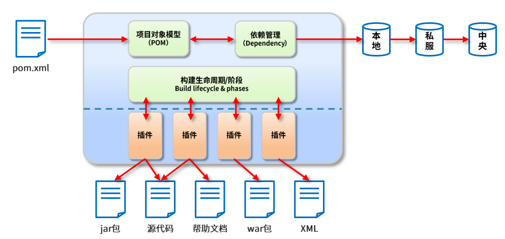
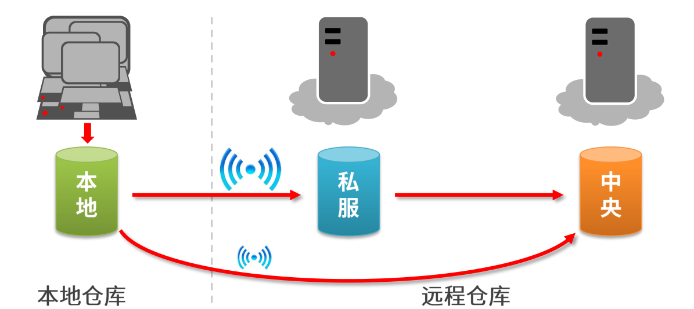
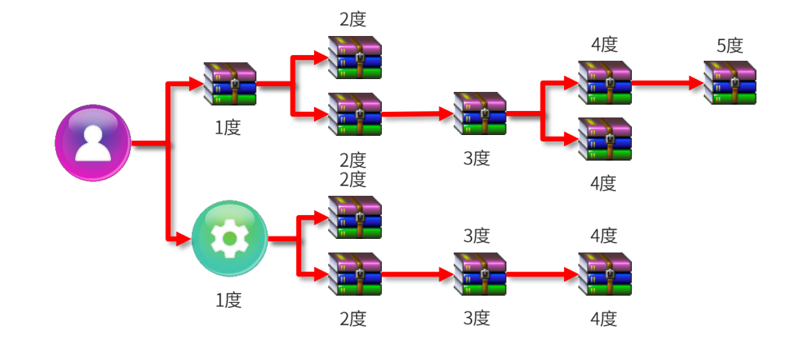
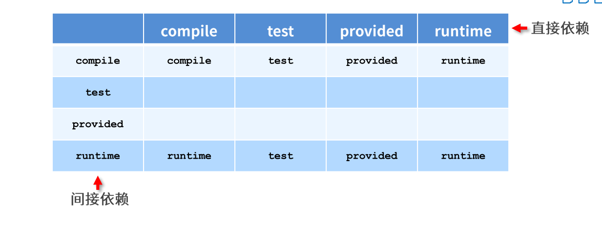
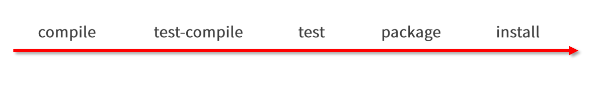
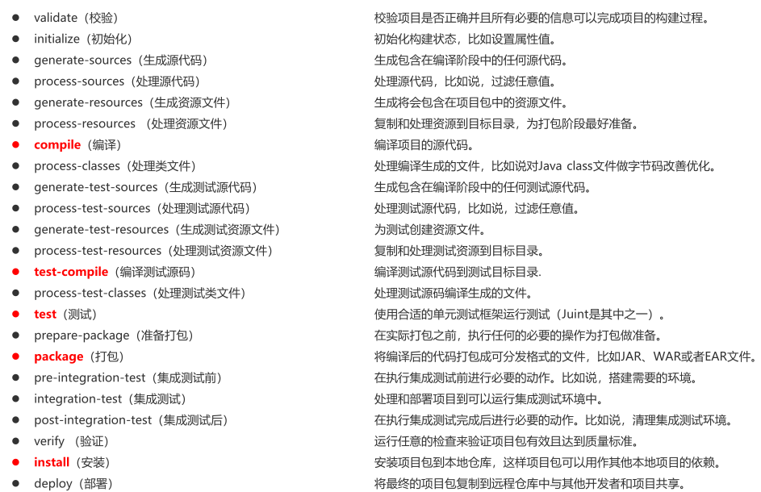
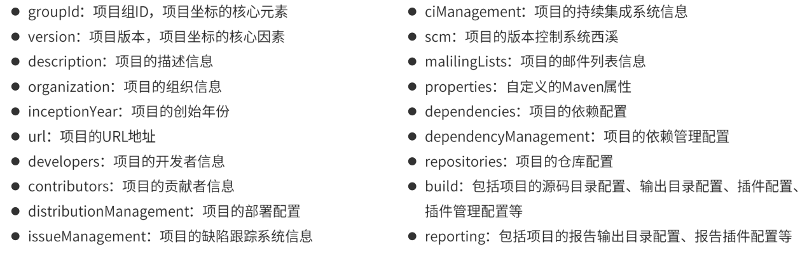
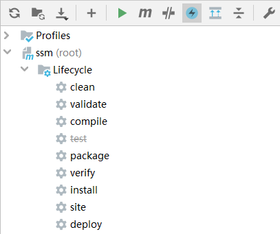

# Maven基础学习笔记

## 目录

[TOC]

## 下载链接

* 官网：<https://maven.apache.org/>
* 所有版本：<https://archive.apache.org/dist/maven/maven-3/>
* 阿里云云效Maven：<https://developer.aliyun.com/mvn/guide>
* 坐标查询：
    * <https://mvnrepository.com/>
    * <https://search.maven.org/>
* IDEA 2018 2020 2021 各版本对Maven版本兼容问题汇总 ：<https://blog.csdn.net/qq_44866828/article/details/117571120>

## Maven简介

* Maven是什么
  * Maven的本质是一个项目管理工具，将项目开发和管理的过程抽象成一个对象模型（POM）
  * POM(Project Object Model)项目对象模型



* Maven有什么用
  * 项目构建：提供标准的、跨平台的、自动化项目构建方式
  * 依赖管理：方便快捷的依赖（jar包）管理，避免资源版本冲突的问题
  * 统一开发结构
    * src
      * main
        * java
        * resources
      * test
        * java
        * resources
    * pom.xml 

## Maven的基本概念

### 仓库

* 仓库：用于存储资源，里面有各种各样的jar包
* 仓库分类：
  * 本地仓库：自己电脑上的存储，一般是Maven自动从远程仓库是下载下来的
  * 远程仓库：非自己电脑上的仓库，为本地提供资源
    * 中央仓库：Maven官方的仓库
    * 私服：部门自己资源存储仓库，一般是Maven自动从远程仓库是下载下来的
* 私服的作用
  * 保存具有版权的资源，包含购买和自主研发的jar
    * 中央仓库的jar都是开源的，不能有有版权jar
  * 一定范围内资源共享，仅对内部开放



### 坐标

* 什么是坐标？
  * Maven中的坐标用于描述仓库中资源的位置
  * https://repo1.maven.org/maven2/
* Maven坐标主要组成
  * groupld：定义当前Maven项目隶属组织名称（通常是域名反写，例如：orgmybatis）
  * artifactld：定义当前Maven项目名称（通常是模块名称，例如CRM、SMS）
  * version：定义当前项目版本号
  * packaging：定义该项目的打包方式
* Maven坐标的作用
  * 使用唯一标识，唯一性定位资源位置，通过该标识可以将资源的识别与下载工作交由机器完成
* 坐标查询
  * <https://mvnrepository.com/>
  * <https://search.maven.org/>

## 仓库的配置

* Maven会默认把下载的资源保存在C盘，可以自定义
  * 配置文件位置：Maven的安装目录/conf/settings.xml
  * 50行左右：`Default: ${user.home}/.m2/repository`
  * `<localRepository>D:\Software\ApplicationSoftware\mvnrepository\repository</localRepository>`
* 由于Maven的远程仓库在国外，下载速度慢，所以要改一下远程仓库的位置，这里可以使用阿里的镜像仓库
  * 阿里云云效Maven：<https://developer.aliyun.com/mvn/guide>
  * 在160行左右，将阿里的`<mirror></mirror>`标签，放入配置文件的`<mirrors></mirrors>`标签内

## 依赖管理

### 依赖配置

* 在pom.xml中添加

```xml
<!-- 设置所有的依赖 -->
<dependencies>
	<!-- 配置具体的某一个依赖 -->
    <dependency>
    	<!-- 依赖所属的群组id -->
        <groupId>org.springframework</groupId>
        <!-- 依赖所属的项目id -->
        <artifactId>spring-webmvc</artifactId>
        <!-- 依赖所属的版本号 -->
        <version>5.3.15</version>
    </dependency>
    <dependency>
        <groupId>junit</groupId>
        <artifactId>junit</artifactId>
        <version>4.12</version>
        <scope>test</scope>
    </dependency>
</dependencies>
```

### 依赖传递

* 依赖具有传递性
  * 直接依赖：当前项目直接配置的依赖
  * 间接依赖：依赖的依赖
* 依赖冲突问题
  * 路径优先：当依赖中出现相同的资源时，层级越深，优先级越低，层级越浅，优先级越高
  * 声明优先：当资源在相同层级被依赖时，配置顺序靠前的覆盖配置顺序靠后的
  * 特殊优先：当同级配置了相同资源的不同版本，后配置的覆盖先配置的



### 可选依赖

* 指对外隐藏当前项目的依赖资源
* 如果其它项目依赖了当前项目，那么它看不见当前项目的依赖

```xml
<dependency>
    <groupId>junit</groupId>
    <artifactId>junit</artifactId>
    <version>4.12</version>
    <!-- 隐藏 -->
    <optional>true</optional>
</dependency>
```

### 排除依赖

* 主动断开依赖资源
* 被排除的依赖不用指定version

```xml
<dependency>
    <groupId>junit</groupId>
    <artifactId>junit</artifactId>
    <version>4.12</version>
    <exclusions>
        <exclusion>
        	<!-- 断开 -->
            <groupId>org.hamcrest</groupId>
            <artifactId>hamcrest-core</artifactId>
        </exclusion>
    </exclusions>
</dependency>
```

### 依赖范围

* 依赖的jar在默认情况下为complie，可以在任何地方使用
* 通过`<scope></scope>`标签设置依赖范围
* 依赖范围
  * 主程序范围有效（main文件夹范围内）
  * 测试程序范围有效（test文件夹范围内）
  * 是否参与打包（package指令范围内）


| scope         | 主代码 | 测试代码 | 打包 | 范例        |
| ------------- | ------ | -------- | ---- | ----------- |
| compile(默认) | Y      | Y        | Y    | log4j       |
| test          |        | Y        |      | junit       |
| provided      | Y      | Y        |      | servlet-api |
| runtime       |        |          | Y    | jdbc        |

### 依赖范围的传递性

* 有依赖范围的资源在传递时，作用范围会受到影响



## 生命周期与插件

* 一次构建过程经历了多少个事件



* Maven对项目构建的生命周期划分为3套
  * clean：清理工作
  * default：核心工作，例如编译，测试，打包，部署等
  * site：产生报告，发布站点等

### clean生命周期

* `pre-clean`执行一些在clean之前的工作
* `clean`移除上一次构建生成的文件
* `post-clean`执行一些在clean之后的工作

### default生命周期

* 执行哪一项，那么生命周期为从第一个到当前项，从上到下



### site构建生命周期

* `pre-site`执行一些需要在生成站点文档之前完成的工作
* `site`生成项目的站点文档
* `post-site`执行一些需要在生成站点文档之后完成的工作，并且为部署做准备
* `site-deploy`将生成的站点文档部署到特定的服务器上

### 插件

* 插件与生命周期内的阶段绑定，在执行到对应的生命周期时执行对应的插件功能
* 默认Maven在各个生命周期上绑定有预设的功能
* 通过插件可以自定义其它功能

```xml
<build>
    <plugins>
        <plugin>
            <groupId>org.apache.maven.plugins</groupId>
            <artifactId>maven-source-plugin</artifactId>
            <version>2.2.1</version>
            <executions>
                <execution>
                    <goals>
                        <goal>jar</goal>
                    </goals>
                    <phase>generate-test-resources</phase>
                </execution>
            </executions>
        </plugin>
    </plugins>
</build>
```

#### tomcat7插件

```xml
<build>
    <plugins>
      <plugin>
          <groupId>org.apache.tomcat.maven</groupId>
          <artifactId>tomcat7-maven-plugin</artifactId>
          <version>2.1</version>
          <configuration>
            <!-- 可省略，默认使用8080 -->
            <port>8080</port>
            <!-- 可省略，默认为项目名起始路径 -->
            <path>/</path>
            <uriEncoding>UTF-8</uriEncoding>
          </configuration>
      </plugin>
    </plugins>
</build>
```

#### 打jar包插件

* maven的package打jar包并不会把依赖一起打进去

```xml
<build>
    <plugins>
        <plugin>
            <artifactId>maven-assembly-plugin</artifactId>
            <configuration>
                <descriptorRefs>
                    <descriptorRef>jar-with-dependencies</descriptorRef>
                </descriptorRefs>
                <archive>
                    <manifest>
                        <mainClass>主方法类</mainClass>
                    </manifest>
                </archive>
            </configuration>
            <executions>
                <execution>
                    <id>make-assembly</id>
                    <phase>package</phase>
                    <goals>
                        <goal>assembly</goal>
                    </goals>
                </execution>
            </executions>
        </plugin>
    </plugins>
</build>
```

## 聚合

* 作用：用于快速构建Maven工程，一次构建多个Mavne模块
* 制作方式：
    * 创建一个空模块，打包方式定义为`pom`：
    * `<packaging>pom</packaging>`
    * 定义当前模块进行构建操作时关联的其他模块名称
    * 配置无顺序

```
<modules>
    <module>../ssm_controller</module>
    <module>../ssm_service</module>
    <module>../ssm_dao</module>
    <module>../ssm_pojo</module>
</modules>
```

## 继承

* 作用：通过继承可以在子工程中沿用父工程的配置
    * maven的继承配置与java相似，在子工程中配置继承关系
* 制作方式
    * 在子工程中声明其父工程的坐标和位置

```xml
<!-- 定义该工程的父工程 -->
<parent>
    <groupId>com.itheima</groupId>
    <artifactId>ssm</artifactId>
    <version>1.0-SNAPSHOT</version>
    <!-- 父工程的pom文件 -->
    <relativePath>../ssm/pom.xml</relativePath>
</parent>
```

### 继承依赖的定义

* 在父工程中进行依赖管理

```xml
<!--声明此处进行依赖管理-->
<dependencyManagement>
    <!--具体的依赖-->
    <dependencies>
        <!--spring-->
        <dependency>
            <groupId>org.springframework</groupId>
            <artifactId>spring-context</artifactId>
            <version>5.1.9.RELEASE</version>
        </dependency>
    <dependencies>
<dependencyManagement>
```

### 继承的使用

* 在子工程中定义依赖关系，无需声明依赖版本，版本参照父工程中依赖的版本

```xml
<dependencies>
<!--spring-->
    <dependency>
        <groupId>org.springframework</groupId>
        <artifactId>spring-context</artifactId>
    </dependency>
</dependencies>
```

### 继承的资源



### 继承与聚合

* 作用
    * 聚合用于快速的构建项目
    * 继承用于快速配置
* 相同点：
    * 聚合与继承的pom.xml文件打包方式均为pom，可以将两种关系制作到同一个pom文件中
    * 聚合与继承均属于设计型模块，并无实际的模块内容
* 不同点：
    * 聚合是在当前模块中配置关系，聚合可以感知到参与聚合的模块有哪些
    * 继承是在子模块中配置关系，父模块无法感知哪些子模块继承了自己


## 属性

### 自定义属性

* 属性定义

```xml
<!--自定义属性-->
<properties>
    <spring.version>5.1.9.RELEASE</spring.version>
    <junit.version>4.12</junit.version>
</properties>
```

* 属性调用：`${属性标签名}`

```xml
<dependency>
    <groupId>org.springframework</groupId>
    <artifactId>spring-context</artifactId>
    <version>${spring.version}</version>
</dependency>
```

### 内置属性

* 当前项目版本：`${version}`

## 版本管理

### 工程版本

* SNAPSHOT (快照版本)
    * 小项目开发过程中，为方便团队成员合作，解决模块间相互依赖和时时更新的问题，开发者对每个模块进行构建的时候，输出的临时性版本叫快照版本 (测试阶段版本)
    * 快照版本会随着开发的进展不断更新
* RELEASE (发布版本)
    * 令项目开发到进入阶段里程碑后，向团队外部发布较为稳定的版本，这种版本所对应的构件文件是稳定的，即便进行功能的后续开发，也不会改变当前发布版本内容，这种版本称为发布版本

### 工程版本号约定

* 约定规范:
    * `<主版本>.<次版本>.<增量版本>.<里程碑版本>`
    * 主版本:表示项目重大架构的变更，如:spring5相较于spring4的选代
    * 次版本:表示有较大的功能增加和变化，或者全面系统地修复漏洞
    * 增量版本:表示有重大漏洞的修复
    * 里程碑版本:表明一个版本的里程碑(版本内部)。这样的版本同下一个正式版本相比，相对来说不是很稳定，有待更多的测试
* 范例:
    * 5.1.9.RELEASE

## 资源配置

* 作用：在任意的文件中**加载**pom文件中定义的属性
* 调用格式：`${jdbc.url}`
* 配置方式

```xml
<!--配置资源文件对应的信息-->
<resources>
    <resource>
        <!--设定配置文件对应的位置目录，支持使用属性动态设定路径-->
        <directory>${project.basedir}/src/main/resources</directory>
        <!--开启对配置文件的资源加载过滤-->
        <filtering>true</filtering>
    </resource>
</resources>
```

## 多环境测试

* 作用：针对不同的环境使用不同的配置
    * 生产环境produce
    * 开发环境develop
    * 测试环境test
* 调用格式
    * `mvn 指令 -P 环境定义ID`
* 例子
    * `mvn install -P pro_env`

```xml
<!--创建多环境-->
<profiles>
    <!--定义具体某个玩意-->
    <profile>
        <!--环境的唯一名称ID：生产-->
        <id>pro_env</id>
        <!--定义环境中的属性值-->
        <properties>
            <jdbc.url>jdbc:mysql://127.1.1.1:3306/ssm_db</jdbc.url>
        </properties>
        <!--设置默认启动-->
        <activation>
            <activeByDefault>true</activeByDefault>
        </activation>
    </profile>
    <!--开发环境-->
    <profile>
        <id>dev_env</id>
    </profile>
</profiles>
```

## 路过测试*

### 应用场景

* 整体模块功能未开发
* 模块中某个功能未开发完毕
* 单个功能更新调试导致其他功能失败
* 快速打包

### 命令跳过

* `mvn 指令 -D skipTests`

### 界面跳过



### 配置跳过

```xml
<plugin>
    <artifactId>maven-surefire-plugin</artifactId>
    <version>2.22.1</version>
    <configuration>
        <skipTests>true</skipTests><!--设置跳过测试-->
        <includes> <!--包含指定测试用例-->
            <include>**/User*Test.java</include>
        </includes>
        <excludes><!--排除-->
            <exclude>**/User*TestCase.java</exclude>
        </excludes>
    </configuration>
</plugin>
```