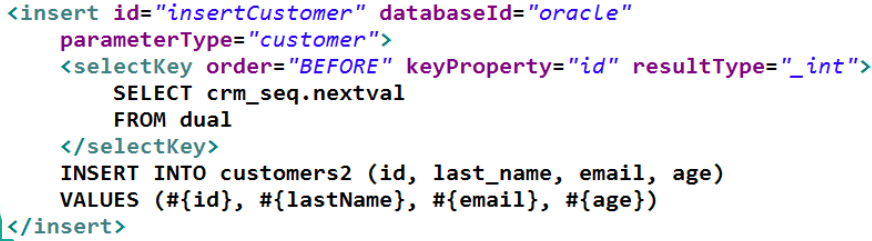
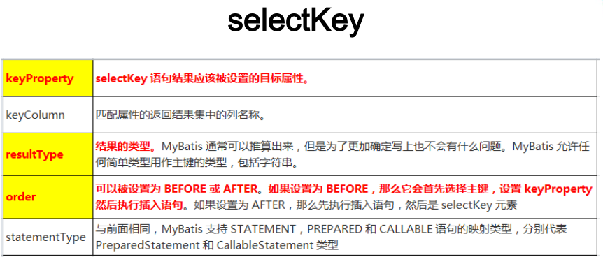

# MyBatis学习笔记

## 目录

[TOC]

## 链接

* mybatis官网：<https://mybatis.org/mybatis-3/zh/index.html>
* github：<https://github.com/mybatis/mybatis-3/>

## 1. 准备

* 导入依赖

```xml
<dependency>
    <groupId>org.mybatis</groupId>
    <artifactId>mybatis</artifactId>
    <version>3.5.9</version>
</dependency>

<dependency>
    <groupId>log4j</groupId>
    <artifactId>log4j</artifactId>
    <version>1.2.17</version>
</dependency>
```

* 加入log4j配置文件

```xml
<?xml version="1.0" encoding="UTF-8" ?>
<!DOCTYPE log4j:configuration SYSTEM "log4j.dtd">
<log4j:configuration xmlns:log4j="http://jakarta.apache.org/log4j/">
    <appender name="STDOUT" class="org.apache.log4j.ConsoleAppender">
        <param name="Encoding" value="UTF-8" />
        <layout class="org.apache.log4j.PatternLayout">
            <param name="ConversionPattern" value="%-5p %d{MM-dd HH:mm:ss,SSS} %m  (%F:%L) \n" />
        </layout>
    </appender>
    <logger name="java.sql">
        <level value="debug" />
    </logger>
    <logger name="org.apache.ibatis">
        <level value="info" />
    </logger>
    <root>
        <level value="debug" />
        <appender-ref ref="STDOUT" />
    </root>
</log4j:configuration>
```

* 创建全局配置文件`mybatis-config.xml`，在java程序中要读取这个文件
* 包含数据库连接池信息，事务管理器信息等...系统运行环境信息
* `<mappers></mappers>`注册SQL映射文件

```xml
<?xml version="1.0" encoding="UTF-8" ?>
<!DOCTYPE configuration
        PUBLIC "-//mybatis.org//DTD Config 3.0//EN"
        "http://mybatis.org/dtd/mybatis-3-config.dtd">
<configuration>
    <environments default="development">
        <environment id="development">
            <transactionManager type="JDBC"/>
            <dataSource type="POOLED">
                <property name="driver" value="com.mysql.jdbc.Driver"/>
                <property name="url" value="jdbc:mysql://localhost:3306/temp"/>
                <property name="username" value="root"/>
                <property name="password" value="123"/>
            </dataSource>
        </environment>
    </environments>
    <mappers>
        <mapper resource="UserMapper.xml"/>
    </mappers>
</configuration>
```

* SQL映射文件，上面注册了名字`"UserMapper.xml`
* 配置了每一个sql，以及sql的封装规则等。 
* namespace:名称空间
* id：唯一标识
* resultType：返回值类型
* #{id}：从传递过来的参数中取出id值

```xml
<?xml version="1.0" encoding="UTF-8" ?>
<!DOCTYPE mapper
        PUBLIC "-//mybatis.org//DTD Mapper 3.0//EN"
        "http://mybatis.org/dtd/mybatis-3-mapper.dtd">
<mapper namespace="com.example.mybatis.UserMapper">

    <select id="getUserById" resultType="com.example.mybatis.pojo.User">
        select uid as id,username,password,sex,email from user where uid = #{id}
    </select>

</mapper>
```

* 执行
    1. 根据全局配置文件得到SqlSessionFactory
    2. 使用sqlSession工厂，获取sqlSession对象使用他来执行增删改查
    一个sqlSession代表着一次和数据库的一次会话，用完要关闭
    3. 使用sql的唯一标识来告诉Mybatis执行那个sql，sql都是保存在SQL映射文件中


```java
@Test
public void test() throws IOException {
    String resource = "mybatis-config.xml";
    InputStream inputStream = Resources.getResourceAsStream(resource);
    SqlSessionFactory sqlSessionFactory = new SqlSessionFactoryBuilder().build(inputStream);

    SqlSession sqlSession = sqlSessionFactory.openSession();
    Object o = sqlSession.selectOne("org.mybatis.example.UserMapper.selectUserById", 2);
    System.out.println(o);

    sqlSession.close();
}
```

### 1.1 接口式编程


* 创建dao对应接口

```java
package com.example.mybatis.dao;
public interface UserDao {
    public User getUserById(Integer id);
}
```

* 调整SQL映射文件中的值
* `namespace`改为接口全类名
* `id`改为接口的某个方法名

```xml
<mapper namespace="com.example.mybatis.dao.UserDao">
    <select id="getUserById" resultType="com.example.mybatis.pojo.User">
        select uid as id,username,password,sex,email from user where uid = #{id}
    </select>
</mapper>
```

* 在java代码中通过`SqlSession`获取到dao接口的映射代理对象
* 再通过代理对象调用接口中的方法，传入参数

```java
@Test
public void test2() throws IOException {
    String resource = "mybatis-config.xml";
    InputStream inputStream = Resources.getResourceAsStream(resource);
    SqlSessionFactory sqlSessionFactory = new SqlSessionFactoryBuilder().build(inputStream);

    SqlSession sqlSession = sqlSessionFactory.openSession();
    UserDao userDao = sqlSession.getMapper(UserDao.class); // 获取代理对象
    System.out.println(userDao); // org.apache.ibatis.binding.MapperProxy@206a70ef
    User user = userDao.getUserById(150);
    System.out.println(user);
    sqlSession.close();
}
```

### 1.2 SqlSession

* SqlSession 的实例不是线程安全的，因此是不能被共享的。
* SqlSession每次**使用完成后需要正确关闭**，这个关闭操作是必须的
* SqlSession可以直接调用方法的id进行数据库操作，但是我们一般还是推荐使用SqlSession获取到Dao接口的代理类，执行代理对象的方法，可以更安全的进行类型检查操作

## 2. 全局配置文件

* MyBatis 的配置文件包含了会深深影响 MyBatis 行为的设置和属性信息。 配置文档的顶层结构如下：
* configuration（配置）
    * properties（属性）
    * settings（设置）
    * typeAliases（类型别名）
    * typeHandlers（类型处理器）
    * objectFactory（对象工厂）
    * plugins（插件）
    * environments（环境配置）
        * environment（环境变量）
            * transactionManager（事务管理器）
            * dataSource（数据源）
    * databaseIdProvider（数据库厂商标识）
    * mappers（映射器）
* 必需按这个顺序来配置标签，否则报错

### 2.2 properties属性

* `<properties resource="dbconfig.properties"></properties>`

```
jdbc.driver=com.mysql.jdbc.Driver
jdbc.url=jdbc:mysql://localhost:3306/temp
jdbc.username=root
jdbc.password=123
```

```xml
<property name="driver" value="${jdbc.driver}"/>
<property name="url" value="${jdbc.url}"/>
<property name="username" value="${jdbc.username}"/>
<property name="password" value="${jdbc.password}"/>
```

### 2.3 settings设置

* 这是 MyBatis 中极为重要的调整设置，它们会改变 MyBatis 的运行时行为。 下表描述了设置中各项设置的含义、默认值等。
* 且看官网：<https://mybatis.org/mybatis-3/zh/configuration.html#settings>
* `<setting name="jdbcTypeForNull" value="NULL"/>`传空值
* `<setting name="mapUnderscoreToCamelCase" value="true"/>`开启驼峰命名自动映射,自动去除下划线（默认false）
* `<setting name="cacheEnabled" value="true"/>`开启二级缓存

### 2.4 typeAliases别名处理器

* 类型别名是为 Java 类型设置一个短的名字，可以方便我们引用某个类。
* 类很多的情况下，可以批量设置别名这个包下的每一个类创建一个默认的别名，就是简单类名小写。
* 也可以使用@Alias注解为其指定一个别名
    * 类上使用
* 当设置的别名后，SQL映射文件中`<select>`标签的`resultType`属性就可以直接用别名，而不用使用全类名了
* MyBatis已经为许多常见的Java类型内建了相应的类型别名。都是大小写不敏感的，**不要占用已有的别名。**

```xml
<!--表示设置所有的别名-->
<typeAliases>
    <!--具体某一个别名，没有设置alias属性默认是 类名小写-->
    <typeAlias type="com.example.mybatis.pojo.User"></typeAlias>
    
    <!--为一个包下批量起别名-->
    <package name="com.example"/>
</typeAliases>
```

```xml
<select id="getUserById" resultType="User">
    select uid as id,username,password,sex,email from user where uid = #{id}
</select>
```

### 2.5 日期类型的处理


* 日期和时间的处理，JDK1.8以前一直是个头疼的问题。我们通常使用JSR310规范领导者StephenColebourne创建的Joda-Time来操作。1.8已经实现全部的JSR310规范了。
* 日期时间处理上，我们可以使用MyBatis基于JSR310（Date and Time API）编写的各种日期时间类型处理器。
* MyBatis3.4以前的版本需要我们手动注册这些处理器，以后的版本都是自动注册的

### 2.6 plugins插件

暂无

### 2.7 环境配置（environments）

* mybatis可以适应多种环境
* 比如，开发、测试和生产环境需要有不同的配置
* 尽管可以配置多个环境，但每个 SqlSessionFactory 实例只能选择一种环境。
* `<environments></environments>`皀配置所有的环境，`<environment></environment>`指配置某一个环境
* `default="development"`指定默认环境

#### 2.7.1 environment

* `id`指当前环境的唯一标识
* `transactionManager`事务管理器
    * type： JDBC | MANAGED | 自定义
        * JDBC：使用了 JDBC 的提交和回滚设置，依赖于从数据源得到的连接来管理事务范围。JdbcTransactionFactory
        * MANAGED：不提交或回滚一个连接、让容器来管理事务的整个生命周期（比如 JEE 应用服务器的上下文）。 ManagedTransactionFactory
        * 自定义：实现TransactionFactory接口，type=全类名/别名
* `dataSource`数据源
    * type： UNPOOLED | POOLED | JNDI | 自定义
        * UNPOOLED：不使用连接池，UnpooledDataSourceFactory
        * POOLED：使用连接池， PooledDataSourceFactory
        * JNDI： 在EJB 或应用服务器这类容器中查找指定的数据源
        * 自定义：实现DataSourceFactory接口，定义数据源的获取方式。
* 实际开发中我们使用Spring管理数据源，并进行事务控制的配置来覆盖上述配置

### 2.8 数据库厂商标识（databaseIdProvider）

* mybatis可以根据不同的数据库厂商，而执行不同的SQL语句
* Type： DB_VENDOR
    * 使用MyBatis提供的VendorDatabaseIdProvider解析数据库厂商标识。也可以实现DatabaseIdProvider接口来自定义。
* MyBatis匹配规则如下：
    1. 如果没有配置databaseIdProvider标签，那么**databaseId=null**
    2. 如果配置了databaseIdProvider标签，使用标签配置的name去匹配数据库信息，匹配上设置databaseId=配置指定的值，否则依旧为null
    3. 如果databaseId不为null，他只会找到配置databaseId的sql语句
    4. MyBatis 会加载不带databaseId属性和带有匹配当前数据库databaseId属性的所有语句。如果同时找到带有 databaseId 和不带databaseId 的相同语句，则后者会被舍弃

```xml
<databaseIdProvider type="DB_VENDOR">
    <property name="SQL Server" value="sqlserver"/>
    <property name="DB2" value="db2"/>
    <property name="Oracle" value="oracle" />
</databaseIdProvider>
```

```xml
<select id="getUserById" resultType="user" databaseId="mysql">
    select uid as id,username,password,sex,email from user where uid = #{id}
</select>
```

### 2.9 映射器（mappers）

* 告诉mybatis去哪里找SQL映射文件
* `<mappers></mappers>`
* `<mapper></mapper>`
    * `resource`属性：相对一类路径的资源引用
    * `url`：相对于url的资源引用
* `<package></package>`
    * `name`：包内**所有**的映射器接口全部注册成映射器
    * **此方式必须保证mapper接口和mapper映射文件必须在相同的包下**

## 3. SQL映射文件

* mybatis的映射文件可以把SQL语句和Java代码分离出来，减少SQL与Java代码之间的耦合度
* 可以让用户可以更加专注于SQL代码
* 映射文件的顶级元素不多
    * cache – 该命名空间的缓存配置。
    * cache-ref – 引用其它命名空间的缓存配置。
    * resultMap – 描述如何从数据库结果集中加载对象，是最复杂也是最强大的元素。
    * ~~parameterMap – 老式风格的参数映射。此元素已被废弃，并可能在将来被移除！请使用行内参数映射。文档中不会介绍此元素。~~
    * sql – 可被其它语句引用的可重用语句块。
    * insert – 映射插入语句。
    * update – 映射更新语句。
    * delete – 映射删除语句。
    * select – 映射查询语句。

### 3.1 select

* 标签属性
* `id`：SQL语句的唯一标识，一般是映射器接口的方法名
* `parameterType`：SQL语句中的参数类型，
    * `#{id}`：MyBatis 创建一个预处理语句（PreparedStatement）参数，在 JDBC 中，这样的一个参数在 SQL 中会由一个“?”来标识，
* `resultType`：查询出的参数类型
* `databaseId`：数据库厂商标识

```xml
<select id="getUserById" resultType="user" databaseId="mysql">
    select uid as id,username,password,sex,email from user where uid = #{uid}
</select>
```

#### 3.1.1 返回List集合

* 映射器接口的方法返回值是`List`集合
* `<select>`标签`resultType`的值是集合中对象的类型

```java
public List<User> getAllUser();
```

```xml
<select id="getAllUser" resultType="user">
    select * from user
</select>
```

#### 3.1.2 返回Map集合

##### 3.1.2.1 返回单个Map集合

* 映射器接口的方法返回值是`Map`集合
* `<select>`标签`resultType`的值是`map`

```java
public Map<String,String> getUserByIdForMap(Integer id);
```

```xml
<select id="getUserByIdForMap" resultType="map">
    select * from user where uid = #{id}
</select>
```
##### 3.1.2.2 返回特殊Map集合

* 比如`Map<Integer,User>`，key是表的主键，value是对应对象
* 映射器接口的方法返回值是`Map`集合
    * 在方法上添加`@MapKey()`注解，value值是要作为key的**表字段**
* `<select>`标签`resultType`的值是Map中`value`对象类型

```java
@MapKey("uid")
public Map<Integer,User> getUsersForMap();
```

```xml
<select id="getUsersForMap" resultType="user">
    select * from user
</select>
```

#### 3.1.3 reslutMap

* 自定义结果映射
* `<resultMap></resultMap>`
    * `id`:映射结果规则的名字
    * `type`:类型
* `<id/>`主键字段的映射
* `<result/>`非主键字段映射，和上面一个无区别
    * `column`:查询出的字段名
    * `property`:对应的对象属性名
* `<association></association>`：结果集中的对象关联（套娃、多对一）
    * `property`：对象属性名
    * `javaType`：对象类型
    * `select`：关联对象结果集的接口映射器的查询方法
    * `column`：要传入方法的字段值
* `<collection></collection>`结果集中的集合关联（一对多）
    * `property`：集合属性名
    * `ofType`：集合类型
    * `select`：关联对象结果集的接口映射器的查询方法
    * `column`：要传入方法的字段值

##### 3.1.3.1 普通结果集

```xml
<resultMap id="empMap" type="com.example.mybatis.pojo.Emp">
    <id column="empno" property="empno"></id>
    <result column="ename" property="ename" />
    <result column="job" property="job" />
    <result column="mgr" property="mgr" />
    <result column="hiredate" property="hiredate" />
    <result column="sal" property="sal" />
    <result column="comm" property="comm" />
    <!--结果集中的对象-->
    <result column="deptno" property="dept.deptno" />
    <result column="dname" property="dept.dname" />
    <result column="loc" property="dept.loc" />
</resultMap>

<select id="getEmpByEmpno" resultMap="empMap">
    select
           e.empno empno, e.ename ename,e.job job,e.mgr mgr,e.hiredate hiredate,e.sal sal,e.comm comm,d.deptno deptno,d.dname dname,d.loc loc
    from emp e
        join dept d
            on d.deptno = e.deptno and empno = #{empno};
</select>
```

##### 3.1.3.2 嵌套结果集

```xml
<resultMap id="empMap" type="com.example.mybatis.pojo.Emp">
    <id column="empno" property="empno"></id>
    <result column="ename" property="ename" />
    <result column="job" property="job" />
    <result column="mgr" property="mgr" />
    <result column="hiredate" property="hiredate" />
    <result column="sal" property="sal" />
    <result column="comm" property="comm" />

    <association property="dept" javaType="com.example.mybatis.pojo.Dept">
        <id column="deptno" property="deptno"/>
        <result column="dname" property="dname" />
        <result column="loc" property="loc" />
    </association>
</resultMap>

<select id="getEmpByEmpno" resultMap="empMap">
    select
           e.empno empno, e.ename ename,e.job job,e.mgr mgr,e.hiredate hiredate,e.sal sal,e.comm comm,d.deptno deptno,d.dname dname,d.loc loc
    from emp e
        join dept d
            on d.deptno = e.deptno and empno = #{empno};
</select>
```

##### 3.1.3.3 分段查询


```java
public interface EmpDao {
    public Emp getEmpByEmpnoForStep(Integer empno);
}
```

* EmpMapper.xml

```xml
<resultMap id="empStep" type="com.example.mybatis.pojo.Emp">
    <id column="empno" property="empno"/>
    <result column="ename" property="ename"/>
    <result column="job" property="job" />
    <result column="mgr" property="mgr" />
    <result column="hiredate" property="hiredate" />
    <result column="sal" property="sal" />
    <result column="comm" property="comm" />
    <!--调用getDeptByDeptnoForStep，形参是deptno字段-->
    <association property="dept"
                 select="com.example.mybatis.dao.DeptDao.getDeptByDeptnoForStep"
                 column="deptno">
    </association>
</resultMap>

<select id="getEmpByEmpnoForStep" resultMap="empStep">
    select * from emp where empno=#{empno}
</select>
```


```java
public interface DeptDao {
    public Dept getDeptByDeptnoForStep(Integer deptno);
}
```

* DeptMapper.xml

```xml
<select id="getDeptByDeptnoForStep" resultType="com.example.mybatis.pojo.Dept">
    select * from dept where deptno=#{deptno}
</select>
```

##### 3.1.3.4 分段查询&延迟加载

* 开启延迟加载和属性按需加载，全局配置文件
* `<setting name="lazyLoadingEnabled" value="true"/>`
* `<setting name="aggressiveLazyLoading" value="false"/>`
* association或者collection标签的**fetchType=eager/laz**y可以**覆盖全局的延迟加载策略**，指定立即加载（eager）或者延迟加载（lazy）

##### 3.1.3.5 分段查询传入多个值

* 当分步查询时，调用的方法可能要传入多个参数
* column属性使用{key1=column1,key2=column2}的形式

```xml
<collection property="emps" ofType="com.example.mybatis.pojo.Emp"
            select="com.example.mybatis.dao.EmpDao.getEmpsnoByDeptno"
            column="{deptno=id}">
</collection>
```


### 3.2 insert、update和delete

* 标签属性
* `id`：SQL语句的唯一标识，一般是映射器接口的方法名
* `parameterType`：SQL语句中的参数类型，
    * `#{id}`：MyBatis 创建一个预处理语句（PreparedStatement）参数，在 JDBC 中，这样的一个参数在 SQL 中会由一个“?”来标识，
* `resultType`：查询出的参数类型
* `databaseId`：数据库厂商标识
* `useGeneratedKeys`：是否取出插入数据时，数据库自增的主键值（true/false，默认是false）
* `keyProperty`：取出的主键的值的字段名

```xml
<insert id="addUser" parameterType="user" useGeneratedKeys="true" keyProperty="uid">
    insert into user(username,password,sex,email) values (#{username},#{password},#{sex},#{email})
</insert>

<delete id="deleteUserById" parameterType="Integer">
    delete from user where uid = #{uid}
</delete>

<update id="updateUser" parameterType="user">
    update user set username=#{username}, password=#{password}, sex=#{sex}, email=#{email} where uid=#{uid}
</update>
```

#### 3.2.1 获取主键

* 如果数据库带有字段自增，可以使用标签的两个属性就好
    * `useGeneratedKeys`：是否取出插入数据时，数据库自增的主键值（true/false，默认是false）
    * `keyProperty`：取出的主键的值的字段名
* 在进行`insert`和`update`后，会把主键自动放入对象内


* 而对于不支持自增型主键的数据库（例如Oracle），则可以使用`selectKey`子元素：`selectKey`元素将会首先运行，id 会被设置，然后插入语句会被调用





### 3.3 参数传递

* `#{}`取值是预编译的SQL语句
* `${}`是相当于把参数值直接拼接到SQL语句上
* 单个参数
    * 可以接收基本数据类型、对象类型、集合类型，这种情况可以直接`#{}`使用，不用作任何处理
* 多个参数  
    * 多个参数，mybatis会把参数**包装成一个map**传入。map的kay是`param1`、`param2`或`arg0`、`arg1`、`arg2`
* 命名参数
    * 在接口映射方法形参上使用`@Param`注解，为参数起一个名字，mybatis封装map时就会以`@Param`的`value`作为map的key
* POJO
    * 当SQL语句中的值是pojo的属性时，可以直接传一个pojo对象
* Map
    * 我们也可以自己封装一个map当作接口映射器方法的形参，`#{}`中是自己定义的key
* **特别注意**，如果是Collection类型（list，set）类型或者数组。会特殊处理，会把list或者数组封装进map中
    * 如果key是Collection(collection) 
    * 是List(list)
    * 是数组(array)
* 参数也可以是一个特殊的数据类型
    * `#{property,javaType=int,jdbcType=NUMERIC}`
    * javaType 通常可以从参数对象中来去确定
    * 如果 null 被当作值来传递，对于所有可能为空，jdbcType 需要被设置
    * SQL映射文件：`#{username,javaType=NULL}`
    * 全局配置文件：`<setting name="jdbcTypeForNull" value="NULL"/>`


## 4. 动态SQL

### 4.1 \<if\>

* `<if>`标签可以通过`test`属性的值，进行判断，如果是true则把标签中的内容拼接进SQL语句，反之不会

```xml
<select id="getUserTestIfTab" resultType="com.example.mybatis.pojo.User">
    select * from user where 1=1
    <if test="username != '' and username != null">
        and username=#{username}
    </if>
    <if test="password != '' and password != null">
        and password=#{password}
    </if>
    <if test="sex != '' and sex != null">
        and sex=#{sex}
    </if>
    <if test="email != '' and email != null">
        and email=#{email}
    </if>
</select>
```

### 4.2 \<where\>

* `<where>`和`<if>`一般结合使用
* 如果`<where>`中的所有的`<if>`都不成立，则SQL语句中不会有where条件
* 如果满足条件，则会自动产生where，拼接条件，并将**前方**多余的`and`、`or`删除
    * **不能去掉后面的and or** 

```xml
<select id="getUserTestWhereTab" resultType="com.example.mybatis.pojo.User">
    select * from user
    <where>
        <if test="username != '' and username != null">
            and username=#{username}
        </if>
        <if test="password != '' and password != null">
            and password=#{password}
        </if>
        <if test="sex != '' and sex != null">
            and sex=#{sex}
        </if>
        <if test="email != '' and email != null">
            and email=#{email}
        </if>
    </where>
</select>
```

### 4.3 \<trim\>

* `prefix`在`<trim>`标签**内容前**加的内容
* `suffix`在`<trim>`标签**内容后**加的内容
* `prefixOverrides`去掉子标签的某个前缀
* `suffixOverrides`去掉子标签的某个后缀
    * 多个前后缀用`|`隔开，比如：`and|or`

```xml
<select id="getUserTestTrimTab" resultType="com.example.mybatis.pojo.User">
    select * from user
    <trim prefix="where" prefixOverrides="and|or">
        <if test="username != '' and username != null">
            and username=#{username}
        </if>
        <if test="password != '' and password != null">
            and password=#{password}
        </if>
        <if test="sex != '' and sex != null">
            and sex=#{sex}
        </if>
        <if test="email != '' and email != null">
            and email=#{email}
        </if>
    </trim>
</select>
```

### 4.4 \<choose\>\<when\>\<otherwise\>

* 相当于`switch...case...default`
* when标签只会执行一个（自带break）

```xml
<select id="getUserTestChooseTab" resultType="com.example.mybatis.pojo.User">
    select * from user
    <where>
        <choose>
            <when test="username != '' and username != null">
                and username=#{username}
            </when>
            <when test="password != '' and password != null">
                and password=#{password}
            </when>
            <when test="sex != '' and sex != null">
                and sex=#{sex}
            </when>
            <when test="email != '' and email != null">
                and email=#{email}
            </when>
            <otherwise>
                and uid = 1
            </otherwise>
        </choose>
    </where>
</select>
```

### 4.5 \<foreach\>

* `collection`要循环的集合、数组。。
* `item`集合或数组中的每一个项
* `separator`每次循环之间的分割符
* `open`循环之前添加的内容、符号
* `close`循环之后添加的内容、符号

```xml
<delete id="batchDelete">
    delete from user where uid in
    <foreach collection="list" item="id" separator="," open="(" close=")">
        #{id}
    </foreach>
</delete>

<insert id="batchInsert">
    insert into user values
        <foreach collection="users" item="user" separator=",">
            (#{user.uid},#{user.username},#{user.password},#{user.sex},#{user.email})
        </foreach>
</insert>
```

### 4.6 \<sql\>

* `<sql>`标签可以把字段部分提取出来

```xml
<sql id="user">
    username,password,sex,email
</sql>
<select id="getUserTestIfTab" resultType="com.example.mybatis.pojo.User">
    select <include refid="user"></include> from user
</select>
```

## 5. 缓存机制

### 5.1 一级缓存

* 一级缓存是SqlSession级别的，通过**同一个**SqlSession查询的数据会被缓存，下次查询相同的数据，就会从缓存中直接获取，不会从数据库重新访问
* 使一级缓存失效的四种情况：
    1. 不同的SqlSession对应不同的一级缓存
    1. 同一个SqlSession但是查询条件不同
    1. 同一个SqlSession两次查询期间执行了任何一次增删改操作
    1. 同一个SqlSession两次查询期间手动清空了缓存

### 5.2 二级缓存

* 二级缓存是SqlSessionFactory级别，通过同一个SqlSessionFactory创建的SqlSession查询的结果会被缓存；此后若再次执行相同的查询语句，结果就会从缓存中获取
* 二级缓存开启的条件：
    1. 在核心配置文件中，设置全局配置属性`cacheEnabled`="true"，默认为true，不需要设置
    1. 在映射文件中设置标签`<cache />`
    1. 二级缓存必须在SqlSession**关闭或提交**之后有效
        * SqlSession关闭之后，一级缓存中的数据会写入二级缓存 
    1. 查询的数据所转换的实体类类型必须**实现序列化的接口**
* 使二级缓存失效的情况：
    * 两次查询之间执行了任意的增删改，会使一级和二级缓存**同时失效**

#### 5.2.1 二级缓存相关配置

* 在mapper配置文件中添加的cache标签可以设置一些属性：
* eviction属性：缓存回收策略
    * LRU（Least Recently Used） – 最近最少使用的：移除最长时间不被使用的对象。
    * FIFO（First in First out） – 先进先出：按对象进入缓存的顺序来移除它们。
    * SOFT – 软引用：移除基于垃圾回收器状态和软引用规则的对象。
    * WEAK – 弱引用：更积极地移除基于垃圾收集器状态和弱引用规则的对象。
    默认的是 LRU。
* flushInterval属性：刷新间隔，单位毫秒
    * 默认情况是不设置，也就是没有刷新间隔，缓存仅仅调用语句时刷新
* size属性：引用数目，正整数
    * 代表缓存最多可以存储多少个对象，太大容易导致内存溢出
* readOnly属性：只读，true/false
    * true：只读缓存；会给所有调用者返回缓存对象的相同实例。因此这些对象不能被修改。这提供了很重要的性能优势。
    * false：读写缓存；会返回缓存对象的拷贝（通过序列化）。这会慢一些，但是安全，因此默认是false。

### 5.3 MyBatis缓存查询的顺序

1. 先查询二级缓存，因为二级缓存中可能会有其他程序已经查出来的数据，可以拿来直接使用。
1. 如果二级缓存没有命中，再查询一级缓存
1. 如果一级缓存也没有命中，则查询数据库
1. SqlSession关闭之后，一级缓存中的数据会写入二级缓存

## 6. 逆向工程

* 正向工程：先创建Java实体类，由框架负责根据实体类生成数据库表。Hibernate是支持正向工程的。
* 逆向工程：先创建数据库表，由框架负责根据数据库表，反向生成如下资源：
    * Java实体类
    * Mapper接口
    * Mapper映射文件
    
### 6.1 步骤

* 引入依赖和插件

```xml
<dependencies>
    <dependency>
        <groupId>org.mybatis</groupId>
        <artifactId>mybatis</artifactId>
        <version>3.5.9</version>
    </dependency>
</dependencies>

<build>
    <plugins>
        <plugin>
            <groupId>org.mybatis.generator</groupId>
            <artifactId>mybatis-generator-maven-plugin</artifactId>
            <version>1.4.0</version>
            <dependencies>
                <dependency>
                    <groupId>org.mybatis.generator</groupId>
                    <artifactId>mybatis-generator-core</artifactId>
                    <version>1.4.0</version>
                </dependency>
                <dependency>
                    <groupId>com.mchange</groupId>
                    <artifactId>c3p0</artifactId>
                    <version>0.9.2</version>
                </dependency>
                <dependency>
                    <groupId>mysql</groupId>
                    <artifactId>mysql-connector-java</artifactId>
                    <version>5.1.49</version>
                </dependency>
            </dependencies>
        </plugin>
    </plugins>
</build>
```

* 创建Mybatis核心配置文件
* 创建逆向工程的配置文件
    * 文件名是：generatorConfig.xml
* `<context id="DB2Tables" targetRuntime="MyBatis3">`
    * targetRuntime: 执行生成的逆向工程的版本
    * MyBatis3Simple: 生成基本的CRUD（清新简洁版）
    * MyBatis3: 生成带条件的CRUD（奢华尊享版）

```xml
<?xml version="1.0" encoding="UTF-8"?>
<!DOCTYPE generatorConfiguration
        PUBLIC "-//mybatis.org//DTD MyBatis Generator Configuration 1.0//EN"
        "http://mybatis.org/dtd/mybatis-generator-config_1_0.dtd">
<generatorConfiguration>
    <!--
        targetRuntime: 执行生成的逆向工程的版本
        MyBatis3Simple: 生成基本的CRUD（清新简洁版）
        MyBatis3: 生成带条件的CRUD（奢华尊享版）
    -->
    <context id="DB2Tables" targetRuntime="MyBatis3Simple">
        <commentGenerator>
            <!-- 去掉注释 -->
            <property name="suppressAllComments" value="true" />
        </commentGenerator>
        <!-- 数据库的连接信息 -->
        <jdbcConnection driverClass="com.mysql.jdbc.Driver"
                        connectionURL="jdbc:mysql://localhost:3306/db_name"
                        userId="root"
                        password="123">
        </jdbcConnection>

        <!-- javaBean的生成策略-->
        <javaModelGenerator targetPackage="org.example.pojo"
                            targetProject=".\src\main\java">
            <property name="enableSubPackages" value="true" />
            <property name="trimStrings" value="true" />
        </javaModelGenerator>
        <!-- SQL映射文件的生成策略 -->
        <sqlMapGenerator targetPackage="org.example.dao"
                         targetProject=".\src\main\resources">
            <property name="enableSubPackages" value="true" />
        </sqlMapGenerator>
        <!-- Mapper接口的生成策略 -->
        <javaClientGenerator type="XMLMAPPER"
                             targetPackage="org.example.dao" targetProject=".\src\main\java">
            <property name="enableSubPackages" value="true" />
        </javaClientGenerator>
        <!-- 逆向分析的表 -->
        <!-- tableName设置为*号，可以对应所有表，此时不写domainObjectName -->
        <!-- domainObjectName属性指定生成出来的实体类的类名 -->
        <table tableName="sys_user" domainObjectName="SysUser" enableCountByExample="false" enableUpdateByExample="false"
               enableDeleteByExample="false" enableSelectByExample="false" selectByExampleQueryId="false">
            <property name="useActualColumnNames" value="true"/>
        </table>
        <table tableName="t_orders" domainObjectName="Orders">
            <!--开启驼峰命名-->
            <property name="useActualColumnNames" value="true"/>
        </table>

    </context>

</generatorConfiguration>
```

### 6.2 QBC查询

* 创建条件对象，通过andXXX方法为SQL添加查询添加，每个条件之间是and关系
* `empExample.or().andSexEqualTo("男");`
    * 将之前添加的条件通过or拼接其他条件

```java
@Test
public void  test() {
    SqlSession sqlSession = SqlSessionUtils.getSqlSession("mybatis-config.xml");
    EmpMapper empMapper = sqlSession.getMapper(EmpMapper.class);
    EmpExample empExample = new EmpExample();
    empExample.createCriteria().andEnameEqualTo("SMITH").andEmpnoEqualTo(7369);
    List<Emp> emps = empMapper.selectByExample(empExample);
    System.out.println(emps);
}
```

## 7. 分页插件

### 7.1 准备

* 添加依赖

```xml
<dependency>
    <groupId>com.github.pagehelper</groupId>
    <artifactId>pagehelper</artifactId>
    <version>5.2.0</version>
</dependency>
```

* mybatis全局配置文件添加plugins（插件）

```xml
<plugins>
    <!--设置分页插件-->
    <plugin interceptor="com.github.pagehelper.PageInterceptor"></plugin>
</plugins>
```

### 7.2 使用方法

* 在查询之前使用`PageHelper.startPage(int pageNum, int pageSize)`
* 会自动在SQL语句后面加上`LIMIT begin, length`，通过上面的`pageNum`和`pageSize`计算出来的
    * **SQL语句后不要加`;`**
* 在查询之后使用`PageInfo<Book> pageInfo = new PageInfo<Book>(bookList,5);`
* `pageInfo`中会有很分页相关的信息
    * `pageNum`：当前页的页码
    * `pageSize`：每页显示的条数
    * `size`：当前页显示的真实条数
    * `total`：总记录数
    * `pages`：总页数
    * `prePage`：上一页的页码
    * `nextPage`：下一页的页码
    * `isFirstPage`/isLastPage：是否为第一页/最后一页
    * `hasPreviousPage`/hasNextPage：是否存在上一页/下一页
    * `navigatePages`：导航分页的页码数
    * `navigatepageNums`：导航分页的页码，[1,2,3,4,5]


```java
PageHelper.startPage(2,4);
List<Book> bookList = bookService.getAllBook();
PageInfo<Book> pageInfo = new PageInfo<Book>(bookList,5);
System.out.println(pageInfo);
```


>PageInfo{pageNum=2, pageSize=4, size=4, startRow=5, endRow=8, total=15, pages=4, list=Page{count=true, pageNum=2, pageSize=4, startRow=4, endRow=8, total=15, pages=4, reasonable=false, pageSizeZero=false}[Book{bid=5, bname='史记', author='司马迁', pubcomp='清华大学', pubdate=2022-01-04, bcount=88, price=278.20}, Book{bid=6, bname='资治通鉴', author='司马光', pubcomp='清华大学', pubdate=2022-01-05, bcount=88, price=524.00}, Book{bid=7, bname='Java核心技术 卷I：基础知识', author='Cay S', pubcomp='清华大学', pubdate=2022-01-06, bcount=88, price=92.50}, Book{bid=8, bname='Java核心技术卷II：高级特性', author='Cay S', pubcomp='清华大学', pubdate=2022-01-07, bcount=88, price=111.20}], prePage=1, nextPage=3, isFirstPage=false, isLastPage=false, hasPreviousPage=true, hasNextPage=true, navigatePages=5, navigateFirstPage=1, navigateLastPage=4, navigatepageNums=[1, 2, 3, 4]}
