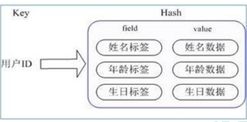
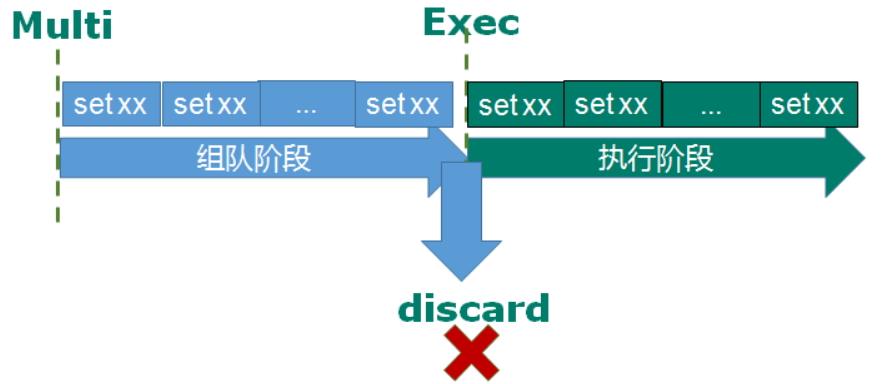

# Redis学习笔记

[TOC]

## 1. 下载

* 官网：<https://redis.io/>
* windows：<https://github.com/microsoftarchive/redis>
* 可视化软件：<https://lestore.lenovo.com/detail/L102054>

## 2. key常用命令

* `keys *`查看所有的key
* `exists key`查看某个key存在否
* `type key` 查看数据类型
* `del key`删除
* `unlink key`异步删除
* `expire key`设置超时时间
* `ttl key`查看过期时间，-1永不过时，-2已过期
* `selec [num]`切换数据库
* `dbsize`查看当前数据库key的数量
* `flushdb`清除当前数据库
* `flushall`清除所有数据库

## 3. 常用五大数据类型

### 3.1 String

#### 3.1.1 简介

* 一个key对应一个value
* 二进制安全的，可以存储任何类型
* 一个value最多可以是512M

#### 3.1.2 常用命令

* `get key` 获取对应的键值
* `append key value`在对应的key的value末尾追加
* `strlen key`获取value的长度
* `setnx key value`当key不存在时设置value
* `incr key `key对应的value自增1，key不存在直接设置值为1，只能数字（integer）操作
* `incrby key <step>`指定步长自增
* `decr key`自减，为空-1
* `decrby key <step>`指定步长自减
* `mset k1 v1 k2 v2 k3 v3`同时设置多组键值对
* `mget k1 k2 k3 k4`同时获取多个key的value
* `msernx k1 v1 k2 v2`必须所有的key都不存在，才设置
* `getrange key <start> <end>`类似substring ，前闭后闭
* `setrange key <start>`
* `getset key value` 获取新值，替换旧值

#### 3.1.3 数据结构

String 的数据结构为简单动态字符串(Simple Dynamic String,缩写 SDS)。是可以修改的字符串，内部结构实现上类似于 Java 的 ArrayList，采用预分配冗余空间的方式来减少内存的频繁分配.

内部为当前字符串实际分配的空间 capacity 一般要高于实际字符串长度len。当字符串长度小于 1M 时，扩容都是加倍现有的空间，如果超过 1M，扩容时一次只会多扩 1M 的空间。需要注意的是字符串最大长度为 512M。

### 3.2 List

#### 3.2.1 简介

* 单键多值
* Redis 列表是简单的字符串列表，按照插入顺序排序。你可以添加一个元素到列表的头部（左边）或者尾部（右边）。
* 它的底层实际是个双向链表，对两端的操作性能很高，通过索引下标的操作中间的节
点性能会较差。

#### 3.2.2 常用命令

* `lpush/rpush <key><value1><value2><value3> `从左边/右边插入一个或多个值。
* `lpop/rpop <key>`从左边/右边吐出一个值。**值在键在，值光键亡。**
* `rpoplpush <key1><key2>`从<key1>列表右边吐出一个值，插到<key2>列表左边。
* `lrange <key><start><stop>`按照索引下标获得元素(从左到右)
* `lrange mylist 0 -1` 0 左边第一个，-1 右边第一个，（0-1 表示获取所有）
* `lindex <key><index>`按照索引下标获得元素(从左到右)
* `llen <key>`获得列表长度
* `linsert <key> before <value><newvalue>`在<value>的后面插入<newvalue>插入值
* `lrem <key><n><value>`从左边删除 n 个 value(从左到右)
* `lset<key><index><value>`将列表 key 下标为 index 的值替换成 value

#### 3.2.3 数据结构

List 的数据结构为快速链表 quickList。首先在列表元素较少的情况下会使用一块连续的内存存储，这个结构是 ziplist，也即是压缩列表。  
它将所有的元素紧挨着一起存储，分配的是一块连续的内存。  
当数据量比较多的时候才会改成 quicklist。  
因为普通的链表需要的附加指针空间太大，会比较浪费空间。比如这个列表里存的只
是 int 类型的数据，结构上还需要两个额外的指针 prev 和 next。  
Redis 将链表和 ziplist 结合起来组成了 quicklist。也就是将多个 ziplist   使用双向指针串起来使用。这样既满足了快速的插入删除性能，又不会出现太大的空间冗余。

### 3.3 Set

#### 3.3.1 简介

* 自动去重
* 无序
* 添加，删除，查找的复杂度都是 O(1)。

#### 3.3.2 常用命令

* `sadd <key><value1><value2>`将一个或多个 member 元素加入到集合 key 中，已经存在的 member 元素将被忽略
* `smembers <key>`取出该集合的所有值。
* `sismember <key><value>`判断集合<key>是否为含有该<value>值，有 1，没有 0
* `scard<key>`返回该集合的元素个数。
* `srem <key><value1><value2> ` 删除集合中的某个元素。
* `spop <key>`随机从该集合中吐出一个值。
* `srandmember <key><n>`随机从该集合中取出 n 个值。不会从集合中删除 。
* `smove <source><destination>value` 把集合中一个值从一个集合移动到另一个集合
* `sinter <key1><key2>`返回两个集合的交集元素。
* `sunion <key1><key2>`返回两个集合的并集元素。
* `sdiff <key1><key2>`返回两个集合的差集元素(key1 中的，不包含 key2 中的)

#### 3.3.3 数据结构

Set 数据结构是 dict 字典，字典是用哈希表实现的。  
Java 中 HashSet 的内部实现使用的是 HashMap，只不过所有的 value 都指向同一个对象。  
Redis 的 set 结构也是一样，它的内部也使用 hash 结构，所有的 value 都指向同一个内部值。

### 3.4 Map

#### 3.4.1 简介

* filed value映射表
* 适合存储对象



#### 3.4.2 常用命令

* `hset <key><field><value>`给<key>集合中的 <field>键赋值<value>
* `hget <key1><field>`从<key1>集合<field>取出 value
* `hmset <key1><field1><value1><field2><value2>`批量设置 hash 的值
* `hexists<key1><field>`查看哈希表 key 中，给定域 field 是否存在。
* `hkeys <key>`列出该 hash 集合的所有 field
* `hvals <key>`列出该 hash 集合的所有 value
* `hincrby <key><field><increment>`为哈希表 key 中的域 field 的值加上增量 1 -1
* `hsetnx <key><field><value>`将哈希表 key 中的域 field 的值设置为 value ，当且仅当域field 不存在 

#### 3.4.3 数据结构

Hash 类型对应的数据结构是两种：ziplist（压缩列表），hashtable（哈希表）。当
field-value 长度较短且个数较少时，使用 ziplist，否则使用 hashtable。

### 3.5 Zset

#### 3.5.1 简介

* 与set相似
* 每个关联一个score
* 成员唯一，score可以重复

#### 3.5.2 常用命令

* `zadd <key><score1><value1><score2><value2>`将一个或多个 member 元素及其 score 值加入到有序集 key 当中。
* `zrange <key><start><stop> [WITHSCORES]`返回有序集 key 中，下标在<start><stop>之间的元素带WITHSCORES，可以让分数一起和值返回到结果集。
* `zrangebyscore key minmax [withscores] [limit offset count]`返回有序集 key 中，所有 score 值介于 min 和 max 之间(包括等于 min 或 max )的成员。
    * 有序集成员按 score 值递增(从小到大)次序排列。
* `zrevrangebyscore key maxmin [withscores] [limit offset count]`同上，改为从大到小排列。
* `zincrby <key><increment><value>` 为元素的 score 加上增量
* `zrem <key><value>`删除该集合下，指定值的元素
* `zcount <key><min><max>`统计该集合，分数区间内的元素个数
* `zrank <key><value>`返回该值在集合中的排名，从 0 开始。

#### 3.5.3 数据结构

* 跳跃表


## 4. 配置文件

* `bind=127.0.0.1`接受连接的的IP地址
* `protected-mode=yes`受保护模式
* `timeout`一个空闲的客户端维持多少秒会关闭，0 表示关闭该功能。即永不关闭。
* `daemonize=yes`是否为后台进程
* `requirepass foobared`设置密码

## 5. 发布和订阅

* 客户端可以订阅一个或多个频道，当给这些频道发送消息后，消息应付改善给订阅的客户端
* `SUBSCRIBE channel1 channel2`订阅频道
* `publish channel1 hello`发送消息

## 6. 新数据类型

### 6.1 bitmaps

* 可以对位进行操作
* `setbit<key><offset><value>`设置Bitmaps中某个偏移量的值（0 或 1）
* `getbit<key><offset>`获取 Bitmaps 中某个偏移量的值
* `bitcount<key>[start end]` 统计字符串从 start 字节到 end 字节比特值为 1 的数量
* `bitop and(or/not/xor) <destkey> [key…]`它可以做多个 Bitmaps 的 and（交集） 、 or（并集） 、 not
（非） 、 xor（异或） 操作并将结果保存在 destkey 中。


### 6.2 HyperLogLog

* 统计计数
* 自动去重
* `pfadd <key>< element> [element ...]` 添加指定元素到 HyperLogLog 中
* `pfcount<key> [key ...]` 计算HLL的近似基数，可以计算多个 HLL
* `pfmerge<destkey><sourcekey> [sourcekey ...]`将一个或多个 HLL 合并后的结果存储在另一个 HLL 中

### 6.3 Geospatial

* 地理位置，经度、纬度
* `geoadd<key>< longitude><latitude><member> [longitude latitude member...]` 添加地理位置（经度，纬度，名称）
* `geopos <key><member> [member...]`获得指定地区的坐标值
*` geodist<key><member1><member2> [m|km|ft|mi ]` 获取两个位置之间的直线距离
    * m 表示单位为米[默认值]。
    * km 表示单位为千米。
    * mi 表示单位为英里。
    * ft 表示单位为英尺。
* `georadius<key>< longitude><latitude>radius m|km|ft|mi` 以给定的经纬度为中心，找出某一半径内的元素

## 7. Jedis

### 7.1 初级实例

* 导入依赖

```xml
<dependency>
    <groupId>redis.clients</groupId>
    <artifactId>jedis</artifactId>
    <version>3.1.0</version>
</dependency>
```

* 方法名称的调用与命令行的名称一致

```java
public class JedisTest {

    @Test
    public void testConnection() {
        Jedis jedis = getConnection();
        System.out.println(jedis.ping());
    }

    @Test
    public void testString() {
        Jedis jedis = getConnection();
        jedis.set("k1", "1234");
        String k1 = jedis.get("k1");
        System.out.println(k1);
    }

    @Test
    public void testList() {
        Jedis jedis = getConnection();
        jedis.lpush("k2","v1","v2","v3");
        List<String> k2 = jedis.lrange("k2", 0, -1);
        System.out.println(k2);
    }

    @Test
    public void testHash() {
        Jedis jedis = getConnection();
        jedis.hset("k3","name","zhangsan");
        List<String> k3 = jedis.hvals("k3");
        System.out.println(k3);
        Map<String, String> map = new HashMap<>();
        map.put("name","zhangsan");
        map.put("age","18");
        map.put("sex","1");
        jedis.hset("k4", map);
        List<String> k4 = jedis.hvals("k4");
        System.out.println(k4);
    }

    @Test
    public void testSet() {
        Jedis jedis = getConnection();
        jedis.sadd("k5","java","c++","java","php");
        Set<String> k5 = jedis.smembers("k5");
        System.out.println(k5);
    }


    public Jedis getConnection(String host, Integer port, String pwd) {
        Jedis jedis = new Jedis(host, port);
        jedis.auth(pwd);
        return jedis;
    }
    public Jedis getConnection() {
        return getConnection("192.168.241.137", 6379, "2233");
    }
}
```

### 7.2 SpringBoot整合

* 导入stater与依赖

```xml
<dependency>
    <groupId>org.springframework.boot</groupId>
    <artifactId>spring-boot-starter-data-redis</artifactId>
</dependency>
<dependency>
    <groupId>org.apache.commons</groupId>
    <artifactId>commons-pool2</artifactId>
    <version>2.11.1</version>
</dependency>
<dependency>
    <groupId>com.alibaba</groupId>
    <artifactId>fastjson</artifactId>
    <version>1.2.33</version>
</dependency>
```

* 写yaml配置文件

```yaml
spring:
  redis:
    host: 192.168.241.137
    port: 6379
    database: 0
    timeout: 1800000
    lettuce:
      pool:
        max-active: 20
        max-wait: -1
        max-idle: 5
        min-idle: 0
    password: 123
```

* 编写redis配置文件
* RedisConfig

```java

@Configuration
public class RedisConfig {

    @Bean
    @SuppressWarnings(value = { "unchecked", "rawtypes" })
    public RedisTemplate<Object, Object> redisTemplate(RedisConnectionFactory connectionFactory)
    {
        RedisTemplate<Object, Object> template = new RedisTemplate<>();
        template.setConnectionFactory(connectionFactory);

        FastJsonRedisSerializer serializer = new FastJsonRedisSerializer(Object.class);

        // 使用StringRedisSerializer来序列化和反序列化redis的key值
        template.setKeySerializer(new StringRedisSerializer());
        template.setValueSerializer(serializer);

        // Hash的key也采用StringRedisSerializer的序列化方式
        template.setHashKeySerializer(new StringRedisSerializer());
        template.setHashValueSerializer(serializer);

        template.afterPropertiesSet();
        return template;
    }
}
```

* FastJsonRedisSerializer

```java
public class FastJsonRedisSerializer<T> implements RedisSerializer<T> {

    public static final Charset DEFAULT_CHARSET = Charset.forName("UTF-8");

    private Class<T> clazz;

    static {
        ParserConfig.getGlobalInstance().setAutoTypeSupport(true);
    }

    public FastJsonRedisSerializer(Class<T> clazz) {
        super();
        this.clazz = clazz;
    }

    @Override
    public byte[] serialize(T t) throws SerializationException {
        if (t == null) {
            return new byte[0];
        }
        return JSON.toJSONString(t, SerializerFeature.WriteClassName).getBytes(DEFAULT_CHARSET);
    }

    @Override
    public T deserialize(byte[] bytes) throws SerializationException {
        if (bytes == null || bytes.length <= 0) {
            return null;
        }
        String str = new String(bytes, DEFAULT_CHARSET);

        return JSON.parseObject(str, clazz);
    }
    
    protected JavaType getJavaType(Class<?> clazz) {
        return TypeFactory.defaultInstance().constructType(clazz);
    }
}
```

## 8. 事务

* Redis 事务是一个单独的隔离操作：
* 事务中的所有命令都会序列化、按顺序地执行。
* 事务在执行的过程中，不会被其他客户端发送来的命令请求所打断。
* Redis 事务的主要作用就是串联多个命令防止别的命令插队。

### 8.1 Multi、Exec、discard

* 从输入`multi`命令开始，之后的命令都会依次进入命令队列中，但不会执行
* `exeu`命令执行
* `discard`放弃组队



### 8.2  Redis 事务三特性

* 单独的隔离操作
    * 事务中的所有命令都会序列化、按顺序地执行。事务在执行的过程中，不会被其他客户端发送来的命令请求所打断。
* 没有隔离级别的概念
    * 队列中的命令没有提交之前都不会实际被执行，因为事务提交前任何指令都不会被实际执行
* 不保证原子性
    * 事务中如果有一条命令执行失败，其后的命令仍然会被执行，没有回滚

### 8.3 乐观锁

* `WATCH key [key ...]`
* 在执行 multi 之前，先执行 `watch key1 [key2]`,可以监视一个(或多个) key ，如果在事务执行之前这个(或这些) key 被其他命令所改动，那么事务将被打断。


