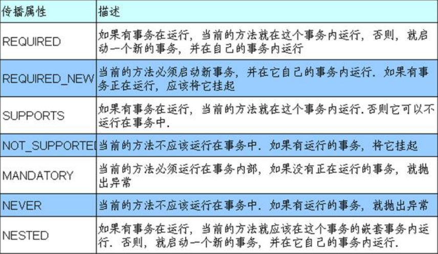
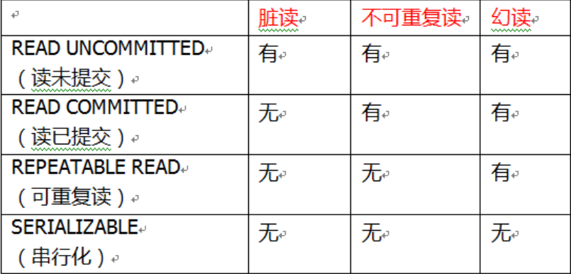

# Spring

## 目录

[TOC]

## IOC

1. 什么是 IOC
    1. 控制反转，把对象创建和对象之间的调用过程，交给 Spring 进行管理
    2. 使用 IOC 目的：为了耦合度降低
2. IOC 底层原理
    1. xml 解析、工厂模式、反射
1. IOC 思想基于 IOC 容器完成，IOC 容器底层就是对象工厂
2. Spring 提供 IOC 容器实现两种方式：（两个接口）
    1. BeanFactory：IOC 容器基本实现，是Spring内部的使用接口，不提供开发人员进行使用
        * 加载配置文件时候不会创建对象，在获取对象（使用）才去创建对象
    2. ApplicationContext：BeanFactory接口的子接口，提供更多更强大的功能，一般由开发人员进行使用
        * 加载配置文件时候就会把在配置文件对象进行创建
1. 什么是 Bean 管理
    1. Bean 管理指的是两个操作
    1. Spring 创建对象
    2. Spirng 注入属性
2. Bean 管理操作有两种方式
    1. 基于 xml 配置文件方式实现
    2. 基于注解方式实现
2.  对象的创建和属性的注入全部交给Spring去完成

### 导入依赖

```xml
<dependencies>
    <dependency>
        <groupId>org.springframework</groupId>
        <artifactId>spring-webmvc</artifactId>
        <version>5.3.15</version>
    </dependency>
    <dependency>
        <groupId>junit</groupId>
        <artifactId>junit</artifactId>
        <version>4.12</version>
        <scope>test</scope>
    </dependency>
</dependencies>
```

### XML配置

#### 创建和获取对象

1. 在 spring 配置文件中，使用 bean 标签，标签里面添加对应属性，就可以实现对象创建
2. 在 bean 标签有很多属性，介绍常用的属性
    * id 属性：唯一标识
    * class 属性：类全路径（包类路径）
3. 创建对象时候，默认也是执行无参数构造方法完成对象创建

xml文件

```
<!--对象创建-->
<bean id="userService" class="com.spring.service.UserService"></bean>
```

调用

```java
ApplicationContext app = new ClassPathXmlApplicationContext("applicationContext.xml");
UserService userService  = app.getBean(UserService.class);
userService.add();
```

#### 属性注入


##### set注入

* 写属性的setter方法
* 在bean标签中用property标签
    * name属性：属性名称
    * value：属性的值

```
<bean id="book" class="com.atguigu.spring5.Book">
    <property name="bname" value="易筋经"></property>
    <property name="bauthor" value="达摩老祖"></property>
</bean>
```

##### 有参构造注入

* 写出类的属性有参构造器

```
<bean id="orders" class="com.atguigu.spring5.Orders">
    <constructor-arg name="oname" value="电脑"></constructor-arg>
    <constructor-arg name="address" value="China"></constructor-arg>
</bean>
```

##### p名称空间注入*

* 在spring的xml配置文件加入`xmlns:p="http://www.springframework.org/schema/p"`


```
<bean id="book" class="com.atguigu.spring5.Book" p:bname="九阳神功"
p:bauthor="无名氏"></bean>
```

#### 其它属性注入

##### null

```
<property name="address">
    <null/>
</property>
```

##### 特殊符号

```
<property name="address">
    <value><![CDATA[<<钝角>>]]></value>
</property>
```

#### 外部bean属性注入

* 创建好外部bean
* 用property的ref属性

```
<bean id="userService" class="com.spring.service.UserService">
    <property name="userDao" ref="userDao"></property>
</bean>

<bean id="userDao" class="com.spring.dao.UserDaoImpl"></bean>
```

* 直接在property的标签内创建属性
* 套娃

```
<bean id="userService" class="com.spring.service.UserService">
    <property name="userDao">
        <bean id="userDao" class="com.spring.dao.UserDaoImpl"></bean>
    </property>
</bean>
```

#### 数组集合属性注入

```
<bean id="book" class="com.spring.pojo.Book">
    <property name="name">
        <array>
            <value>java</value>
            <value>c++</value>
            <value>mysql</value>
        </array>
    </property>
    <property name="list">
        <list>
            <value>aaa</value>
            <value>bbb</value>
            <value>ccc</value>
        </list>
    </property>
    <property name="map">
        <map>
            <entry key="1" value="111"></entry>
            <entry key="2" value="222"></entry>
        </map>
    </property>
    <property name="set">
        <set>
            <value>666</value>
            <value>000</value>
        </set>
    </property>
</bean>

```

##### 集合抽取

* 加入util
* `xmlns:util="http://www.springframework.org/schema/util"`
* `http://www.springframework.org/schema/util http://www.springframework.org/schema/util/spring-util.xsd`
* `<util:list id="">`

```
<util:list id="list">
    <value>aaa</value>
    <value>bbb</value>
    <value>ccc</value>
</util:list>
property name="list" ref="list"></property>
```

#### FactoryBean

1. Spring 有两种类型 bean，一种普通 bean，另外一种工厂 bean（FactoryBean）
2. 普通 bean：在配置文件中定义 bean 类型就是返回类型
3. 工厂 bean：在配置文件定义 bean 类型可以和返回类型不一样
    1. 创建类，让这个类作为工厂 bean，实现接口 FactoryBean
    1. 实现接口里面的方法，在实现的方法中定义返回的 bean 类型


```
public class MyBean implements FactoryBean<Course> {
    //定义返回 bean
    @Override
    public Course getObject() throws Exception {
        Course course = new Course();
        course.setCname("abc");
        return course;
    }
    @Override
    public Class<?> getObjectType() {
        return null;
    }
    @Override
    public boolean isSingleton() {
        return false;
    }
}

<bean id="myBean" class="com.atguigu.spring5.factorybean.MyBean"></bean>

@Test
public void test3() {
    ApplicationContext context =
    new ClassPathXmlApplicationContext("bean3.xml");
    Course course = context.getBean("myBean", Course.class);
    System.out.println(course);
}
```

#### bean的作用域

* 可以设置bean对象是单实例还是多实例
* 默认情况下是单实例
* 每次用`getBean()`方法获取的都是同一个对象
* 在bean标签中可以设置scope属性
    * `singleton`默认值，单实例对象
    * `prototype`多实例对象
    * 当scope是singleton时，在加载spring配置文件的时候就会创建对象，所以每次getBean()的都是同一个
    * 而prototype只有在getBean()方法调用时才会创建对象实例

```
<bean id="book" class="com.spring.pojo.Book" scope="prototype"></bean>
```
#### bean的生命周期

1. 生命周期
    1. 从对象创建到对象销毁的过程
2. bean 生命周期
    1. 通过构造器创建 bean 实例（无参数构造）
    2. 为 bean 的属性设置值和对其他 bean 引用（调用 set 方法）
    3. 调用 bean 的初始化的方法（需要进行配置初始化的方法）
    4. bean 可以使用了（对象获取到了）
    5. 当容器关闭时候，调用 bean 的销毁的方法（需要进行配置销毁的方法）

```
public class Orders {
//无参数构造
    public Orders() {
        System.out.println("第一步 执行无参数构造创建 bean 实例");
    }
    private String oname;
    public void setOname(String oname) {
        this.oname = oname;
        System.out.println("第二步 调用 set 方法设置属性值");
    }
//创建执行的初始化的方法
    public void initMethod() {
        System.out.println("第三步 执行初始化的方法");
    }
//创建执行的销毁的方法
    public void destroyMethod() {
        System.out.println("第五步 执行销毁的方法");
    }
}

<bean id="orders" class="com.atguigu.spring5.bean.Orders" init-
	method="initMethod" destroy-method="destroyMethod">
	<property name="oname" value="手机"></property>
</bean>


@Test
public void testBean3() {
	// ApplicationContext context =
		// new ClassPathXmlApplicationContext("bean4.xml");
    ClassPathXmlApplicationContext context =
        new ClassPathXmlApplicationContext("bean4.xml");
    Orders orders = context.getBean("orders", Orders.class);
    System.out.println("第四步 获取创建 bean 实例对象");
    System.out.println(orders);
	//手动让 bean 实例销毁
    context.close();
}
```

##### 后置处理器

* 当加入bean的后置处理器后，生命周期变为7步
    1. 无参数构造
    2. 调用 set 方法
    3. 后置处理器的方法 postProcessBeforeInitialization
    4. bean的初始化的方法（需要进行配置初始化的方法）
    5. 后置处理器的方法 postProcessAfterInitialization
    6. bean 可以使用了（对象获取到了）
    7. 调用 bean 的销毁的方法（需要进行配置销毁的方法）

#### 自动装配

* 根据指定的装配规则，spring自动把属性注入
* bean标签autowire属性
    * `byName`根据属性名
        * 必须有一个和属性同名的实例
    * `byType`根据属性类型
        * 不适合用于一个接口，多个实现类

```
<bean id="userService" class="com.spring.service.UserService" autowire="byType"></bean>

<bean id="userDao" class="com.spring.dao.UserDaoImpl"></bean>
```

### 注解

* 什么是注解
    1. 注解是代码特殊标记，格式：@注解名称(属性名称=属性值, 属性名称=属性值..)
* 怎么使用注解
    2. 使用注解，注解作用在类上面，方法上面，属性上面
* 为什么使用注解 
    3. 使用注解目的：简化 xml 配置


#### 创建实例

* 创建对象实例注解
    1. `@Component`
    2. `@Service`
    3. `@Controller`
    4. `@Repository`
* 四个注解都是一样的，只不过是为了能够区分出不同的层结构
    * @Service用于service业务层
    * @Controlle用于视图层
    * @Repository用于DAO数据库访问对象层
* 开启组件扫描
* `<context:component-scan base-package="com.spring02"></context:component-scan>`
* 在要实例的类上使用注解
* 如果没有指定value值，那么实例对象的名称为类名首字母小写

```java
@Repository(value = "userDao")
public class UserDaoImpl implements UserDao {
    public void add() {
        System.out.println("add.....");
    }
}

```

#### 属性注入

* `@Autowired`根据属性类型注入
* `@Qualifier`根据属性值注入，必须和autowired一起使用
* `@Resource`如果指定name值根据名称注入，否则根据类型注入
* `@Value`注入普通类型
* 属性注入事项：
    * @Autowired写在变量上和构造器上的区别：<https://blog.csdn.net/kane0409/article/details/78865964>

```java
@Service(value = "userService")
public class UserServiceImpl implements UserService {

    @Autowired
    @Qualifier(value = "userDao")
    private UserDao userDao;
    public void setUserDao(UserDao userDao) {
        this.userDao = userDao;
    }

    public void add() {
        userDao.add();
    }
}
```

```java
public class UserServiceImplTest {

    @Test
    public void add() {
        ApplicationContext app = new ClassPathXmlApplicationContext("app03.xml");

        UserService userService = app.getBean("userService", UserService.class);
        userService.add();
    }
}

```

#### 完全注解开发

```
@Configuration //作为配置类，替代 xml 配置文件
@ComponentScan(basePackages = {"com.atguigu"})
public class SpringConfig {
}

@Test
public void testService2() {
    //加载配置类
    ApplicationContext context
    = new AnnotationConfigApplicationContext(SpringConfig.class);
    UserService userService = context.getBean("userService",
    UserService.class);
    System.out.println(userService);
    userService.add();
}
```

## AOP

* 什么是 AOP
    1. 面向切面编程（方面），利用 AOP 可以对业务逻辑的各个部分进行隔离，从而使得
业务逻辑各部分之间的耦合度降低，提高程序的可重用性，同时提高了开发的效率。
    2. 通俗描述：不通过修改源代码方式，在主干功能里面添加新功能
* AOP 底层使用动态代理
    1. 有接口情况，使用 JDK 动态代理
        * 建接口实现类代理对象，增强类的方法
    2. 没有接口情况，使用 CGLIB 动态代理
        * 创建子类的代理对象，增强类的方法

### AOP术语

1. 连接点
    * 类中的哪些方法**可以被增强**，这些方法称为连接点
2. 切入点
    * **实际**被增强的方法，称为切入点
3. 通知（增强）
    * 实际增加的逻辑部分
    * 类型
        * 前置通知`@Before`
        * 后置通知`@AfterReturning`
        * 环绕通知`@Around`
        * 异常通知`@AfterThrowing`
        * 最终通知`@After`
4. 切面
    * 是一个动作，把通知应用到切入点的过程

### 切入点

* 切入点表达式作用：知道对哪个类里面的哪个方法进行增强
* 语法结构：`execution([权限修饰符] [返回类型] [类全路径] [方法名称]([参数列表]) )`
    * 修饰符，一般省略
        * public 公共方法
        * \* 任意
    * 返回类型，不能省略
        * void 无返回值
        * String 返回字符串
        * \* 任意
    * 参数
        * ()无参
        * (int,int)两个整数型
        * (..)任意参数
    * 参考：<http://www.manongjc.com/detail/7-bvryvfphgqlbijl.html>
* 例如
    * 对 com.atguigu.dao.BookDao 类里面的 add 进行增强
        * `execution(* com.atguigu.dao.BookDao.add(..))` 
    * 对 com.atguigu.dao.BookDao 类里面的所有的方法进行增强
        * `execution(* com.atguigu.dao.BookDao.* (..))`
    * 对 com.atguigu.dao 包里面所有类，类里面所有方法进行增强
        * `execution(* com.atguigu.dao.*.* (..))`

### 食用方法

* 导入相关依赖

```
<dependency>
    <groupId>org.aspectj</groupId>
    <artifactId>aspectjweaver</artifactId>
    <version>1.9.7</version>
</dependency>
```

* 实例化增强类，并生成代理对象
    * @Component
    * @Aspect
* 在增强方法上添加注解
* 指定value为execution表达式
* 在xml文件上开启aop

```
<aop:aspectj-autoproxy></aop:aspectj-autoproxy>
```


```java
@Service
@Aspect
public class UserServiceProxy {
    //前置通知
    @Before(value = "execution(* com.spring03.service.UserService.add(..))")
    public void addBefore() {
        System.out.println("before前置通知......");
    }

//    后置通知
    @AfterReturning(value = "execution(* com.spring03.service.UserService.add(..))")
    public void addAfterReturning() {
        System.out.println("后置通知AfterReturning........");
    }

//  环绕通知
    @Around(value = "execution(* com.spring03.service.UserService.add(..))")
    public void addAround(ProceedingJoinPoint p) throws Throwable {
        System.out.println("环绕通知Around.....之前");
        p.proceed();
        System.out.println("环绕通知Around.....之后");
    }

//    异常通知
    @AfterThrowing(value = "execution(* com.spring03.service.UserService.add(..))")
    public void addAfterThrowing() {
        System.out.println("异常通知AfterThrowing.......");
    }

//    最终通知
    @After(value = "execution(* com.spring03.service.UserService.add(..))")
    public void addAfter() {
        System.out.println("最终通知After......");
    }
}

```

输出结果  

>环绕通知Around.....之前  
before前置通知......  
add.....  
后置通知AfterReturning........  
最终通知After......  
环绕通知Around.....之后  


### 相同切入点抽取

```
@Service
@Aspect
public class UserServiceProxy {

    @Pointcut(value = "execution(* com.spring03.service.UserService.add(..))")
    public void point() {

    }

    //前置通知
    @Before(value = "point()")
    public void addBefore() {
        System.out.println("before前置通知......");
    }

//    后置通知
    @AfterReturning(value = "point()")
    public void addAfterReturning() {
        System.out.println("后置通知AfterReturning........");
    }
}
```

### 完全注解

```java
@Configuration
@ComponentScan(basePackages = {"com.spring03"})
@EnableAspectJAutoProxy(proxyTargetClass = true)
public class ConfigAop {
}

```

### XML方式配置

```
<!--创建对象-->
<bean id="book" class="com.atguigu.spring5.aopxml.Book"></bean>
<bean id="bookProxy" class="com.atguigu.spring5.aopxml.BookProxy"></bean>
3、在 spring 配置文件中配置切入点
<!--配置 aop 增强-->
<aop:config>
    <!--切入点-->
    <aop:pointcut id="p" expression="execution(* com.atguigu.spring5.aopxml.Book.buy(..))"/>
    <!--配置切面-->
    <aop:aspect ref="bookProxy">
        <!--增强作用在具体的方法上-->
        <aop:before method="before" pointcut-ref="p"/>
    </aop:aspect>
</aop:config>
```

## JdbcTemplate

* 导入依赖

```xml
<dependency>
    <groupId>org.springframework</groupId>
    <artifactId>spring-jdbc</artifactId>
    <version>5.3.15</version>
</dependency>
<dependency>
    <groupId>com.alibaba</groupId>
    <artifactId>druid</artifactId>
    <version>1.2.8</version>
</dependency>
<dependency>
    <groupId>mysql</groupId>
    <artifactId>mysql-connector-java</artifactId>
    <version>5.1.49</version>
</dependency>
```

* 创建druid`com.alibaba.druid.pool.DruidDataSource`对象并注入属性
* 创建jdbcTemplate对象并注入dataSource属性

```
<bean id="dataSource" class="com.alibaba.druid.pool.DruidDataSource">
    <property name="url" value="jdbc:mysql://localhost:3306/book"></property>
    <property name="driverClassName" value="com.mysql.jdbc.Driver"></property>
    <property name="username" value="root"></property>
    <property name="password" value="1234"></property>
</bean>

<bean id="jdbcTemplate" class="org.springframework.jdbc.core.JdbcTemplate">
    <property name="dataSource" ref="dataSource"></property>
</bean>
```

* `jdbcTemplate.update(sql, args);`增删改
* `jdbcTemplate.queryForObject(sql, new BeanPropertyRowMapper<User>(User.class), id);`查询一行数据，封装成一个对象
* `jdbcTemplate.query(sql, new BeanPropertyRowMapper<User>(User.class));`查询多个数据，封装成一个List集合
* `jdbcTemplate.queryForObject(sql, Integer.class);`查询单个值
* `jdbcTemplate.batchUpdate(String sql,List<Object[]> batchArgs)`执行多个增删改sql语句


```java
import com.spring04.dao.UserDao;
import com.spring04.pojo.User;
import org.springframework.beans.factory.annotation.Autowired;
import org.springframework.beans.factory.annotation.Qualifier;
import org.springframework.jdbc.core.BeanPropertyRowMapper;
import org.springframework.jdbc.core.ColumnMapRowMapper;
import org.springframework.jdbc.core.JdbcTemplate;
import org.springframework.stereotype.Repository;

import java.util.List;

@Repository(value = "userDao")
public class UserDaoImpl implements UserDao {

    @Autowired
    @Qualifier(value = "jdbcTemplate")
    public JdbcTemplate jdbcTemplate;

    public int add(User user) {
        String sql = "insert into user(username,password,email) values(?,?,?)";
        Object[] args = {user.getUsername(),user.getPassword(),user.getEmail()};
        int update = jdbcTemplate.update(sql, args);
        return update;
    }

    public int updateUser(User user) {
        String sql = "update user set username = ?, password = ?, email = ? where uid = ?";
        Object[] args = {user.getUsername(),user.getPassword(),user.getEmail(),user.getId()};
        int update = jdbcTemplate.update(sql, args);
        return update;
    }

    public User queryUserById(Integer id) {
        String sql = "select * from user where uid = ?";

        User user = jdbcTemplate.queryForObject(sql, new BeanPropertyRowMapper<User>(User.class), id);
        return user;
    }

    public List<User> queryUsers() {
        String sql = "select * from user";
        List<User> users = jdbcTemplate.query(sql, new BeanPropertyRowMapper<User>(User.class));
        return users;
    }

    public int queryUserConut() {
        String sql = "select count(*) from user";
        Integer integer = jdbcTemplate.queryForObject(sql, Integer.class);
        return integer;
    }
}
```


## 事务

* 什么是事务？
    * 事务是操作数据库的基本单元，是一系列的操作。
    * 要么都成功
    * 只要有一个失败那么所有的操作数据，要全部回滚
* 事务的四个特性（ACID）
    * 原子性
    * 一致性
    * 隔离性
    * 持久性

### Spring的事务

1. 事务操作添加到Service层（业务层）
2. Spring使用事务管理，底层用的AOP
3. 事务注解：`@Transactional`
    * 如果把注解用在类上，表示该类所有的方法都使用事务
    * 如果用在方法上，只有该方法使用事务

**创建事务管理器**

```xml
<!--    创建事务管理器实例-->
<bean id="transactionManager" class="org.springframework.jdbc.datasource.DataSourceTransactionManager">
    <property name="dataSource" ref="druidDataSource"></property>
</bean>
```

**开启事务注解驱动**

```xml
<tx:annotation-driven transaction-manager="transactionManager"></tx:annotation-driven>
```

**在Service类或方法上使用事务注解**

```java
@Service(value = "bankCardService")
public class BankCardServiceImpl implements BankCardService {

    @Autowired
    @Qualifier(value = "bankCardDao")
    private BankCardDao bankCardDao;

    @Transactional
    public boolean transfer(Integer id1, Integer id2, BigDecimal money) {

        int dec = bankCardDao.decBalance(id1, money);

        int i = 10/0;//模拟异常情况

        int add = bankCardDao.addBalance(id2, money);

        if(dec == 1 && add == 1) {
            return true;
        }
        return false;
    }
}
```

### Spring事务的参数配置

#### 事务的传播行为

* propagation
* Spring框架的事务传播行为有7种
* `@Transactional(propagation = Propagation.REQUIRED)`



#### 事务的隔离级别

* isolation
* 当进行多事务操作时，如果不考虑事务的隔离级别会出现一些问题
    * 脏读：一个未提交事务读取到另一个未提交事务的数据
    * 不可重复读：一个未提交事务读取到另一提交事务修改数据
    * 幻读：一个未提交事务读取到另一提交事务添加数据
* `@Transactional(propagation = Propagation.REQUIRED,isolation = Isolation.READ_COMMITTED)`



#### 超时时间

* timeout
* 事务需要在一定时间内进行提交，如果不提交进行回滚
* **默认值是-1**，设置时间以秒为单位计算
* `@Transactional(timeout = 100)`

#### 是否只读

* readOnly
* 读：查询
* 写：增删改
* 默认值是false，表示可以增、删、改、查

#### 回滚

* rollbackFor
* 设置出现哪些异常进行事务回滚

#### 不回滚

* noRollbackFor
* 设置出现哪些异常不进行事务回滚

### XML 声明式事务管理

```
<!--1 创建事务管理器-->
<bean id="transactionManager"
class="org.springframework.jdbc.datasource.DataSourceTransactionManager">
    <!--注入数据源-->
    <property name="dataSource" ref="dataSource"></property>
</bean>

<!--2 配置通知-->
<tx:advice id="txadvice">
    <!--配置事务参数-->
    <tx:attributes>
        <!--指定哪种规则的方法上面添加事务-->
        <tx:method name="accountMoney" propagation="REQUIRED"/>
    <!--<tx:method name="account*"/>-->
    </tx:attributes>
</tx:advice>
<!--3 配置切入点和切面-->
<aop:config>
    <!--配置切入点-->
    <aop:pointcut id="pt" expression="execution(*
    com.atguigu.spring5.service.UserService.*(..))"/>
    <!--配置切面-->
    <aop:advisor advice-ref="txadvice" pointcut-ref="pt"/>
</aop:config>
```

### 完全注解开发*

```java
@Configuration //配置类
@ComponentScan(basePackages = "com.atguigu") //组件扫描
@EnableTransactionManagement //开启事务
public class TxConfig {
    //创建数据库连接池
    @Bean
    public DruidDataSource getDruidDataSource() {
        DruidDataSource dataSource = new DruidDataSource();
        dataSource.setDriverClassName("com.mysql.jdbc.Driver");
        dataSource.setUrl("jdbc:mysql:///user_db");
        dataSource.setUsername("root");
        dataSource.setPassword("root");
        return dataSource;
    }
    //创建 JdbcTemplate 对象
    @Bean
    public JdbcTemplate getJdbcTemplate(DataSource dataSource) {
        //到 ioc 容器中根据类型找到 dataSource
        JdbcTemplate jdbcTemplate = new JdbcTemplate();
        //注入 dataSource
        jdbcTemplate.setDataSource(dataSource);
        return jdbcTemplate;
    }
    //创建事务管理器
    @Bean
    public DataSourceTransactionManager getDataSourceTransactionManager(DataSource dataSource) {
        DataSourceTransactionManager transactionManager = new
        DataSourceTransactionManager();
        transactionManager.setDataSource(dataSource);
        return transactionManager;
    }
}
```

