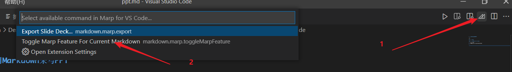
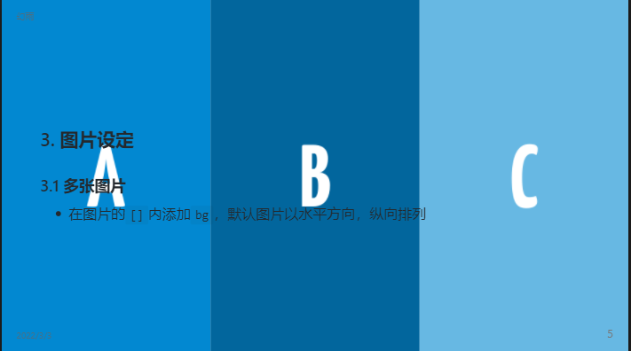
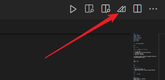
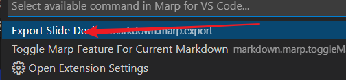
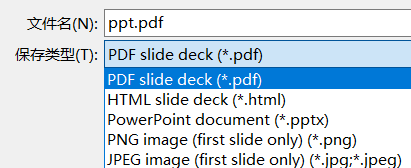

# 使用Markdown来写PPT

1. 准备
2. 头部指令
3. 图片设定
4. 导出文件

***

## 1. 准备

### 1.1 安装Marp for VS Code

1. 打开VS Code
2. 搜索Marp for VS Code插件，并安装
3. 点击编译器右上角，会自动添加上头部指令



```
---
marp: true
---
```

***

### 1.2 使用

* 分割线来结束PPT的一页
* 少数派攻略：<https://sspai.com/post/55718>

***

## 2. 头部指令

```
---
marp: true
backgroundColor: #FFFFFF
theme: default
header: 幻雨
footer: 2022/3/3
paginate: true
size: 16:9
math: katex
---
```

*** 

* `marp`是否开启markdown转PPT
* `backgroundColor`设置全局背景色
* `theme:`设置全局主题
    * 目前官方有`default`、`gaia`、`uncover`，三种主题
* `header`设置页头
* `footer`设置页脚
* `paginate`是否开启页码
* `size`设置PPT比例
* `math`数学公式支持

*** 

## 3. 图片设定

### 3.1 多张图片

* 在图片的`[]`内添加`bg`，默认图片以水平方向，纵向排列
* 可以使用 direction 关键字将对齐方向从水平更改为垂直。vertical
* `[bg vertical]`

```


```



*** 

### 3.2 图片位置

* 将背景图片至为PPT的左边或右边，文字会自动适应，默认会占用PPT的一半内容
* `[bg left]`
* `[bg right]`
* 可以设置图片占比`[bg right:30%]`

```

```

***

### 3.3 图片大小

* 设置图片大小`[h:300px]`
* 图像自动`[bg auto]`
* 图像适应`[bg fit]`
    * 自动适应PPT窗口大小
    * 也可以多图时自动大小分列
* 图像填满`[bg cover]`

***

## 4. 导出文件

* 导出的PPT文件不可编辑








