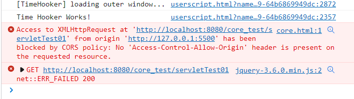

# 前端跨域

## 目录

[TOC]

## 跨域是什么

* 浏览器为了安全，做了一个同源限制
* 同源：协议、主机名、端口相同
* 当不满足下列任一要求时就会发生跨域
    * 协议不同
    * 域名不同
    * 端口不同



*  这里说的是 XMLHttpRequest 下的 AJAX 请求.
* 对于 `` , `<script>`, `<link>` 等标签,就不存在跨域请求.(除非对方后台做了防盗链)

## 为什么要跨域

* 当一个项目很大的时候，我们不可能把所有的文件丢在同一个服务器或同一个服务器软件中

## 解决方法

### JSONP

* src不受跨域限制，比如script标签
* jsonp 跨域是利用在浏览器中,script标签是不受同源策略限制的特性.
* JSOP 处理跨域的原理是，利用某些 html 标签不受同源策略的限制，来发送请求。比如 img script
* 只支持get请求

```
<!DOCTYPE html>
<html lang="en">
<head>
    <meta charset="UTF-8">
    <meta http-equiv="X-UA-Compatible" content="IE=edge">
    <meta name="viewport" content="width=device-width, initial-scale=1.0">
    <title>core</title>
</head>
<body>
    <script src="https://code.jquery.com/jquery-3.6.0.min.js"></script>
    <script type="text/javascript">
    
        //指定数据传输的函数
        function callback(data) {
            console.log(data);
        }
    </script>
    <!--以script标签的形式把函数执行-->
    <script src="http://localhost:8080/core_test/servletTest01"></script> 
</body>
</html>
```

```
public class ServletTest01 extends HttpServlet {
    @Override
    protected void doGet(HttpServletRequest req, HttpServletResponse resp) throws ServletException, IOException {
        PrintWriter writer = resp.getWriter();
        // 用指定的函数名写一个函数，传入数据作为参数
        writer.print("callback( [{\"name\": \"zhangsan\",\"age\": 18},{\"name\": \"lisi\",\"age\": 19},{\"name\": \"wangwu\",\"age\": 20}] )");
    }

    @Override
    protected void doPost(HttpServletRequest req, HttpServletResponse resp) throws ServletException, IOException {
        doGet(req,resp);
    }
}
```

### JQuery

#### ajax

```
<!DOCTYPE html>
<html lang="en">
<head>
    <meta charset="UTF-8">
    <meta http-equiv="X-UA-Compatible" content="IE=edge">
    <meta name="viewport" content="width=device-width, initial-scale=1.0">
    <title>core</title>
</head>
<body>
    <script src="https://code.jquery.com/jquery-3.6.0.min.js"></script>
    <script type="text/javascript">
        // jquery的jsonp跨域
        $.ajax({
            "url": "http://localhost:8080/core_test/servletTest01",
            "dataType": "jsonp",
            "type": "get",
            jsonp: "callback",//这里会自动生成一个jsonp函数名，传给后端
            success: function(data) {
                console.log(data);
            }
        })
        
    </script>
</body>
</html>
```

```
public class ServletTest01 extends HttpServlet {
    @Override
    protected void doGet(HttpServletRequest req, HttpServletResponse resp) throws ServletException, IOException {
        //接收jquery生成的函数名
        String callback = req.getParameter("callback");
        System.out.println(callback);
        PrintWriter writer = resp.getWriter();

        writer.print(callback + "( [{\"name\": \"zhangsan\",\"age\": 18},{\"name\": \"lisi\",\"age\": 19},{\"name\": \"wangwu\",\"age\": 20}] )");
    }

    @Override
    protected void doPost(HttpServletRequest req, HttpServletResponse resp) throws ServletException, IOException {
        doGet(req,resp);
    }
}
```
#### getJson


```
<!DOCTYPE html>
<html lang="en">
<head>
    <meta charset="UTF-8">
    <meta http-equiv="X-UA-Compatible" content="IE=edge">
    <meta name="viewport" content="width=device-width, initial-scale=1.0">
    <title>core</title>
</head>
<body>
    <script src="https://code.jquery.com/jquery-3.6.0.min.js"></script>
    <script type="text/javascript">
        // url?callback=?
        $.getJSON("http://localhost:8080/core_test/servletTest01?callback=?",function(data) {
            console.log(data);
        })
        
    </script>
    <!-- <script src="http://localhost:8080/core_test/servletTest01"></script> -->
</body>
</html>
```

### CORS同源策略

* 当进行跨域请求时会发生什么呢
    * 这是一次跨域请求.
    * 请求确实发送到服务器了.
    * 服务器也把数据返回到了浏览器.
    * 但是服务器返回的响应头里,没有告诉浏览器哪个域名可以访问这些数据(也就是没有设置 Access-Control-Allow-Origin)
    * 于是浏览器就把这个数据丢弃了.我们也就无法获取到这个数据.
    * 这个时候,只需要后台在相应头里加上一个 `Access-Control-Allow-Origin:*` 即可完成跨域数据获取.
* `Access-Control-Allow-Origin:*`会解除所有的跨域限制，这里，任何一个人都可以请求到你的后端数据

```
<!DOCTYPE html>
<html lang="en">
<head>
    <meta charset="UTF-8">
    <meta http-equiv="X-UA-Compatible" content="IE=edge">
    <meta name="viewport" content="width=device-width, initial-scale=1.0">
    <title>core</title>
</head>
<body>
    <script src="https://code.jquery.com/jquery-3.6.0.min.js"></script>
    <script type="text/javascript">
        $.ajax({
            "url": "http://localhost:8080/core_test/servletTest01",
            "dataType": "json",
            "type": "get",
            success: function(data) {
             console.log(data);
            }
        })
    </script>
</body>
</html>
```


```
public class ServletTest01 extends HttpServlet {
    @Override
    protected void doGet(HttpServletRequest req, HttpServletResponse resp) throws ServletException, IOException {
    
        //设置请求头解决跨域
        resp.setHeader("Access-Control-Allow-Origin", "http://127.0.0.1:5500"); 

        PrintWriter writer = resp.getWriter();

        writer.print("[{\"name\": \"zhangsan\",\"age\": 18},{\"name\": \"lisi\",\"age\": 19},{\"name\": \"wangwu\",\"age\": 20}] ");
    }

    @Override
    protected void doPost(HttpServletRequest req, HttpServletResponse resp) throws ServletException, IOException {
        doGet(req,resp);
    }
}
```

