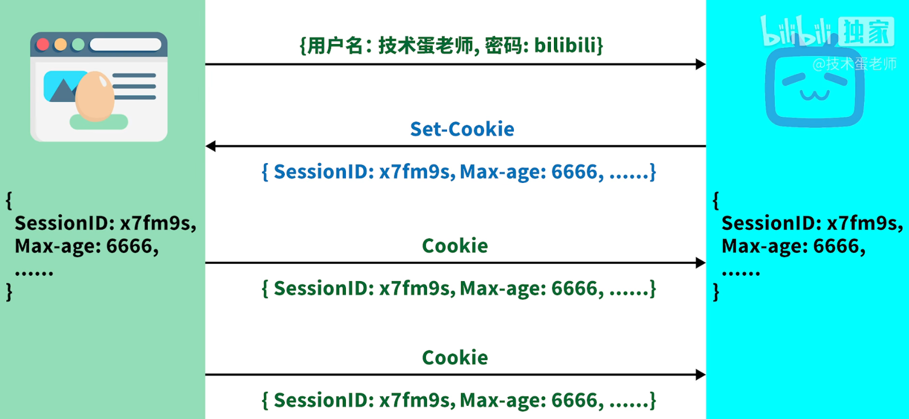
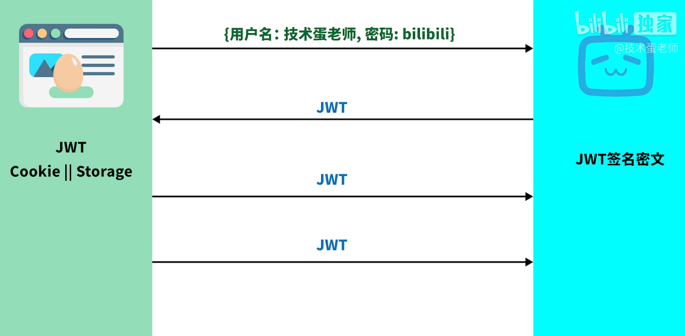

# 登录方案

1. 每个页面都要有登录验证
2. 当没有登录时，自动跳转到登录页面

## 前后端不分离

### session

* 登录流程
    1. 登录请求发出
    2. 后端接收到请求，数据正确，
    3. 把登录数据存到session域中
    4. 登录成功
* 在filter过滤器或interceptor拦截器中过滤每次的请求，如果session中没有数据，跳转到登录页面
* 登出：前端发送logout请求，后端接收到清除session

## 前后端分离

### JWT

* 登录流程
    1. 登录请求发出
    2. 后端收到请求，数据正确，
    3. 生成加密后的token，响应给前端
    4. 登录成功
    1. 前端把响应的Token存到localStorage或Cookie中
    2. 每次请求要带上token
* 在filter过滤器或interceptor拦截器中过滤每次的请求，如果token不正确、失效、没有token，响应403
* 前端在每次页面跳转前（比如路由守卫）检查是否有token，没有跳转到登录页面
* 登出：前端清除token

