# 软件测试大题

## 1

*  题1 用基本路径测试法对以下代码设计测试用例 

```
public void select_sort(int a[]){
1    int i,j,k,t,n;
2    n=a.length;
3    for(i=0;i<n-1;i++){
4        k=i;
5        for(j=i+1;j<n;j++){
6            if(a[j]<a[k]){
7                k=j;
8            }
9        }
10        if(k!=i){
11            t=a[k];
12            a[k]=a[i];
13            a[i]=t;
14        }
15    }
16}
```

  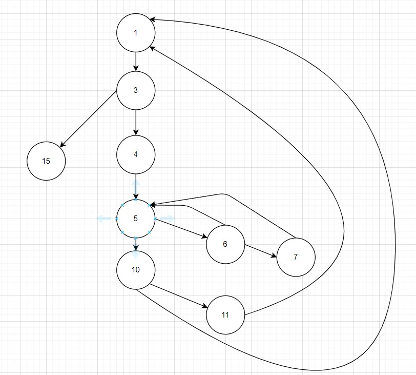

```
圈复杂度：5

路径：
1.3.15
1.3.4.5.10.3.15
1.3.4.5.6.5.10.3.15
1.3.4.5.6.7.5.10.3.15
1.3.4.5.6.7.5.10.11.3.15

测试数据：
n=1       路径二没有合适数据      a[0]=3   a[1]=4 
路径二没有合适数据                    a[0]=4   a[1]=3
```

## 2

* 题2 找出程序中所有的逻辑判断与语句，画出程序的控制流图，并计算控制流图的圈复杂度。

  设函数的参数m取值为150<m<160，使用基本路径测试设计测试用例。

```
IsPrime(int m){
{
1    int i;
2    for(i=2;i<m;i++)
3        if(m%i==0)  break;
4    if(i>=m)
5        printf("%d is a prime number\n",m);
6    else
7        printf("%d is not a prime number\n",m);
8}
```

  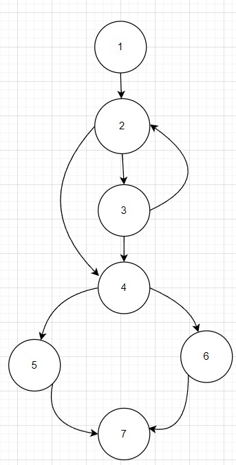

```
圈复杂度：4

路径：
1   2   3   2   3   4   6   7
1   2   3   4   6   7
1   2   4   5   7
1   2   3   2   4   5   7

m取值：
151-路径4   152-路径2    153-路径1
```

## 3

*  题3 为以下代码画出控制流图，计算圈复杂度，导出独立路径（用语句编号），设计测试用例 

```
void Sort(int iRecordNum,int iType)
1{
2 int x=0;
3 int y=0;
4 while(iRecordNum-->0)
5 {
6   if(iType==0)
7     x=y+10;
8   else
9     if(iType==1)
10      x=y+20;
11    else
12      x=y+30;
13 }
14}
```

  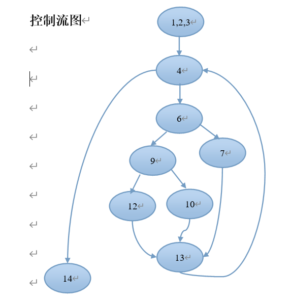

```
圈复杂度：4

路径：
1   4   14
1   4   6   7  13     4   14
1   4   6   9   10   13   4   14
1   4   6   9   12   13   4   14

测试用例
iRecordNum=0
iRecordNum=1       iType=0
iRecordNum=1      iType=1
iRecordNum=1       iType=2
```

## 4

```
一个系统的登录操作规格说明如下：
登录对话框有两个数据输入：用户名和密码。登录操作对两个输入数据进行检查，要求用户名只能包含数字和字母（字母不区分大小写），密码可以包含任何字符。用户名和密码都不能为空且长度不限。当用户名和密码为空时，则登录失败并提示对应的出错信息；当用户名不正确或用户名不存在或密码错误时，则登录失败并提示一下3中相应的出错信息：用户名不合法（即包含有非法字母、非数字字符），或用户名不存在，或密码错误；当用户名和密码都正确时，则显示登录成功信息，完成登录。
    假设正确的用户名为：abc123，密码是：123456。
    用等价类方法为上述规格说明设计等价类表和测试用例。
```

 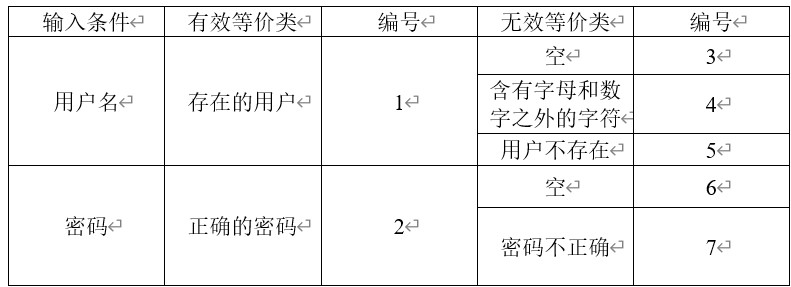 

```
测试用例

--------------------------------------------------------------

用户名       密码               输出                  覆盖等价类

abc123        123456         登录成功                    1   2

a=aa          123456         用户名不合法                   4

abc123        1111111          密码错误                      7

acc           1233333          用户名不存在                  5

空               空           用户名或密码为空              3  6
```

## 5

```
某城市的固定电话号码由以下三个部分组成：
地区码---空白或三位数字；前缀---非“0”或“1”开头的三位数字；后缀---4位数字。
假定被测程序能接受一切符合上述规定的电话号码，拒绝所有不符合规定的电话号码。
要求：
    （1）  对电话号码划分有效等价类和无效等价类，建立等价类表。
    （2）  根据（1）建立的等价类表设计测试用例。
```

  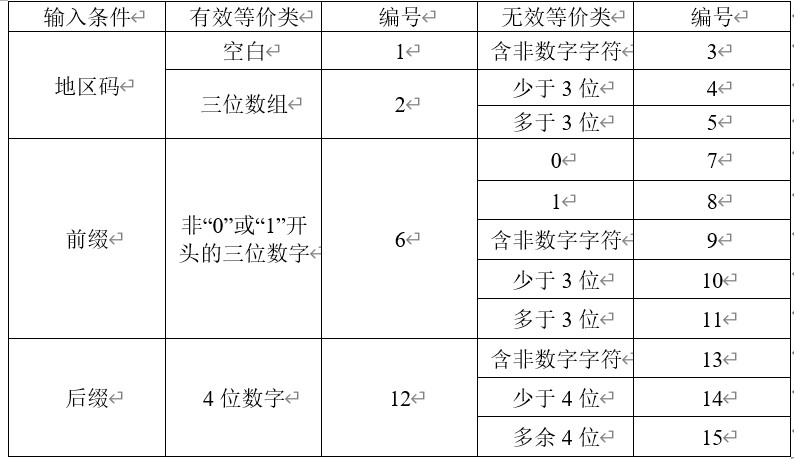

  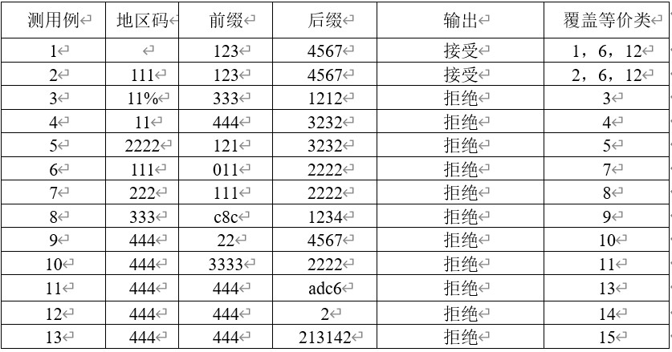

## 6

```
某公司人事软件的工资计算模块的需求规格说明书描述：
    ①　年薪制员工：严重过失，扣当月薪资的4%；过失，扣年终奖的2%。
    ②　非年薪制员工：严重过失，扣当月薪资的8%；过失，扣当月薪资的4%。
    根据题目内容列出条件和结果，给出决策表。
```


  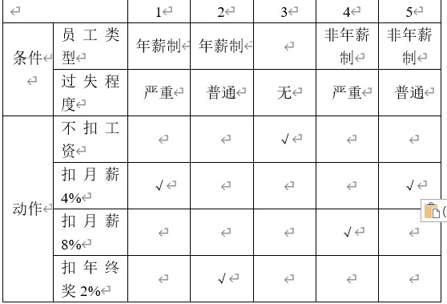

## 7

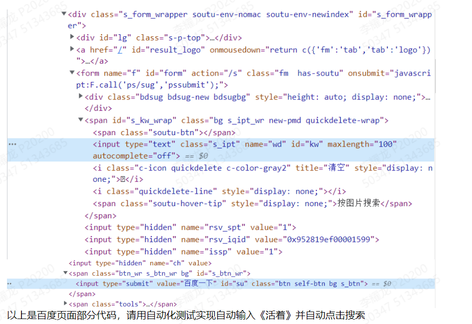

```python
from selenium import webdriver
from selenium.webdriver.common.by import By

wd = webdriver.Edge('D:\Downloads\Browser\edgedriver_win64\msedgedriver.exe')
wd.get('http://www.baidu.com') 

element=wd.find_element(By.ID,'kw')
element.clear()
element.send_keys("活着\n")
```

## 8

* 弱一般：基于单缺陷假设，对一个测试用例中的每个等价类的一个变量实现
* 强一般：基于多缺陷假设，覆盖每个等价类进行测试。
* 弱健壮：基于单缺陷假设的健壮性测试，对于无效输入等价类也将拥有一个测试用例.
* 强健壮：基于多缺陷假设的健壮性测试。

## 9

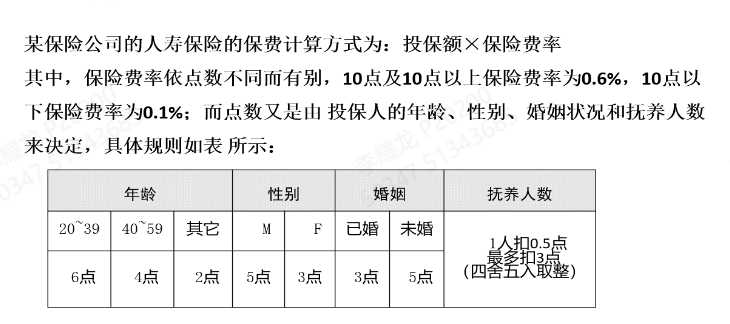

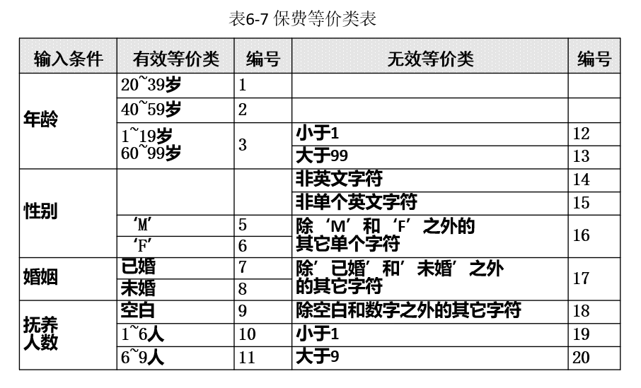

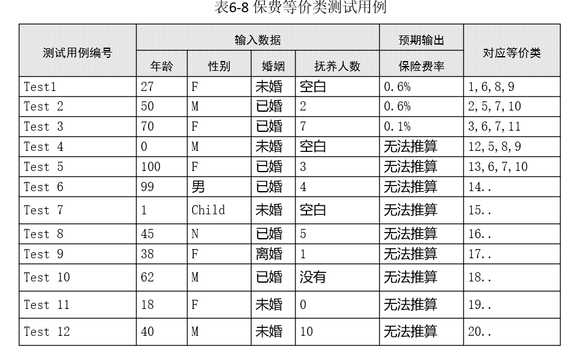

## 10

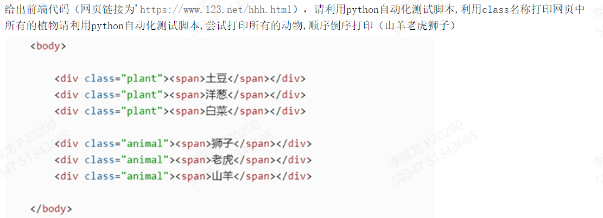

```python
from selenium import webdriver
from selenium.webdriver.common.by import By

wd = webdriver.Edge('D:\\Downloads\\Browser\\edgedriver_win64\\msedgedriver.exe')

wd.get('https://www.123.net/hhh.html')

plant = wd.find_elements(By.CLASS_NAME,'plant')
for ele in plant:
	print(ele.text)

elements = wd.find_elements(By.CLASS_NAME,'animal')
for i in range(0, len(ele)):
    value = ele.pop()
    print(value.text)
```

