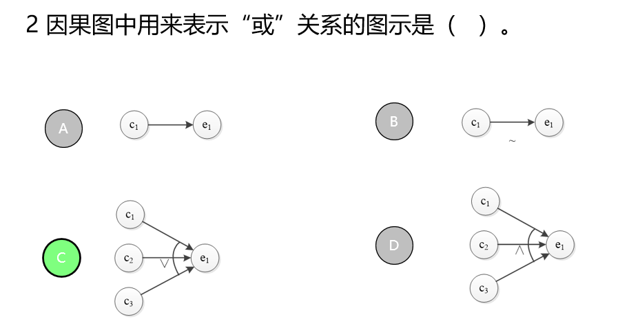

# 软件测试题库

## 期中小测

1. 软件测试是为了证明程序**无误**，这个说法对吗？（错）
2. 关于软件测试，下列说法中错误的是（D）。
   A. 在早期的软件开发中，测试就等同于调试  
   B. 软件测试是使用人工或自动手段来运行或测试某个系统的过程  
   C. 软件测试的目的在于检验它是否满足规定的需求或是弄清楚预期结果与实际结果之间的差异  
   **D. 软件测试与软件开发是两个独立、分离的过程**  
3. 以下关于软件测试目的的描述中，不正确的是（B）
   * 测试以发现故障或缺陷为自的  
   * **测试可以找出软件中存在的所有缺陷和错误**  
   * 执行有限测试用例并发现错误  
   * 检查软件是否满足定义的各种需求  
4. 软件测试是为了检查出并改正尽可能多的错误，不断提高软件的（C）
   * 功能和效率  
   * 设计和技巧  
   * **质量和可靠性**  
   * 质量和效能  
5. 软件测试的对象包括（C）
   * 程序和相关文档  
   * 程序、操作系统和平台软件  
   * **程序、数据及相关文档**  
   * 程序  
6. 软件质量的定义是（D）
   软件的功能性、可靠性、易用性、效率、可维护性、可移植性  
   满足规定用户需求的能力  
   最大限度地满足用户  
   **软件特性的综合，以及满足规定和潜在用户需求的能力**  
7. 下列选项中，哪一项不是影响软件质量的因素 C
   * 需求模糊  
   * 缺乏规范的文档指导  
   * **使用新技术**  
   * 开发人员技术有限  
8. 在关于软件质量保证和软件测试的描述中，不正确的是 D
   * 软件质量保证和软件测试是软件质量工程的两个不同层面的工作
   * 在软件质量保证的活动中也有一些测试活动
   * 软件测试是保证软件质量的一个重要环节
   * **软件测试人员就是软件质量保证人员**
9. 关于软件测试对软件质量的意义，有以下观点：①**度量与评估软件的质量**；②保证软件质量；③**改进软件开发过程**；④**发现软件错误**。其中，正确的是（C）。
   * 123  
   * 124  
   * **134**  
   * 1234  
10. 下列哪一项不是软件缺陷产生的原因？ B
   * 需求不明确
   * **测试用例设计不好**
   * 软件结构复杂
   * 开发人员技术有限
11. 关于软件缺陷，下列说法中错误的是（C）
    * 软件缺陷是软件中存在的影响软件正常运行的问题
    * 按照缺陷的优先级不同可以将缺陷划分为立即解决、高优先级、正常排队、低优先级
    * **缺陷报告有统一的模板，该模板是IEEE729-1983指定的**
    * 每个缺陷都有一个唯一的编号，这是缺陷的标识
12. 寻致软件缺陷的最大原因来自 A
    * **软件需求规格说明书**
    * 软件设计
    * 软件编码
    * 数据输入错误
13. 软件缺陷**都存在**与程序代码中，这种说法对吗？（错）
14. 软件存在缺陷是由于开发人员水平有限引起的，一个非常优秀的程序员可以开发出**零缺陷**的软件。这种说法对吗？（错）
15. 在以下选项中，不属于软件功能性的子特性的是（B）
    * 实用性
    * **稳定性**
    * 准确性
    * 安全性
16. 软件可移植性应从如下（A）方面进行测试
    * **可适应性、易安装性、共存性、易替换性**
    * 可适应性、易安装性、可伸缩性、易替换性
    * 可适应性、易安装性、可恢复性、易替换性
    * 可适应性、成熟性、兼容性、易替换性
17. 系统在特定环境下，在给定的时间内无故障运行的概率称为    **__ 软件可靠性 __**  ，它是对软件设计、开发以及所预定环境下具有特定能力置信度的一种度量，为衡量软件质量主要参数之一。
18. ISO/IEC 9126-1991软件质量模型定义软件包含6项中特性：**功能性、可靠性、易用性、效率性 、易用性和可移植性**。
19. 下列哪一项不是软件测试的原则 B
    * 测试应基于客户需求
    * **测试越晚进行越好**
    * 秀尽测试是不可能的
    * 软件测试应遵循GoodEnough原则
20. 软件测试要投入尽可能多的精力以达到100%的覆盖率。这种说法对吗？（错）
21. 如果同样的测试用例被一再重复地执行，则会减少测试的有效性。先前没有发现的缺陷反复使用同样的测试用例也不会被重新发现。这种现象在软件测试中称为 **（杀虫剂悖论）**  。
22. 一个故障会被应用程序其他部分的某个或某些故障所掩盖，这种现象称为 **（故障屏蔽）**   。
23. 等价类划分就是将输入数据按照输入需求划分为若干个子集，这些子集称为 **（等价类）** 
24. 等价类划分法可将输入数据划分为**（有效等价类）**和**（无效等价类）**   
25. 有效等价类可以捕获程序中的缺陷，而无效等价类不能捕获缺陷，这种说法对吗？  错
26. 如果程序要求输入值是一个有限区间的值，可以划分为一个有效等价类（取值范围）和一个无效等价类（取值范围之外）。这种说法对吗？  错
27. 在下面关于等价类划分法的描述中，错误的是（C）
    * 将测试对象的输入域划分成若干部分
    * 从每个部分中选取少数具有代表性的数据作为测试用例
    * **只需要考虑程序中合理的、有意义的输入数据**
    * 等价类划分的主要依据是需求规格说明书
28. 在某院校的学生成绩信息管理系统中，成绩输入范围为0---100分根据等价类划分法的原则，学生的成绩可划分为（B）。
    * 2个有效等价类和2个无效等价类
    * **1个有效等价类和2个无效等价类**
    * 2个有效等价类和1个无效等价类
    * 1个有效等价类和1个无效等价类
29. 某程序输入X取值于一个固定的枚举类型（1，4，9，16}，并且程序要对这4个输入值分别进行处理，根据等价类划分法，这种情况下对输入X划分正确的是（A）
    * **划分为4个有效等价类、1个无效等价类**
    * 划分为1个有效等价类、4个无效等价类
    * 划分为1个有效等价类、2个无效等价类
    * 划分为1个有效等价类、1个无效等价类
30.  用等价类划分法设计6位长度的数字类型用户名（不能包含除数字外的其他字符）登录操作的测试用例，应该分成（C）个等价类。  A. 2                B.  3                 **C .   4**             D.6
31. 在下面的说法中，错误的是（C）
    * 一般等价类测试不考虑无效数据值
    * 建壮等价类测试会同时考虑有效等价类和无效等价类
    * **各个等价类的代表值至少要在一个测试用例中出现**
    * 更用无效数据值的测试用例可以不用定义预期结果

## 等价类划分

1. 等价类划分法需要考虑程序中输入条件之间的组合情况。这种说法对吗？  对
2. 等价类划分只能从被测程序的输入域来划分等价类。这种说法对吗？  错
3. 如果已划分的等价类中各元素在程序中的处理方式不同，则应将该等价类进一步划分为更小的等价类。这种说法对吗？ 对
4. 应用等价类划分法设计测试用例时，如果某一个输入条件选取了无效等价类的代表值，则其他输入条件应该选取有效等价类的代表值。这种说法对吗？    对

## 边界值

1. **（边界值分析法）**通常作为等价类划分法的补充。
2. 使用边界值方法测试时，只取边界2个值即可完成边界测试。这种说法对吗？ 错
3. 边界值分析法是基于可靠性理论中称为“单故障”的假设，两个或两个以上的故障同时出现而导致软件失效的情况很少。这种说法对啊？ 对
4. 使用边界值分析法设计测试用例时，所有的边界值都可以从模块的功能说明中获得。这种说法对吗？ 错
5. 如果程序规格说明给出的输入域或输出域是有序集合，则应选取集合的第一个和最后一个元素作为测试边界值。这种说法对吗？   对
6. 在下面关于边界值分析的说法中，不正确的是（C）
   * 边界值分析采用定义域或等价区间的边界值设计测试用例
   * 边界值分析法是一种补充等价划分法的黑盒测试技术
   * **边界值分析法考虑了输入变量之间的依赖关系**
   * 程序在处理大量中间数值时不易出错，但容易在边界值处出
7. 如采用边界值分析法进行健壮性测试，需要对程序的每个输入变量选取（D）来设计测试用例
   * 最小值、正常值、最大值
   * 最小值、路大于最小值、正常值、路小于最大值、最大值
   * 路小于最小值、最小值、正常值、最大值、略大于最大值
   * **略小于最小值、最小值、路大于最小值、正常值略小于最大值、最大值、略大于最大值**
8. 某程序含有3个变量，采用边界值分析法设计测试用例，使除一个以外的所有变量取正常值，使剩余变量取最小值、略大于最小值、正常值、略小于最大值、最大值，对每个变量都重复进行。这样产生的测试用例数为（   B）。  A. 12             **B. 13**                C. 14                D.15
9. 某程序的一个输入变量的取值范围是正整数，那么这个变量的有效边界值的数目是（A）**A. 1**   B. 2   C. 3  D. 4
10. 在某汽车销售管理系统中，销售员可以根据当时的实际情况允许给客户0-15%的折扣，折扣精确到小数后两位。现在要对系统的折扣项用边界值分析法进行测试，则折扣项的边界值应该取（C）。
    * （-2,-1,0,1,99,100,101）
    * （-Max，0，20，Max
    * **（-0.01 ,0, 0.01, 14.99, 15.00, 15.01）**
    * （-0.01,0,0.01,99.99，100.00,100.01）

## 决策表

1. 下面说法不正确的是（D）
    * 等价类划分法没有考虑输入条件之间的联系和相互组合的情况
    * 因果图法适合检查程序输入条件的各种组合情况
    * 因果图中可以表示出恒等、非、或、与四种因果关系
    * **因果图法根据画出的因果图直接设计测试用例**
2. 
3. （ B  ）不是因果图中输入条件的约束。       A. E约束         B. **M约束**        C. O约束         D. R约束
4. 某程序的原因C1和C2表示的状态不可能同时出现，则原因C1和C2之间具有（ A  ）。
    * **A. 异约束**              B.  或约束             C. 唯一约束                D. 要求约束
5. 某公司员工分为技术岗和管理岗两大类。员工考核分为称职、优秀和特殊贡献三个等级。称职和优秀员工都可以有特殊贡献，对考核等级相同的两类员工发放的年终奖不同。现有一个程序可以计算该公司员工的年终奖，根据员工类型和考核等级的不同组合情况，输出的奖金分为1类奖金、2类奖金……，现在要使用因果图法对该软件进行测试，分析后得到的结果数目有（D   ）。    A. 4个          B. 5个           C. 6个            D.**8个**
6. 在下面关于决策表法的描述中，不正确的是（D）
     * 是最为严格、最具有逻辑性的黑盒测试方法
    * 适合处理针对不同逻辑条件的组合值执行不同操作的问题
    * 决策表由条件桩、动作桩、条件项和动作项组成
    * **决策表中条件的排列顺序可能会影响所执行的操作**
7. 构造决策表时，（ B  ）将列出问题规定可能采取的操作。    A .条件桩    B. **动作桩**     C. 条件项       D. 动作项
8. 在下面关于决策表规则的说法中，错误的是（C）
     * 任何一个条件组合的特定取值以及相应要执行的操作就是一条规则
    * 规则的排列顺序不影响执行测试的操作
    * **规则在决策表中表现为贯穿条件桩和动作桩的一列**
    * 初始决策表中规则的数目有所有条件的取值组合数决定
9. 如决策表有n个条件，每个条件有真、假两个取值，则简化前的初始决策表中会有2的n次方种规则，这种说法对吗？   对
10. 决策表中的两条规则只要具有相同动作项就可以进行合并。这种说法对吗    错
11. 某公司人事软件的工资计算模块的需求规格说明书描述：
      1. 年薪制员工：严重过失，扣当月薪资的4%；过失，扣年终奖的2%。
      2. 非年薪制员工：严重过失，扣当月薪资的8%；过失，扣当月薪资的4%。
      3. 根据题目内容列出条件和结果，给出决策表

|      |            | 1      | 2      | 3    | 4        | 5        |
| ---- | ---------- | ------ | ------ | ---- | -------- | -------- |
| 条件 | 员工类型？ | 年薪制 | 年薪制 | ---  | 非年薪制 | 非年薪制 |
|      | 过失程度？ | 严重   | 普通   | 无   | 严重     | 普通     |
| 动作 | 不扣工资   |        |        | OK   |          |          |
|      | 扣月薪4%   | OK     |        |      |          | OK       |
|      | 扣月薪8%   |        |        |      | OK       |          |
|      | 扣年终奖2% |        | OK     |      |          |          |

```
测试用例
年薪制员工    严重过失     扣月薪4%
年薪制员工    过失        扣年终奖2%
非年薪制员工   严重过失    扣月薪8%
非年薪制员工   过失       扣月薪4%
无过失 不扣工资
```

## 逻辑覆盖测试

1. 针对逻辑覆盖有下列叙述是不正确的。  B
	* 达到100%分支覆盖就一定能够满足100%语句覆盖的要求
	* **达到100%条件覆盖就一定能够满足100%语句覆盖的要求**
	* 达到100%条件/判定覆盖就一定能够满足100%语句覆盖的要求
	* 达到100%修正条件/判定覆盖就一定能够满足100%语句覆盖的要求
2. 针对下面的程序，满足语句覆盖的测试用例（a，b）的值为（A   ）。

```
if a>0 and b<5 then
    c=a+b
end if
if a>5 or b>10 then 
    c=a-b
end if
```

**A. A=10，b=4**        B. A=-1，b=11           C. A=5，b=3            D. A=6，b=6

3. 针对下列程序段，对于（A，B）的取值，以下（ C  ）测试用例组合能够满足条件覆盖的要求。

```
IF((A-10)=20 AND (B+20)>10)   THEN C=0
IF((A-30)<10 AND (B-30)<0)    THEN B=30
```

```
1. A=50 B=-10   2. A=40 B=40    3.A=30 B=-10    4. A=30 B=30 
```

A. 1、2      B.  3、4          **C. 1、4**           D. 2、4

4. 条件`(x<12 and y>8 or z<>10)`的条件组合覆盖用例个数是（C）A. 3   B. 6    **C. 8**    D. 16

5. 根据条件`(x>3，y<5)`设计条件组合覆盖的测试用例为（A  ）。

   ```
   1. x=6，y=3    2. x=6，y=8   3. x=2，y=3    4. x=2，y=8
   ```

   **A. 1、2、3、4**           B. 1、2、3           C. 1、2、4           D. 3、4

   