# 软件项目管理

## 1. 概述

### 1.1 什么是项目、项目的概念

项目是为完成某个独特的产品或服务所做的**一次性任务**：

* **目标性**，其结果只可能是一种期望的产品或服务。
* **独特性**，每一个项目都是唯一的。
* **一次性**，有确定的起点和终点。
* **约束性**，每一个项目的资源、成本和时间都是有限的。
* **关联性**，所开展的活动是密切相互关联的。
* **多方面性**，一个项目涉及多个相关利益者
* **不可逆转性**。不论结果如何，项目结束了，结果也就确定了。

###  1.2 项目集 - 项目组合

* **项目集**：多个**项目**构成项目集； 程序管理，通过组织**有序、协调**的方式来管理多个项目。
* **项目组合**：多个**项目集**构成资产组合。资产组合管理，将**项目、项目集、资产子组合和业务操作**等作为一个组合，以达到业务战略目标

### 1.3 项目 - 项目集 - 项目组合的关系

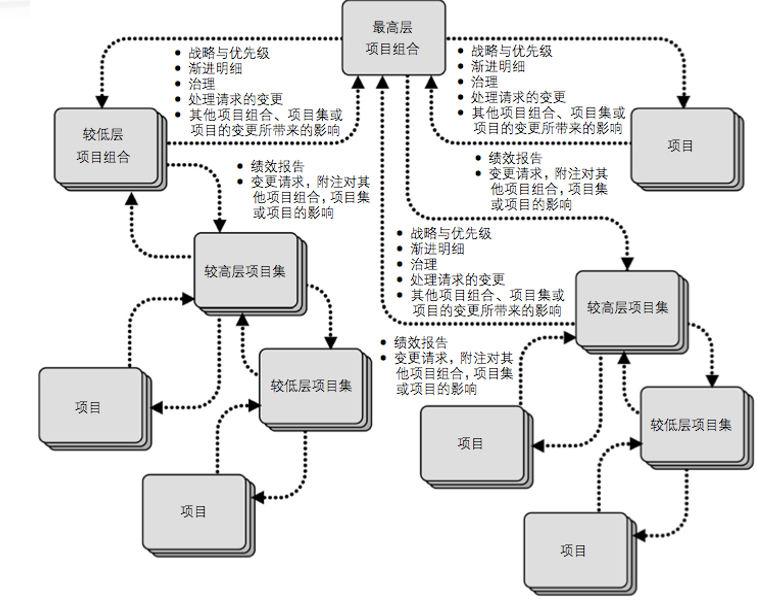

### 1.4 项目管理的定义

项目管理就是组织实施为实现项目目标所必需的一切活动的**计划、安排与控制。**

### 1.5 项目管理的构成与约束因素

* 构成：人、工具、过程

* 约束因素：时间、范围、预算、质量

### 1.6 项目管理的对象 - 3P

* 人员、问题、过程

### 1.7 项目成功的标志

* 在规定的时间内完成项目
* 项目成本控制在预算之内
* 功能特性达到规格说明书所要求的水平（质量）
* 项目通过客户或用户的验收
* 项目范围变化是最小的或可控的
* 没有干扰或严重影响整个组织的主要工作流程
* 没有改变公司文化或改进了公司的文化。

### 1.8 项目管理成功要素

* **制定计划**：预估和确定项目的工作量大小、所需资源和进度、风险应对措施等；
* **建立组织**：建立项目组，并有明确的角色定义和任务分工；
* **配备资源**：任用各种层次的技术人员和管理人员，以及准备所需的软硬件；
* **监控执行**：协调项目各方人员，监控各种风险，督促项目进展，随时检查实施情况，确保项目按计划进行，按时、按质完成任务。
* **总结提高**：项目完成后，及时进行总结，吸取教训，分享经验，丰富组织的项目管理数据库或知识库。

##  2. 项目准备和启动

### 2.1 项目建议书的内容

* 项目的背景。
* 项目的意义和必要性。
* 项目产品或服务的市场预测。
* 项目规模和期限。
* 项目建设必需的条件、已具备和尚不具备的条件分析。
* 投资估算和资金筹措的设想。
* 市场前景及经济效益初步分析。
* 其它需要说明的情况

### 2.2  可行性分析

* 经济可行性
  * 成本分析、直接收益、间接效益
* 技术可行性
  * 技术适用性、技术成熟性
* 风险和不确定性
  * 内部风险
    * 设计的技术风险、组织风险、资金风险、人力资源风险
  * 外部风险
    * 市场风险、环境风险、法律风险

### 2.3 合同种类

* 固定总价合同、费用偿还合同、时间和材料合同、功能点计费合同

### 2.4 软件开发模型

* 瀑布模型
* 快速原型实现模型
* 增量模型到敏捷方法
* 极限编程
* 行为驱动开发
* 功能驱动开发
* 敏捷开发模型Scrum
  * 是一种思想或方法论：通过不断迭代开发和增量发布，最终交付符合用户价值的产品。
  * 五大价值观:承诺、关注、公开、尊重、勇气

#### 2.4.1 Scrum开发流程 

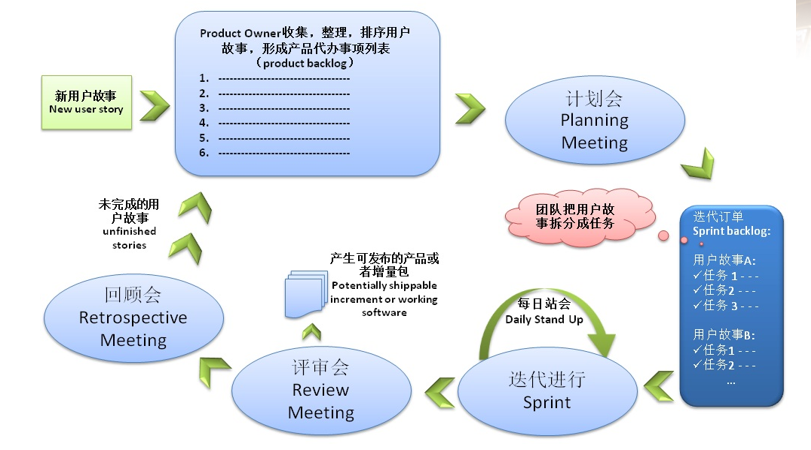

#### 2.4.2 软件开发模型特点

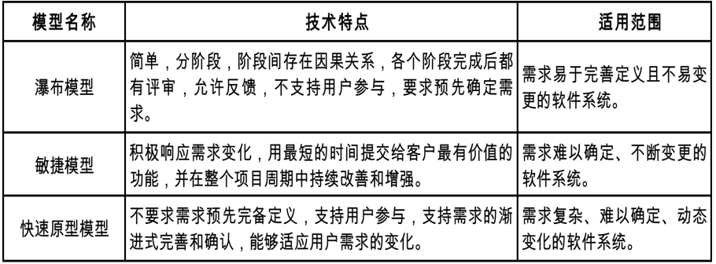

### 2.5 项目组织结构

* 有三种主要的类型：**职能型，纯项目型，矩阵型**
  * 职能型：经营活动按照职能划分成部门。项目功能都在本职能部门内部讨论完成再递交到下一个部门。如果完成期间涉及其他职能部门的问题，只能报告给本职能部门经理，由各职能部门经理进行协调和沟通。
  * 纯项目型：项目经理拥有领导权，项目内所有成员直接向项目经理汇报。每个项目就是一个独立自主单位。它就如同一个子公司那样运作，拥有完整的人员配备-像技术人员，行政人员，财务人员等。
  * 矩阵型：它是职能型和纯项目型的结合体。但是项目内的成员受项目经理和职能经理双重领导。

#### 2.5.1 职能型

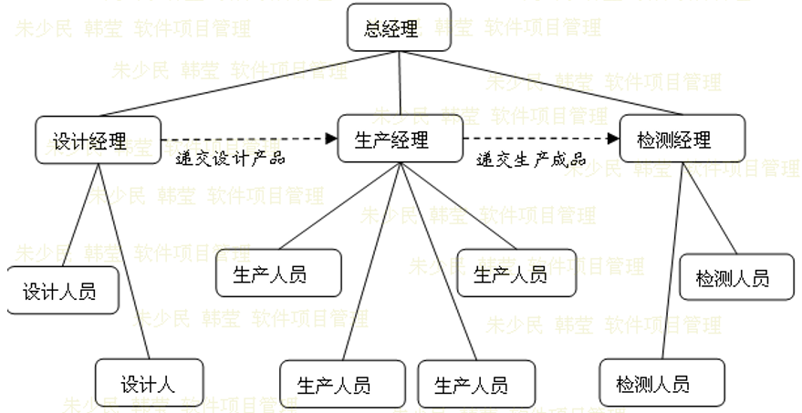

#### 2.5.2 纯项目型

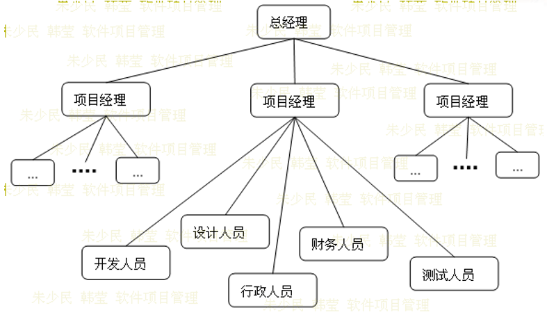

#### 2.5.3 矩阵型

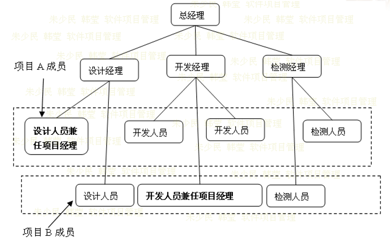

## 3. 项目计划

### 3.1 项目计划的内容

* 目标、策略、流程、标准、质量、进度安排、预算、资源、风险、配置管理

### 3.2 项目计划内容及其关系

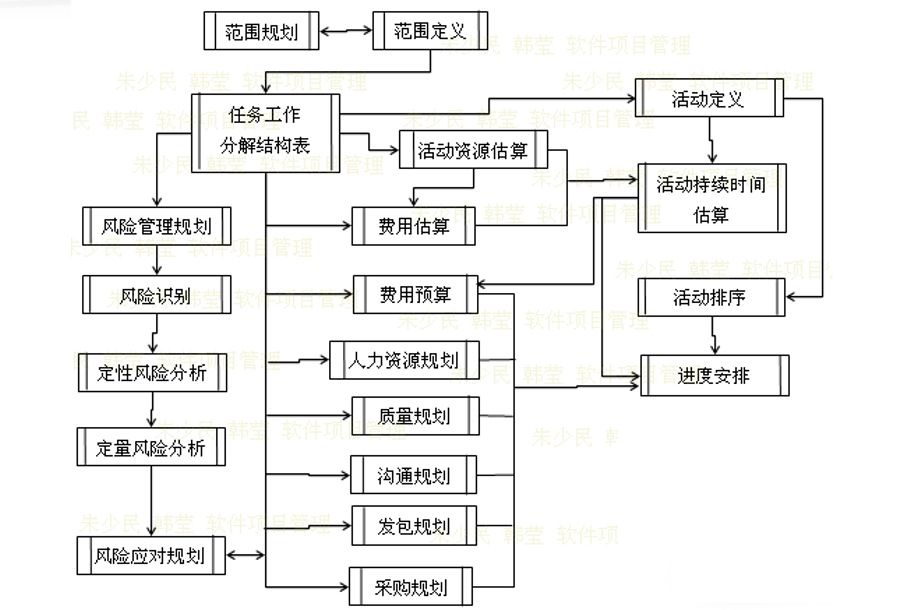

### 3.3 项目计划的方法

* 滚动计划方法、WBS方法、网络计划方法

#### 3.1.1 滚动计划方法

* 滚动计划方法：一种动态编制计划的方法，按照“近细远粗”的原则制定一定时期内的计划，然后按照计划的执行情况和环境变化，调整和修订未来的计划，并逐期向后移动，把短期计划和中期计划结合起来的一种计划方法。

##### 3.1.1.1 要点

* **分而治之**：分为多个阶段，针对不同的阶段制定不同的计划。
* **逐步求精**：随着时间的推移，预测计列逐步变成实施计划。
* **动态规划**：以计划的“变（调整）”来主动适应用户需求和软件开发环境的变化，即“以变应变”。
* **和谐过渡**：可以解决生产的连续性与计划的阶段性之间的矛盾

##### 3.1.1.2 实施

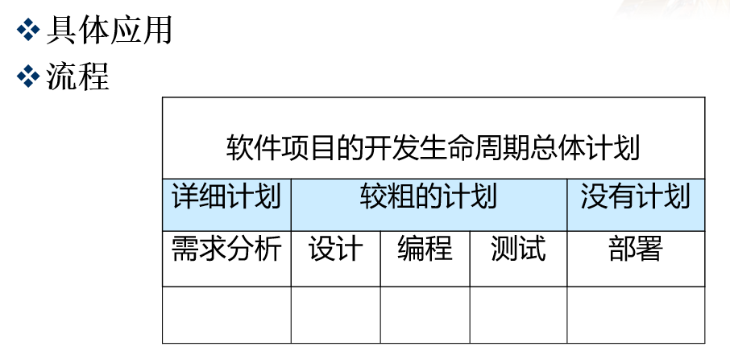

#### 3.1.2 WBS要求和原则

* 某项具体的任务应该在一个工作包且只能在一个工作包中出现
* WBS中某项任务的内容是其下所有WBS项的总和
* 一个工作包只能由一个人负责
* 任务的分解，尽量与实际执行方式保持一致。
* 分解合理，具有良好的稳定性和适应性
* 鼓励项目团队成员积极参与创建WBS
* 所有成果需要文档化

### 3.4 成本构成

* 费用分类：人力资源成本、资产类成本、管理费用、项目特别费用
* 软件项目成本分为**直接成本**和**间接成本**
  * 直接成本：是项目本身的任务所引起的成本，包括为该项目购买的设备和软件工具、参与该项目工作的人员工资等。
  * 间接成本：是许多项目共享的成本，例如办公楼的租金、水电费用、公司管理费用、网络环境和邮件服务等各种间接费用。

## 4. 项目估算

### 4.1 项目估算的基本内容

* **规模估算** (size estimation)：如代码行数、功能点数、对象点或特征点等
* **工作量估算**(workload ～)：任务分解并结合人力资源水平来估算
* **进度估算**(schedule ～)：通过工作量估算、有效资源分配等对项目进度给出正确的评估。
* **风险估算**(risk ～)：一般通过 风险发生的“概率和所带来的损失”来评估风险。
* **其他估算**，如需求稳定因子、资源利用效率、文档复审水平等

### 4.2 软件规模估算

* 德尔菲法
* 代码行估算方法
* 功能点分析方法
* 标准构件法
* 综合讨论

#### 4.2.1 德尔菲法

* 德尔菲法鼓励参加者就问题进行相互的、充分的讨论

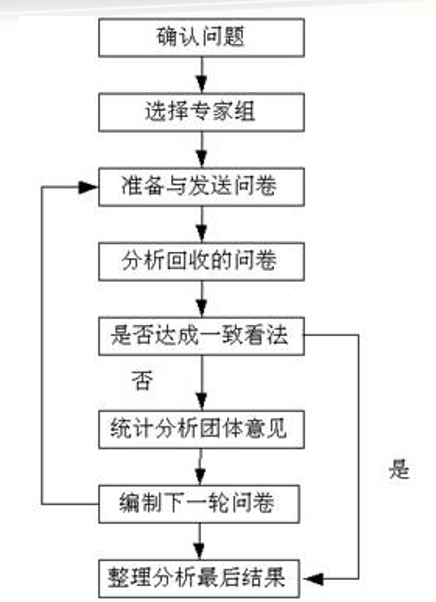

#### 4.2.2 代码行估算方法

* LOC指所有可执行的源代码行数，包括控制语句、数据定义、数据类型声明、等价声明、格式声明等
* 在生产效率的研究中，LOC又具有一定的误导性。如果把LOC和缺陷率等结合起来看，会更完整些

#### 4.2.3 功能点分析方法

* 功能点分析法(FPA)是在需求分析阶段基于系统功能的一种规模估算方法，其国际标准
* **功能点计算元素**：
  * 外部输入数(EI)：计算每个用户输入
  * 外部输出数(EO)：计算每个用户输出(报表、屏幕、出错信息等) 
  * 内部逻辑文件(ILF)：计算每个逻辑的主文件，如数据的一个逻辑组合
  * 外部接口文件(EIF)：计算所有机器可读的接口，如磁带或磁盘上的数据文件。
  * 外部查询数(EQ)：一个查询被定义为一次联机输入，它导致软件以联机输出的方式产生实时的响应

### 4.3 工作量估算

* COCOMO方法
* 多变量模型
* 基于用例的工作量估计
* IBM RMC估算方法
* 不同场景的估算法

#### 4.3.1 COCOMO模型

* 构造性成本模型(COCOMO：constructive cost model)是一种精确、易于使用的基于模型的成本估算方法
  * **基本COCOMO模型**，静态单变量模型，用已估算出来的源代码行数(LOC)为自变量的函数来计算软件开发工作量。
  * **中间COCOMO模型**，在用LOC为自变量的函数计算软件开发工作量的基础上，再用涉及产品、硬件、人员、项目等方面属性的影响因素来调整工作量的估算。
  * **详细COCOMO模型**，包括中间COCOMO模型的所有特性，但用上述各种影响因素调整工作量估算时，还要考虑对软件工程过程中分析、设计等各步骤的影响。

* COCOMO基本变量
  * DSI(源指令条数)，定义为代码行数，包括除注释行以外的全部代码。若一行有两个语句，则算做一条指令。KDSI即为千代码行数。
  * MM(估算单位为人月)表示开发工作量。
  * TDEV(估算单位为月)表示开发进度，由工作量决定。 
* COCOMO模型影响因素
  * **产品因素**：软件可靠性、数据库规模、产品复杂性。
  * **硬件因素**：执行时间限制、存储限制、虚拟机易变性、环境周转时间。
  * **人的因素**：分析员能力、应用领域实际经验、程序员能力、虚拟机使用经验、程序语言使用经验。
  * **项目因素**：现代程序设计技术、软件工具的使用、开发进度限制 

### 4.4 软件项目类型

* **组织型**：指项目需要有丰富的专业经验，同时需求具有灵活性。这样的项目可以由小团队进行开发。如开发业务系统和数据处理系统的项目都是组织型项目。
* **嵌入型**：指要求较少的专业知识，但对接口、可靠性等有严格的要求，并有外部条件的限制。例如开发实时系统或大型操作系统的项目就是嵌入型项目。
* **半独立型**：指需要适中的专业知识，与嵌入型项目相比外部限制相对较为宽松的项目。如开发数据库管理系统和库存产品控制系统的项目就是半独立型项目

### 4.5 项目角色职能确定

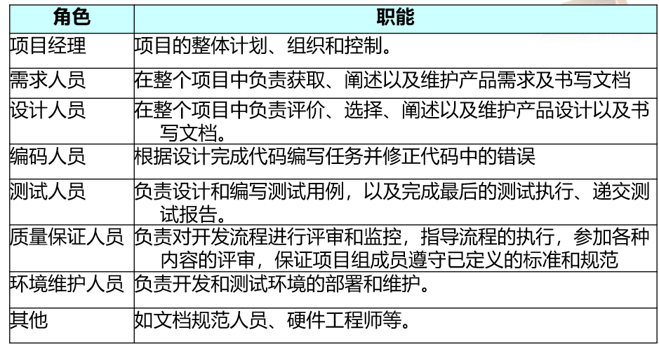

## 5. 项目进度和成本管理

### 5.1 项目活动

* 活动的两种类型: **前导活动和后续活动**
* 前导活动是在下一个活动之前必须出现的活动，例如，如果要开发产品，必须先获取需求。
* 后续活动是在前导活动之后必须出现的活动，例如，代码完成的软件包必须经过测试
* 在所有活动标识结束后，应该形成一个明确的活动清单(包括活动的定义、类型的分析以及 相互依赖关系)并发给项目成员 这可以让每一个项目成员清楚以下几点。
	* 有多少工作需要处理。
	* 有哪些工作可以单独完成
	* 有哪些工作需要相互协助完成
	* 有哪些工作需要提前做好一些准备工作等

### 5.2 确定项目活动的次序

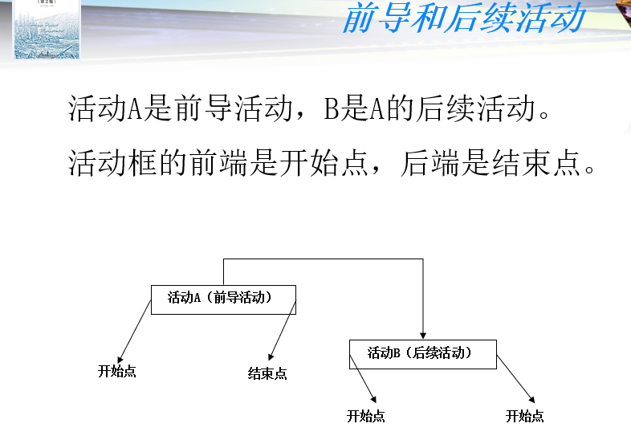

#### 5.2.1 活动之间的3种关系

* 结束后才开始（Finish-Start），这是一类最普遍也是最常用的活动类型。项目中的大多数活动之间都是这种关系。
* 开始后才开始（Start-Start），是指一个活动开始后，另一个活动才能开始。这经常表示某种并行而且具有一定依赖关系的活动。
* 结束后才结束（Finish-Finish），一个活动必须在另一个活动结束之前才能结束。这也经常表示某种并行，但其产出物具有一定依赖关系的活动。

#### 5.2.2 前导图法（PPT有一题）

* 前导图,又叫单节点网络图法, 它用单个节点 ( 方框 )表示一项活动 , 用节点之间的箭线表示项目活动之间的相互依赖关系。

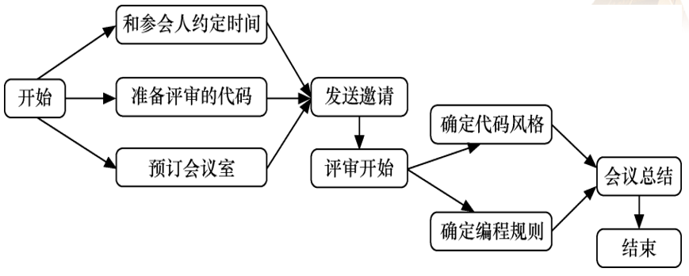

#### 5.2.3 箭线图法

* 箭线图法,又叫双代号网络图法 , 就是用箭线表示活动， 活动之间用节点(称作“事件”)连接，只能表示结束--开始关系. 每个活动必须用唯一的紧前事件和唯一的紧后事件描述

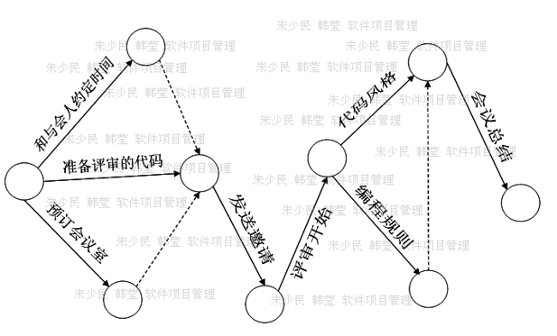

#### 题

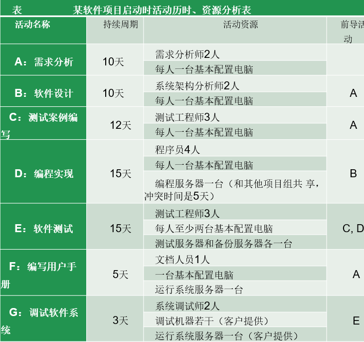

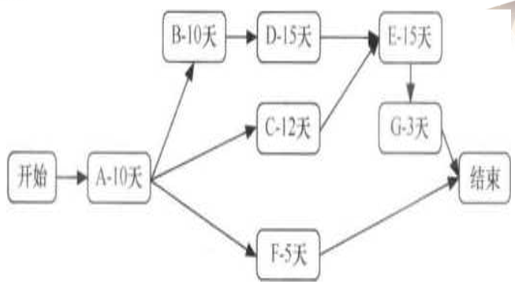

### 5.3 关键路径分析

* 关键路径和关键活动的确定
* 活动缓冲期的计算
* 压缩工期
* 准关键活动的标识	

#### 5.3.1 关键路径和关键活动

* 在项目网络中有一条路线的时间**最长**。这条路线决定着项目的工期时间，称之为关键路径。
* 位于关键路径上的**活动**就是关键项目活动。
* 活动缓冲期：在不导致项目预估工期延退的情况下，各个活动可以有多少时间的延迟。
  * 任何关键活动的延迟都会导致项目预估工期的延期，所以关键活动的缓冲期都是0
  * 非关键活动的缓冲期： 找到下一条最长的网络路径。然后，用关键路径的时间减去这条路径的时间，得到的时间差就是这条线路上活动的缓冲期

#### 5.3.2 压缩工期

**压缩关键路径的工期**是指在现有的资源、成本、任务不变的前提下，针对关键路径进行优化，结合资源、成本、时间因素、活动的可调度等因素对整个计划进行调整，直到关键路径所用的时间不能再压缩为止，得到最佳时间进度计划。

#### 5.3.3 准关键活动标识的必要性

* 准关键活动的标识就是要在项目计划和进展的时候.将那些可能成为关键活动的非关键 活动标注出来的过程。
* 非关键活动可能成为关键活动。
* 关键路径随之改变。
* 网络中各活动缓冲期变化。

#### 5.3.4 准关键活动的识别

* 缓冲期小于它们自身周期的10%，如果不加关注，这样的活动缓冲期比较容易很快用完。
* 活动的路径上只有一、两个活动是非关键活动。这一两个活动延迟时间超过缓冲期的时候，它们就变成了关键活动。
* 一些有依赖关系的活动，由于其依赖关系的特殊性，没有100%的把握保证之前的活动（前导活动）准时完成，那么这类活动也需要定期或者及时关注。以防它们变成关键活动。
* 根据项目的情况来识别。

### 5.4 网络模型的遍历	

#### 5.4.1 正向遍历

* 正向遍历就是按照活动开始到活动结束的顺序对网络中的每个活动进行遍历。通过执行正向遍历来计算出每个活动最早开始和最早结束时间。

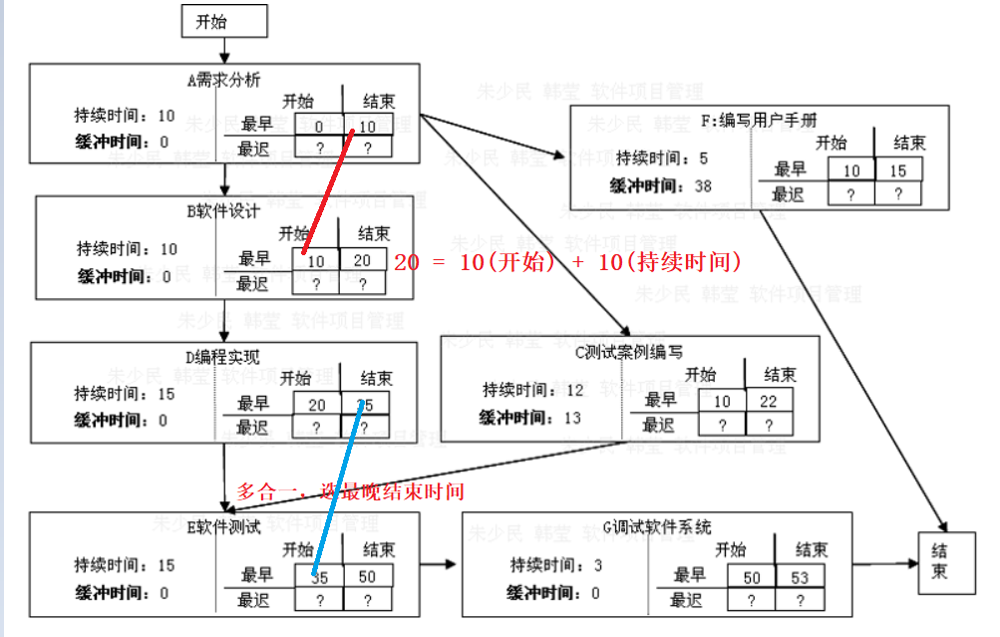

#### 5.4.2 反向遍历

* 反向遍历和正向遍历相反，就是按照活动结束到活动开始的倒序对网络中的每个活动进行遍历。通过执行反向遍历来计算出每个活动最迟开始和最迟结束日期

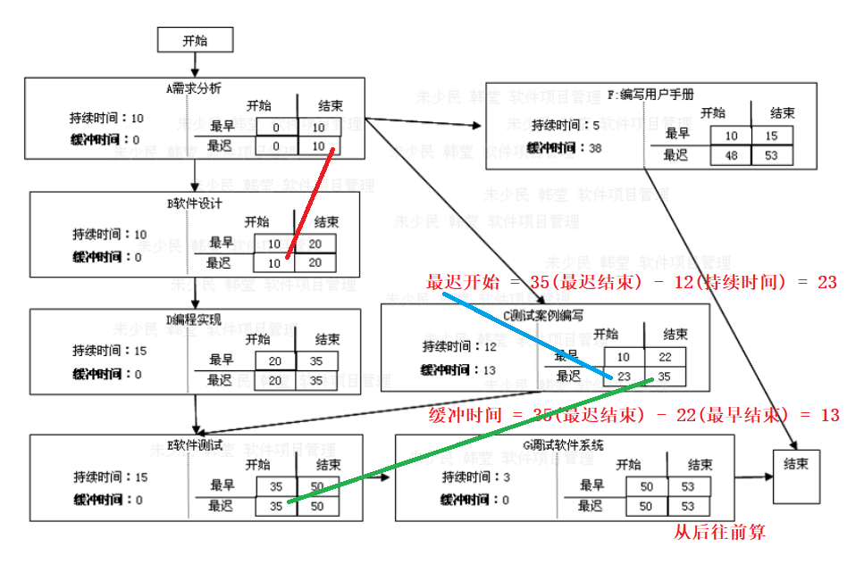

### 5.5 里程碑

#### 5.5.1 建立里程碑5个步骤

1. 设立合理的里程碑检查点
	* 根据项目规模、时间跨度设置（不超过2周）
2. 制定里程碑的完成目标
	* 有一个明确的目标或者交付物
3. 明确里程碑的验证标准
	* 里程碑的作用是确认项目的完成进度。
	* 如，“已按检查清单完成规格化的软件需求说明书的检验”和“软件需求说明书通过客户签字确认”。
4. 确认里程碑的利益相关人
5. 标识里程碑的进度百分比

#### 5.5.2 建立里程碑的方法

* 甘特图法
  * 水平线段描述把任务分解成子任务的过程，以及每个子任务的进度安排。
  * 上方的时间线就是日历时间，每个任务是以横线来表示起止时间的.横线的长度就是任务的历时时间，任务之间的关系用箭头来表示 可以看到图中有SS、FS和FF的关系
     	* 任务四和任务五就是一个主任务拆分的两个子任务 
  * 在甘特图中，还可以用黑色菱形标志表示项目的里程碑

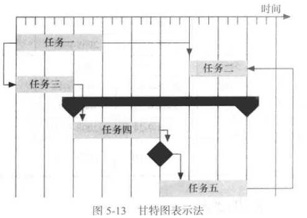

* 表格表示法：用表格来表示各个活动历时和相互之间的依赖关系

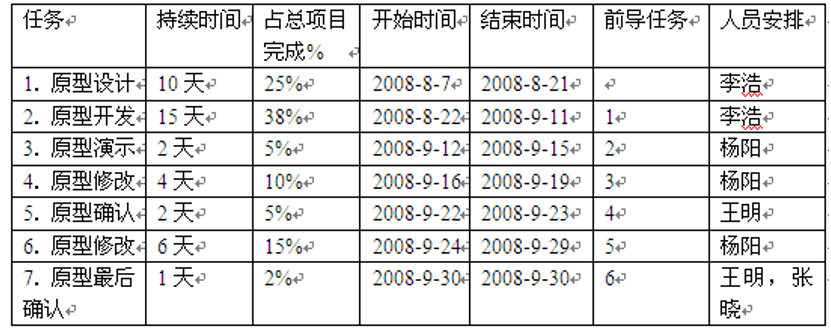

## 6. 项目质量管理

### 6.1 结构

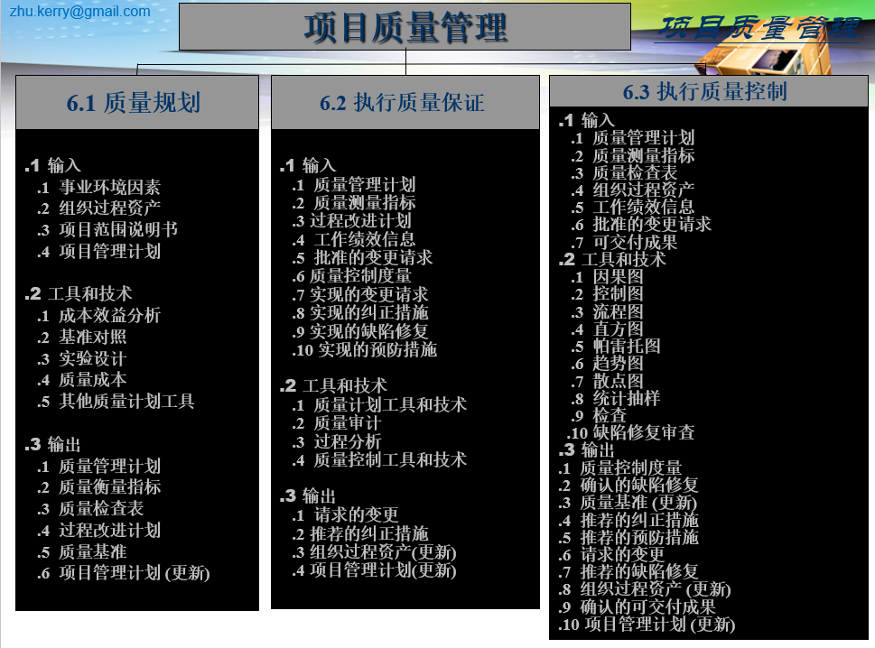

* 软件质量控制：是科学地测量过程状态的基本的方法。就像汽车表盘上的仪器，可以了解行驶中的转速、速度、油量等。
* 软件质量保证：则是过程和程序的参考与指南的集合。就像汽车中的用户手册。
* 软件质量管理：才是操作的誓学，教你如何驾车，建立质量文化和管理思想。 
* 为了开发出符合质量要求的软件产品，使项目获得成功，必须做好软件质量管理，要在各个层次上对质量管理提供支持
  * 基础设施，包括质量文化、开发环境和标准体系等
  * 方法层次，如釆用的开发模型、开发流程等；
  * 技术层次，包括开发技术的成熟度、开发工具、自动化测试水平等
* 在技术层次上，可以通过下列一些措施来提高质量。
	* 制定编程规范，在组织内形成一个开发约定和规则。
	* 组织应通过制定统一的模板来规范文档，形成一些约定和规则，以统一文档内容与风格
	* 实施覆盖生命周期的软件测试，包括单元测试、集成测试和系统测试，不仅要完成动态测试，而且要进行静态测试，即在软件开发早期对需求定义、系统设计、代码等进行评审和验证。
	* 采用统计分析的方法，主要通过对各种度量数据进行量化的数理统计分析等，揭示产品特征或开发过程特征，发现各种不一致性的问题

* 从质量管理功能看，质量保证人员着重内部复审、评审等，复审或内审就是为了达到事先定义的质量标准，确保所有软件开发活动符合有关的要求、规范和约束。
* 复审(Review )：在软件生命周期每个阶段结束之前，都正式用结束标准对该阶段生产出 的软件配置成分(阶段性成果)进行严格的技术审查，如需求分析人员、设计人员、开发 人员和测试人员一起审査“产品设计规格说明书”“测试计划”等
* 内审(Audit )：部门内部审査自己的工作，或由一个独立部门审查其他各部门的工作，以检查组织内部是否遵守已有的模板、规则和流程等

### 6.2 项目质量的组织保证

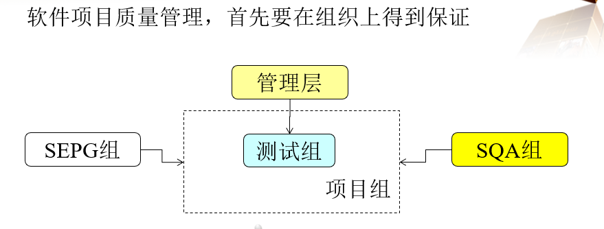

* 管理层：管理层具有很强的“质量第一”的意识，能制定有利于保证和提高质量的正确的策略和方针，在整个组织中营造良好的质量文化。
	* 项目质量工作的基础质量方针体现了组织对质量总的追求，对顾客的承诺，是该组织质量工作的指导思想和行动指南
* SQA组：软件质量保证组主要是从流程上对软件的质量进行跟踪、控制和改进，即监督项目按已定义的流程进行，并符合已定义的相关标准。
	* 例如，要求项目组在开发过程中及时建立相关的文档，以及任何需求变更都要经过变更控制流程，批准之后还要进行配置项修改等。
	* SQA组在职能划分上独立于项目组，但监督项目组的各项活动。
* 测试组：软件测试组负责对软件产品进行全面的测试，包括需求评审、设计评审、功能测试、性能测试、安全性测试等，从中找出所存在的缺陷。
  * 测试组主要是面向产品，进行事后检査，从而给出软件产品的质量评估。
  * 测试组是项目组的重要组成部分，和项目经理、 产品经理、产品设计人员、开发组等一起工作，直至软件成功发布
  * 在敏捷开发模式下， 项目团队是跨职能的团队，不再分为开发组和测试组，但可以有开发人员角色，而且也鼓励开发人员做更多的测试。

* SEPG组：软件工程过程组通常由软件专家组成，在软件开发组织中领导和协调过程改进的小组
	* 主要任务是推动企业所应用的过程的定义、维护和改进
	* 和SQA相比，SEPG 类似于一个“立法”机构，而SQA则类似于一个“监督”机构。
	* SPEG 一般负责组织的过程定义，但也可以帮助项目进行过程剪裁，从而使项目流程更有效。

### 6.3 质量计划

* 质量计划的内容
* 质量计划制定的步骤
* 如何制定有效的质量计划
* 质量计划的实施和控制
* 因为评审的对象不 同，其评审目的是不一样的。
  * 当评审的对象是需求文档、技术设计、代码等，主要目的就是能尽早地发现产品的缺陷， 以前期较少的投入来消除后期大量的返工；
  * 当评审的对象是软件技术时，主要目的是判断引入新的技术是否带来很大风险？技术是否适用当前的研发环境等；
  * 当评审的对象是软件流程、管理时，主要目的是发现流程、管理中存在的问题加以改进
  * 当评审对象是项目计划、测试计划、测试用例时，主要目的也是发现问题，完善这些计划和文档。

## 7. 项目风险管理

### 7.1 什么是风险？

* Webster’s Dictionary：风险是遭受损失、伤害、破坏的可能性。
* 风险是不利的情况(或损失)发生的不确定性 （不期望发生事件的客观不确定性 ）。 
* 风险是在给定情况下和特定时间内，那些可能发生的结果之间的差异，差异越大则风险越大。 

### 7.2 项目风险的特点

* 具有不确定性，必然发生的事情不是风险。
* 不期望发生的事情。
* 客观存在的，不以人的意志为转移。
* 是相对的，尽管风险是客观存在的，但它却依赖于决策目标。
* 主要取决于两个要素：行动方案和未来环境状态。

### 7.3 降低风险的思路

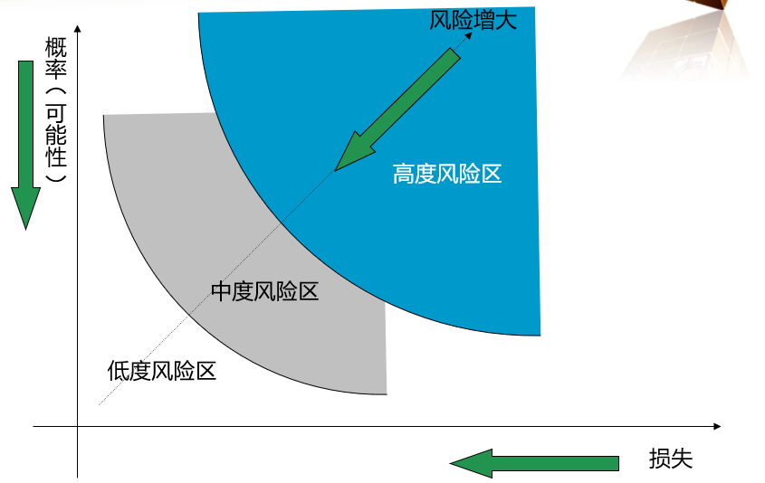

### 7.4 项目风险管理的定义

* 项目风险管：对项目风险从识别到分析乃至采取应对措施等一系列过程，包括风险识别、风险量化、风险对策和风险监控，从而将积极因素所产生的影响最大化和使消极因素产生的影响最小化，或者说达到消除风险、回避风险和缓解风险的目的

### 7.5 项目风险管理内容

* Risk Management Planning －风险管理计划
* Risk Identification－风险识别
* Qualitative Risk Analysis－风险定性分析
* Quantitative Risk Analysis－风险定量分析
* Risk Response Planning－风险应对计划
* Risk monitoring and control －风险监控

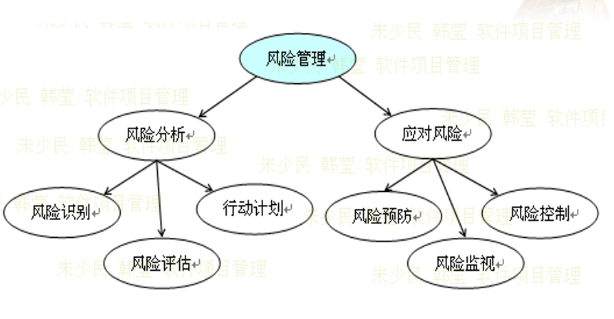

### 7.6 应对风险的基本措施

* 规避。通过变更项目计划消除风险或风险的触发条件，使目标免受影响。
* 转移。不能消除风险，而是将项目风险的结果连同应对的权利转移给第三方。
* 弱化。将风险时间的概率或结果降低到一个可以接受的程度，其中降低发生的概率更为有效。
* 接受。不改变项目计划，而考虑发生后如何应对

### 7.7 项目风险模型

#### 7.7.1 CMMI模型

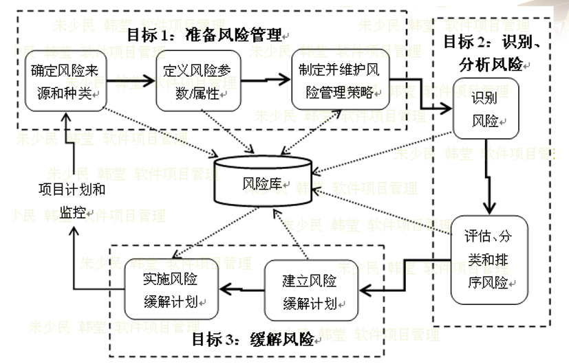

### 7.8 项目风险来源

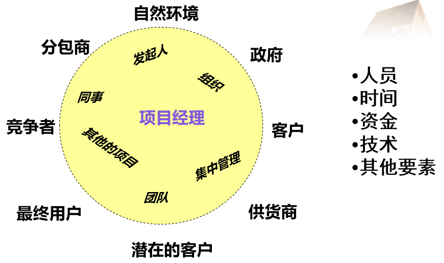

### 7.9 风险的分类

* 内在风险和外在风险 
* 需求风险、设计风险、编程风险、测试风险和维护风险 
* 技术风险、管理风险、人员风险和组织风险 
* 进度风险、成本风险和质量风险 

### 7.10 风险度量的内容

* 风险发生的可能性度量 
* 风险发生后果度量 
* 风险影响范围度量 
* 风险发生时间度量 
* **风险危害  = 可能性 ×后果严重程度 × 范围**

## 8. 项目团队与干系人

### 8.1 工作氛围

* 开放、真诚、平等、信任

### 8.2 马斯洛的需求层次论

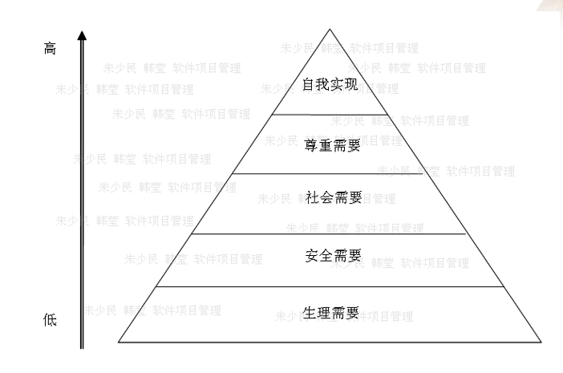

### 8.3 激励步骤

1. 分析激励
2. 创建激励环境
3. 实现激励

### 8.4 团队生命周期五个典型阶段

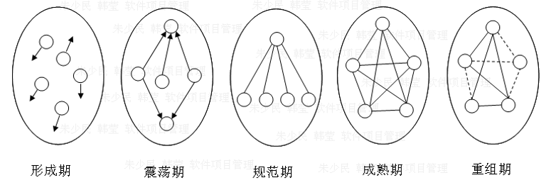

### 8.5 知识传递的有效方法

* 建立正规的流程和文档。
* 加强人员的教育和培训。
* 确保执行力，把质量审查做到位

### 8.6 沟通渠道

* 沟通渠道随沟通元素的增长，不是线性的，而是非线性的。
* 计算公式为`n(n-1) / 2`

## 9. 项目监督和控制

### 9.1 数据收集方式

1. **被动接收**
	* 如：日报、周报、月报等方式。
2. **主动收集**
	* 项目组长/负责人/经理通过各种手段主动地进行数据的收集。

### 9.2 进度可视化监控方法

1. 甘特图
2. 延迟图
3. 时间线
4. 计划与实际对比图
5. 燃尽图

### 9.3 优先级控制

* 优先级设定与处理
* 缺陷优先级和严重性

### 9.4 缺陷严重性

* 缺陷严重性是指软件缺陷对软件质量的破坏程度、对客户使用产品或服务的影响程度。
  * A类：致命错误
  * B类：严重错误
  * C类：一般性错误
  * D类：较小错误
  * E类：建议性问题（非缺陷）

### 9.5 缺陷优先级

* 优先级是指表示处理和修正软件缺陷的先后顺序的指标
  * 最高优先级，立即修复，否则阻碍进一步测试。
  * 较高优先级，在产品发布之前必须修复。
  * 一般优先级，如果时间允许就修复。
  * 低优先级，可能会修复，但是不影响正常发布。

### 9.6 变更控制流程

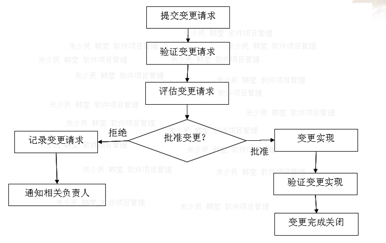

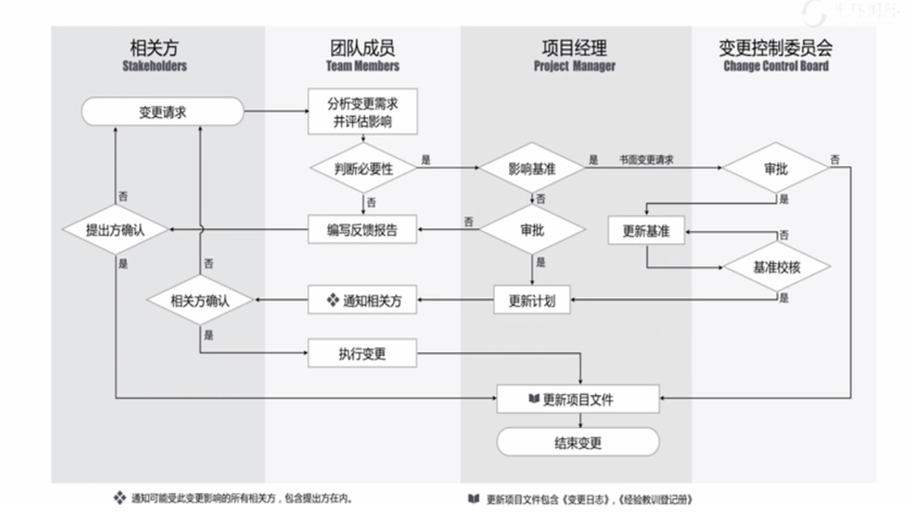